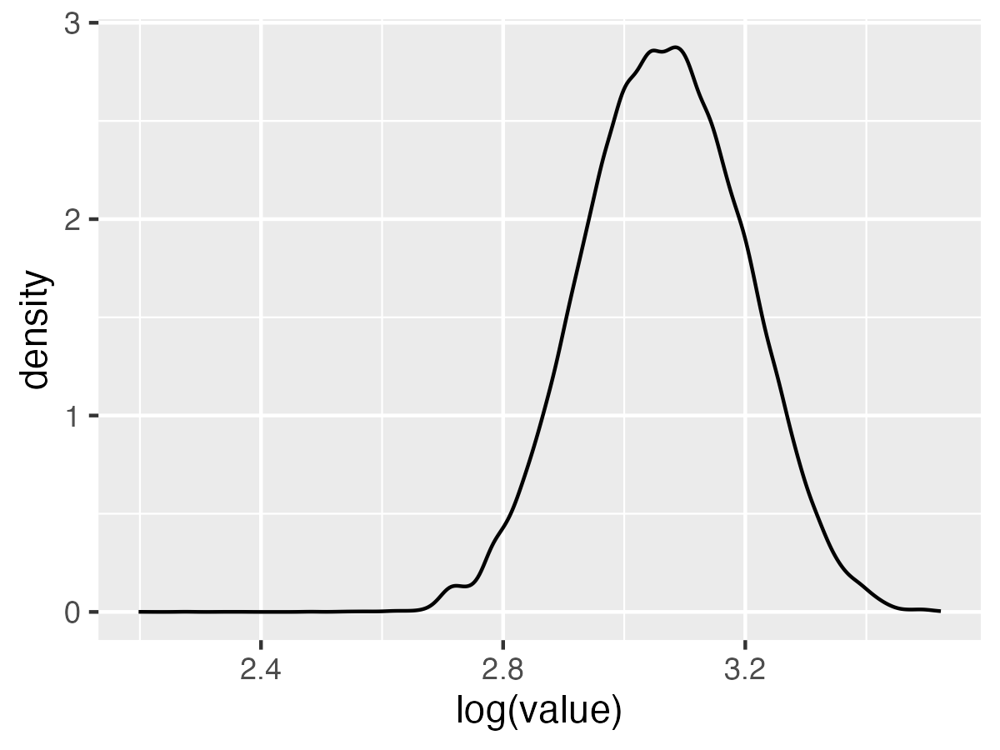
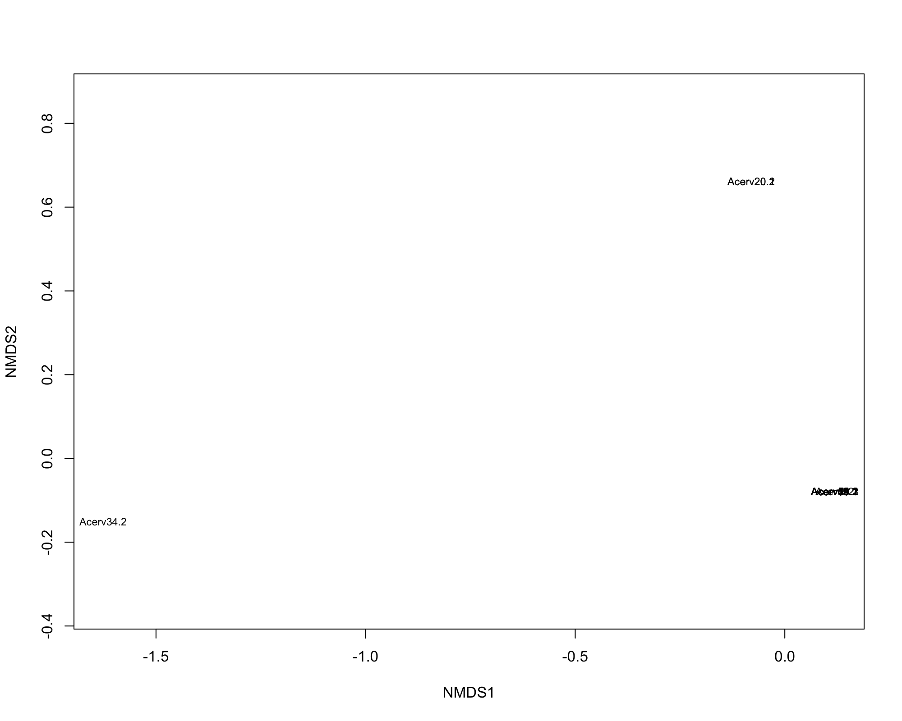
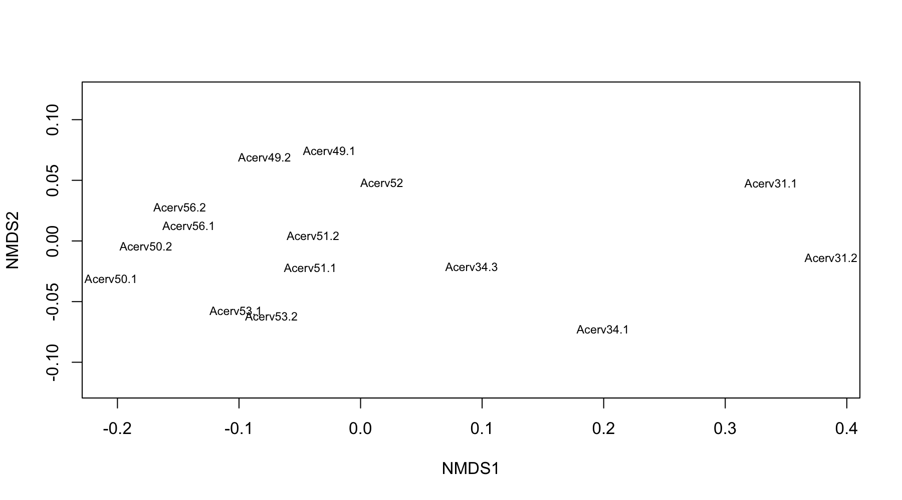
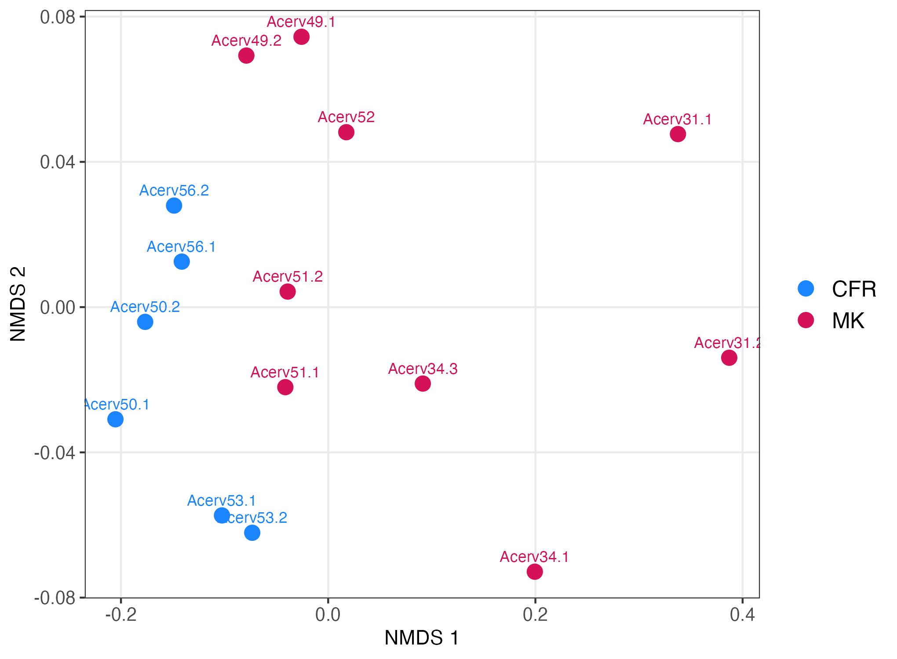
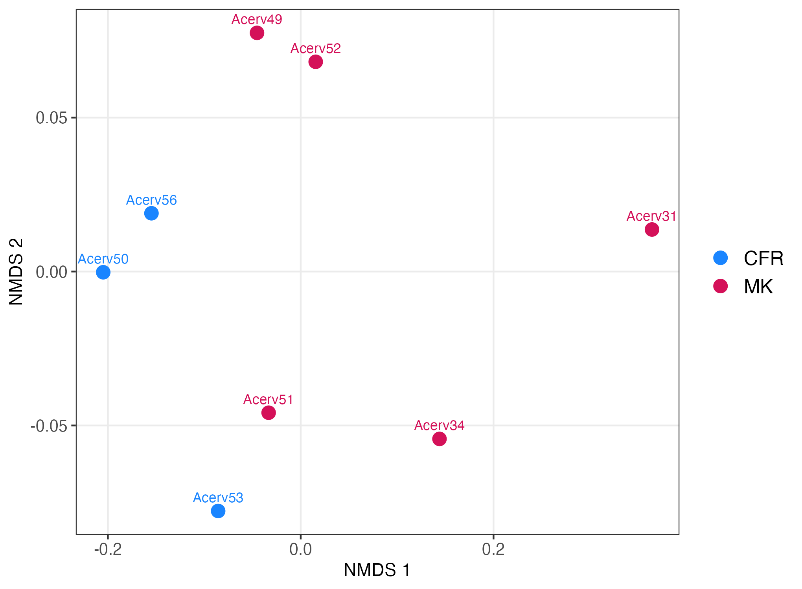
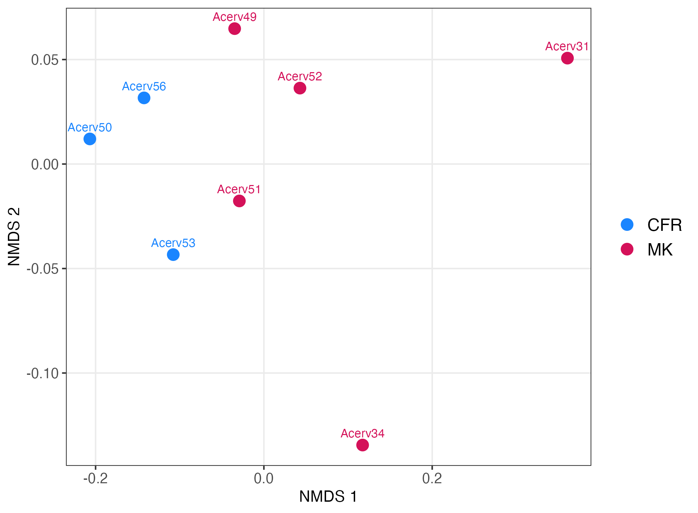
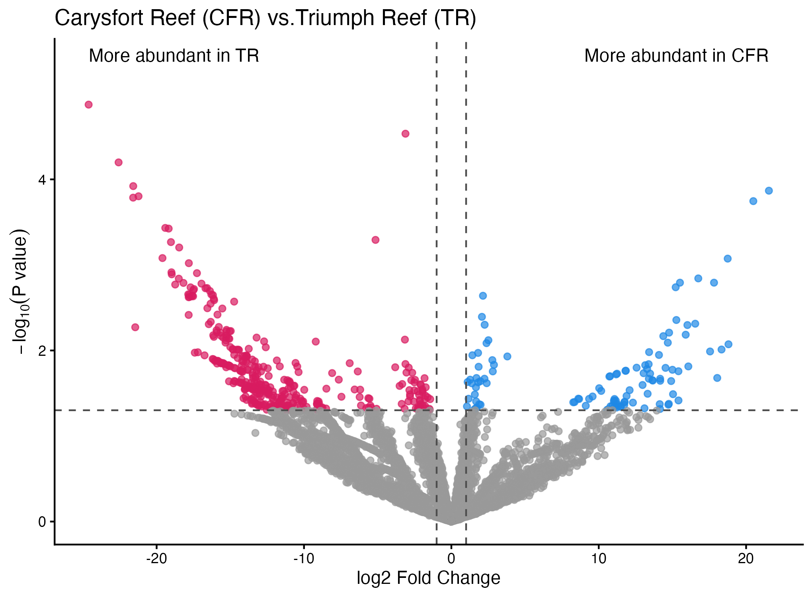

```{r eval=FALSE, message=FALSE, warning=FALSE, include=TRUE}
source("BaseScripts.R")
library(limma) 
library(tidyr)
require(data.table)
library(vegan)
library(WGCNA)
```

# Read the output file & format the data 
```{r eval=FALSE, message=FALSE, warning=FALSE, include=TRUE}
acerv.dia<-fread("../Data/MSstats_format_acerv.csv")
colnames(acerv.dia)<-gsub(" ",".",colnames(acerv.dia))

#remove spike proteins
acerv.dia<-acerv.dia[!grepl("sp\\|",acerv.dia$Protein.Name),]

#format the data
acerv.tic<-subset(acerv.dia, select=c(File.Name, Protein.Name,Peptide.Modified.Sequence, Normalized.Area))

# remove duplicated lines -1 line for each peptide 
acerv.tic<-acerv.tic[!duplicated(acerv.tic[,c('File.Name', 'Protein.Name','Peptide.Modified.Sequence')]),] #711324

#Assign 0 to NAs
acerv.tic$Normalized.Area[is.na(acerv.tic$Normalized.Area)]<-0

#Aggregate by each protein
ProtSums.tic<-aggregate(Normalized.Area ~ File.Name+Protein.Name, data=acerv.tic, FUN=sum) #134874

# this is a simple log2 transformation
ProtSums.tic$log2.norm<-log2((ProtSums.tic$Normalized.Area)+1)

#
ProtSums.tic$File.Name<-gsub(".mzML","",ProtSums.tic$File.Name)


```

# Run NMDS on pooled and non-pooled data

## Non-pooled Data
### Formatting the data for NMDS 
```{r eval=FALSE, message=FALSE, warning=FALSE, include=TRUE}
meta<-read.csv('../Data/20250311_UWPRLumos_Richmond_sequence.csv')
meta$Sample.ID<-gsub('\\.','',meta$Sample.ID)
meta$Sample<-gsub(' ','',meta$Sample)
meta<-meta[,c(1,9)]
# The run "20250311_UWPRLumos_Richmond_Acerv19" does not exit
meta<-meta[meta$File.Name!="20250311_UWPRLumos_Richmond_Acerv19",]
meta<-meta[grepl("Acerv",meta$Sample),]
meta<-meta[!grepl("Acervpool",meta$Sample),]

#Assign a second sample name for those with duplicates
meta$Sample2<-meta$Sample
for (i in 1:nrow(meta)){
    df<-meta[meta$Sample==corals[i],]
    for (j in 1:nrow(df)){
        meta$Sample2[meta$File.Name==df$File.Name[j]]<-paste0(corals[i],".",j)    
    }
}

protsum2<-ProtSums.tic
protsum2<-merge(protsum2, meta[c(1,3)], by="File.Name", all.x=T)
protsum2<-protsum2[,c("Protein.Name","log2.norm","Sample2")]

#reformat so that column File.Name is column headers and Protein.Name is row names
protsums_nonpooled<-pivot_wider(protsum2, names_from=Sample2, values_from=log2.norm)
row.nms2<-protsums_nonpooled$Protein.Name
protsums_nonpooled<-protsums_nonpooled[,-1]
rownames(protsums_nonpooled)<-row.nms2


prot.t2<-as.data.frame(t(protsums_nonpooled))
#check to see if normally distributed
df_tidy2<-gather(prot.t2)
ggplot(df_tidy2, aes(x=log(value))) +
    geom_density()
ggsave("../Output/Acerv_non-pooled_data_check.png", width = 4, height = 3, dpi=300)
# Yes
```



### Continued with NMDS
```{r eval=FALSE, message=FALSE, warning=FALSE, include=TRUE}

#reorganize the data columns based on Location
info<-read.csv('../Data/Florida_proteins.csv', row.names = 1)
info<-info[info$Coral.Species=='ACERV',]
info$Sample<-paste0('Acerv',info$ID)
colnames(info)[colnames(info)=="Collection.Location"]<-'Location'
info<-info[,c("Sample","Location")]
info<-info[order(info$Location),]
info<-merge(info, meta, by="Sample", all.x=T)

c<-info$Sample2[info$Location=="CFR"]
m<-info$Sample2[info$Location=="MK"]
npcfr<-protsums_nonpooled[,c(colnames(protsums_nonpooled) %in% c)]
npmk <-protsums_nonpooled[,c(colnames(protsums_nonpooled) %in% m)]

npall<-cbind(npcfr, npmk)
rownames(npall)<-row.nms2

#check for outliers
goodSamplesGenes(npall, verbose=3) #Iterative filtering of samples and genes with too many missing entries
#$allOK
#[1] TRUE


#NMDS 
npall.t<-t(npall)
nmds.npall<-metaMDS(npall.t,distance='bray', autotransform = F)
{png("../Output/Acerv_nmds_check1.png", width = 10, height = 8, res=200, units = "in")
ordiplot(nmds.npall, type='text', display='sites')
dev.off()}
```




### Remove Acerv20 and Acerv34.2
```{r eval=FALSE, message=FALSE, warning=FALSE, include=TRUE}
# remove Acerv34.2
npall.t<-npall.t[!rownames(npall.t)%in% c("Acerv20.1", "Acerv20.2","Acerv34.2"),]
nmds.npall<-metaMDS(npall.t,distance='bray', autotransform = F)
{png("../Output/Acerv_nmds_check2.png", width = 9, height = 5, res=200, units = "in")
ordiplot(nmds.npall, type='text', display='sites')
dev.off()}
#ok
```



### Create a NMDS plot
```{r eval=FALSE, message=FALSE, warning=FALSE, include=TRUE}
info2<-info[!info$Sample2 %in% c("Acerv20.1", "Acerv20.2", "Acerv34.2"),]
info2<-info2[order(info2$Location),]
table(info2$Location)
#CFR  MK 
#  6   9 

acervnp = data.frame(nmds.npall$points)
acervnp$site<-c(rep("CFR", times=6),rep("MK", times=9))
acervnp$sample<-rownames(acervnp)

ggplot(acervnp, aes(x=MDS1,y=MDS2,color=site)) + 
    geom_point(size=3.5) + theme_bw() +
    theme(legend.text = element_text(size=12), legend.title = element_text(size=13))+
    xlab("NMDS 1") + ylab("NMDS 2")+
    theme(axis.text=element_text(size=10), legend.title = element_blank())+
    scale_color_manual(values=c("#1A85FF","#D41159"))+
    theme(panel.grid.minor = element_blank())+
    geom_text(aes(label = rownames(acervnp)),show.legend = FALSE,
              vjust = -0.9,    # vertical adjustment
              size = 3)
ggsave("../Output/Acerv_nmds.non_pooled.png", height = 5, width = 6.8, dpi=300)
```




# Pool the technical replicates (using median values)
```{r eval=FALSE, message=FALSE, warning=FALSE, include=TRUE}

ProtSums.tic<-merge(ProtSums.tic, meta, by="File.Name", all.x=T)

# Remove Acerv34.2 from the summary data. Keep Acerv20 for now.
ProtSums.tic1<-ProtSums.tic[ProtSums.tic$Sample2 != "Acerv34.2",]
# Total 9 biological samples

ProtSums.tic1<-ProtSums.tic1[,c("File.Name","Protein.Name","log2.norm","Sample")]

# remove the same samples from meta
meta2<-meta[meta$Sample2 !=  "Acerv34.2",]
table(meta2$Sample)
#Acerv20 Acerv31 Acerv34 Acerv49 Acerv50 Acerv51 Acerv52 Acerv53 Acerv56 
#      2       2       2       2       2       2       1       2       2 

# all except Acerv52 have tech reps (Acerv34 had 3 reps, so still has 2)


corals<-unique(meta2$Sample)
corals<-corals[corals!="Acerv52"]
Tech_median<-data.frame()
data<-ProtSums.tic1
for (i in 1:length(corals)){
    df<-data[data$Sample==corals[i],]
    runs<-unique(df$File.Name)
    dfm<-df[df$File.Name==runs[1],]
    
    for(j in 1:nrow(dfm)){
        dfm$log2.norm[j]<-median(df$log2.norm[df$Protein==dfm$Protein.Name[j]])
        }
    Tech_median<-rbind(Tech_median,dfm)
}

ProtSums1<-ProtSums.tic1[!(ProtSums.tic1$Sample %in% corals),]
ProtSums.pooled<-rbind(ProtSums1, Tech_median)
write.csv(ProtSums.pooled,"../Output/Acerv.log2norm_pooled.csv",row.names = F)

```


## NMDS with Pooled Data 1 (no Acerv34.2)
```{r eval=FALSE, message=FALSE, warning=FALSE, include=TRUE}

#reformat so that column File.Name is column headers and Protein.Name is row names
ProtSums.df1<-pivot_wider(ProtSums.pooled[,c(2:4)], names_from=Sample, values_from=log2.norm)
row.nms<-ProtSums.df1$Protein.Name

ProtSums.df1<-ProtSums.df1[,-1]
rownames(ProtSums.df1)<-row.nms

# Reorder the columns based on Location 
info<-read.csv('../Data/Florida_proteins.csv', row.names = 1)
info<-info[info$Coral.Species=='ACERV',]
info$Sample<-paste0('Acerv',info$ID)
colnames(info)[colnames(info)=="Collection.Location"]<-'Location'
info<-info[,c("Sample","Location")]
info<-info[order(info$Location),]

c<-info$Sample[info$Location=="CFR"]
m<-info$Sample[info$Location=="MK"]
cfr<-ProtSums.df1[,c(colnames(ProtSums.df1) %in% c)]
mk <-ProtSums.df1[,c(colnames(ProtSums.df1) %in% m)]

all1<-cbind(cfr, mk)
rownames(all1)<-row.nms


#NMDS 
all.t1<-t(all1)
nmds.all1<-metaMDS(all.t1,distance='bray', autotransform=F)
ordiplot(nmds.all1, type='text', display='sites')
# Pooled data also showed Acerv20 to be an outlier

# remove Acerv20
all.t2<-all.t1[-which(rownames(all.t1)=="Acerv20"),]
nmds.all2<-metaMDS(all.t2,distance='bray', autotransform=F)
ordiplot(nmds.all2, type='text', display='sites')

#check for outliers
goodSamplesGenes(all1, verbose=3) 
#$allOK
#[1] TRUE
# Can include Acerv20 in LIMMA analysis?

table(info$Location) # including Acerv20
#CFR  MK 
#  4   5
acerv <- data.frame(nmds.all2$points)
acerv$site<-c(rep("CFR", times=3),rep("MK", times=5))

ggplot(acerv, aes(x=MDS1,y=MDS2,color=site)) + 
    geom_point(size=3.5) + theme_bw() +
    theme(legend.text = element_text(size=12), legend.title = element_text(size=13))+
    xlab("NMDS 1") + ylab("NMDS 2")+
    theme(axis.text=element_text(size=10), legend.title = element_blank())+
    scale_color_manual(values=c("#1A85FF","#D41159"))+
    theme(panel.grid.minor = element_blank())+
    geom_text(aes(label = rownames(acerv)),show.legend = FALSE,
              vjust = -0.9,   
              size = 3)
ggsave("../Output/Acerv_nmds.pooled_all.png", height = 5, width = 6.8, dpi=300)
```



### NMDS with coral proteins only
```{r eval=FALSE, message=FALSE, warning=FALSE, include=TRUE}
# create a data frame with only coral proteins. 
all.c2<-all.t2[,grepl("^FUN", colnames(all.t2))]
    

nmds.c2<-metaMDS(all.c2,distance='bray', autotransform=F)

acerv1 = data.frame(nmds.c2$points)
acerv1$site<-c(rep("CFR", times=3),rep("MK", times=5))

ggplot(acerv1, aes(x=MDS1,y=MDS2,color=site)) + 
    geom_point(size=3.5) + theme_bw() +
    theme(legend.text = element_text(size=12), legend.title = element_text(size=13))+
    xlab("NMDS 1") + ylab("NMDS 2")+
    theme(axis.text=element_text(size=10), legend.title = element_blank())+
    scale_color_manual(values=c("#1A85FF","#D41159"))+
    theme(panel.grid.minor = element_blank())+
    geom_text(aes(label = rownames(acerv)),show.legend = FALSE,
              vjust = -0.9,   
              size = 3)
ggsave("../Output/Acerv_nmds.coralproteins_only.png", height = 5, width = 6.8, dpi=300)

```


<br>
<br>

# LIMMA analysis
## Run with Acerv20
```{r eval=FALSE, message=FALSE, warning=FALSE, include=TRUE}
# Create design matrix for 2 sites
# with Acerv20
info$Location <- factor(info$Location)

#without Acerv20
info2<-info[info$Sample!="Acerv20",]

design <- model.matrix(~0 + info$Location)
colnames(design) <- levels(info$Location)

design2 <- model.matrix(~0 + info2$Location)
colnames(design2) <- levels(info2$Location)


#Create contrasts
contrast.mat<-makeContrasts(CFR-MK, levels=design)
contrast.mat2<-makeContrasts(CFR-MK, levels=design2)

#Fit the linear model (all 9 samples)
fit <- limma::lmFit(all1, design = design)

#Run contrats
fit.2 <- contrasts.fit(fit, contrast.mat)
fit.2<-eBayes(fit.2, robust = TRUE, trend = TRUE)
diff <- lapply(colnames(fit.2$coefficients), function(co) {
    tt <- topTable(fit.2, coef = co, number = Inf, sort.by = "P")
    tt <- tt %>% rownames_to_column("ProteinID") %>% mutate(contrast = co, .before = 1)
    tt
}) %>% bind_rows()

nrow(diff[diff$adj.P.Val<0.05,])
#0

summary(decideTests(fit.2, adjust.method = "BH", p.value = 0.05))
#       CFR - MK
#Down          0
#NotSig     7493
#Up            0

summary(decideTests(fit.2, adjust.method = "none", p.value = 0.05))
#       CFR - MK
#Down        406
#NotSig     7071
#Up          16
```


## Run without Acerv20
```{r eval=FALSE, message=FALSE, warning=FALSE, include=TRUE}
# Limma with 8 samples (-Acerv20)
all2<-all1[,-which(colnames(all1)=="Acerv20")]

fit2 <- limma::lmFit(all2, design = design2)

#Run contrats
fit2.2 <- contrasts.fit(fit2, contrast.mat2)
fit2.2<-eBayes(fit2.2, robust = TRUE, trend = TRUE)
diff2 <- lapply(colnames(fit2.2$coefficients), function(co) {
    tt <- topTable(fit2.2, coef = co, number = Inf, sort.by = "P")
    tt <- tt %>% rownames_to_column("ProteinID") %>% mutate(contrast = co, .before = 1)
    tt
}) %>% bind_rows()


nrow(diff2[diff2$adj.P.Val<0.05,])
#0

summary(decideTests(fit2.2, adjust.method = "BH", p.value = 0.05))
#       CFR - MK
#Down          0
#NotSig     7493
#Up           0

summary(decideTests(fit2.2, adjust.method = "none", p.value = 0.05))
#      CFR - MK
#Down        366
#NotSig     7017
#Up          110

write.csv(diff2, "../Output/Acerv_Limma_results_8samples.csv", row.names = F)

```


## Plot the results in Volcano Plot 

```{r eval=FALSE, message=FALSE, warning=FALSE, include=TRUE}
# Plot the results
fc_thresh  <- 1        # |log2FC| ≥ 1 (i.e., ≥2-fold)
fdr_thresh <- 0.05
diff$negLog10<-(-log10(diff$P.Value))
diff <- diff %>%
    mutate(fc_dir = case_when(
        logFC >=  1& P.Value<0.05  ~ "pos",
        logFC <= -1& P.Value<0.05  ~ "neg",
        TRUE         ~ "none"
    ))


ggplot(diff, aes(x = logFC, y = negLog10, color=fc_dir)) +
    geom_point(alpha = 0.7, size = 1.6) +
    scale_color_manual(values = c("none"="grey60", "pos"="#1E88E5","neg"="#D81B60"))+
    geom_vline(xintercept = c(-fc_thresh, fc_thresh), linetype = "dashed",color="gray30", linewidth=0.5) +
    geom_hline(yintercept = -log10(fdr_thresh), linetype = "dashed", color="gray30", linewidth=0.5) +
    labs(x = "log2 Fold Change", y = expression(-log[10]("P value")), title="A. cerv Carysfort Reef (CFR) vs.Marquesas Key (MK)") +
    theme_classic()+theme(legend.position = "none") +
    annotate("text",
             x = max(diff$logFC, na.rm = TRUE), y = max(diff$negLog10, na.rm = TRUE) + 0.5,
             hjust = 1, vjust = 0,
             label = "More abundant in CFR") +
    annotate("text",
             x = min(diff$logFC, na.rm = TRUE), y = max(diff$negLog10, na.rm = TRUE)+ 0.5,
             hjust = 0, vjust = 0,
             label = "More abundant in MK")

ggsave("../Output/Acerv_CFR-MK.volcano.plot.png", height = 5, width = 6.8, dpi=300)
```


### Plot the results with 8 samples (3 CFR & 5 MK)
```{r eval=FALSE, message=FALSE, warning=FALSE, include=TRUE}

fc_thresh  <- 1        # |log2FC| ≥ 1 (i.e., ≥2-fold)
fdr_thresh <- 0.05
diff2$negLog10<-(-log10(diff2$P.Value))
diff2 <- diff2 %>%
    mutate(fc_dir = case_when(
        logFC >=  1& P.Value<0.05  ~ "pos",
        logFC <= -1& P.Value<0.05  ~ "neg",
        TRUE         ~ "none"
    ))

ggplot(diff2, aes(x = logFC, y = negLog10, color=fc_dir)) +
    geom_point(alpha = 0.7, size = 1.6) +
    scale_color_manual(values = c("none"="grey60", "pos"="#1E88E5","neg"="#D81B60"))+
    geom_vline(xintercept = c(-fc_thresh, fc_thresh), linetype = "dashed",color="gray30", linewidth=0.5) +
    geom_hline(yintercept = -log10(fdr_thresh), linetype = "dashed", color="gray30", linewidth=0.5) +
    labs(x = "log2 Fold Change", y = expression(-log[10]("P value")), title="Carysfort Reef (CFR) vs.Triumph Reef (TR)") +
    theme_classic()+theme(legend.position = "none") +
    annotate("text",
             x = max(diff2$logFC, na.rm = TRUE), y = max(diff2$negLog10, na.rm = TRUE) + 0.5,
             hjust = 1, vjust = 0,
             label = "More abundant in CFR") +
    annotate("text",
             x = min(diff2$logFC, na.rm = TRUE), y = max(diff2$negLog10, na.rm = TRUE)+ 0.5,
             hjust = 0, vjust = 0,
             label = "More abundant in TR")

ggsave("../Output/Acerv_CFR-MK.volcano.plot_8samples.png", height = 5, width = 6.8, dpi=300)


```


# Add annotation information to the results
```{r eval=FALSE, message=FALSE, warning=FALSE, include=TRUE}
# BLAST results
blastID<-read.csv("../Data/Acerv.blast.uniprot.csv")
blastID<-blastID[,c("ProteinID","Description","GeneSymbol","UniprotID")]

diff2<-merge(diff2, prot, by.x="ProteinID", by.y="Protein", all.x=T)
dir.create("../Output/GO/Acerv")


# Create a list of genes for GO Analysis  
c1<-diff2[diff2$logFC>2&diff2$P.Value<0.05,] #91
c1.c<-c1[!grepl('tr',c1$ProteinID),] #56

m1<-diff2[diff2$logFC<(-2)&diff2$P.Value<0.05,] #352
m1.c<-m1[!grepl('tr',m1$ProteinID),] #322

sink("../Output/GO/Acerv.geneIDs_CFR>MK.txt")
cat(paste0(c1.c$ProteinID,"; "))
sink(NULL)

sink("../Output/GO/Acerv.geneIDs_CFR<MK.txt")
cat(paste0(m1.c$ProteinID,"; "))
sink(NULL)

# Background Genes
protc<-blastID[grepl('FUN',blastID$Protein),] #5887
sink("../Output/GO/Acerv.geneIDs_corals_background.txt")
cat(paste0(protc$Protein,"; "))
sink(NULL)


```


```{r eval=FALSE, message=FALSE, warning=FALSE, include=TRUE}

# Unitprot ID for iPath
proteins<-read.csv("Output/Ofav.blast.uniprot_updated.csv")


ct<-merge(ct, proteins[,c(1,4)], by.x="ProteinID", by.y="Protein", all.x=T)
mt<-merge(mt, proteins[,c(1,4)], by.x="ProteinID", by.y="Protein", all.x=T)
cm<-merge(cm, proteins[,c(1,4)], by.x="ProteinID", by.y="Protein", all.x=T)


ct2<-ct
ct2$color<-""
ct2$color[ct2$logFC>0]<-""

ipath.ct1<-ct[ct$logFC>2&ct$P.Value<0.05,]
ipath.ct1$id<-paste0("UNIPROT:",ipath.ct1$UniprotID)
ipath.ct1$color<-"#0000FF"
ipath.ct1$width<-"W25"


## TR > CFR
c1<-ct[ct$logFC>2&ct$P.Value<0.05,] #80
c1.c<-c1[!grepl('tr',c1$ProteinID),] 
c1.c<-c1.c[!is.na(c1.c$ProteinID),] #57

#1 CFR>TR
t1<-ct[ct$logFC<(-2)&ct$P.Value<0.05,] #311 
t1.c<-t1[!grepl('tr',t1$ProteinID),] #248


```

```{r eval=FALSE, message=FALSE, warning=FALSE, include=TRUE}

```

```{r eval=FALSE, message=FALSE, warning=FALSE, include=TRUE}

```

```{r eval=FALSE, message=FALSE, warning=FALSE, include=TRUE}

```

```{r eval=FALSE, message=FALSE, warning=FALSE, include=TRUE}

```
