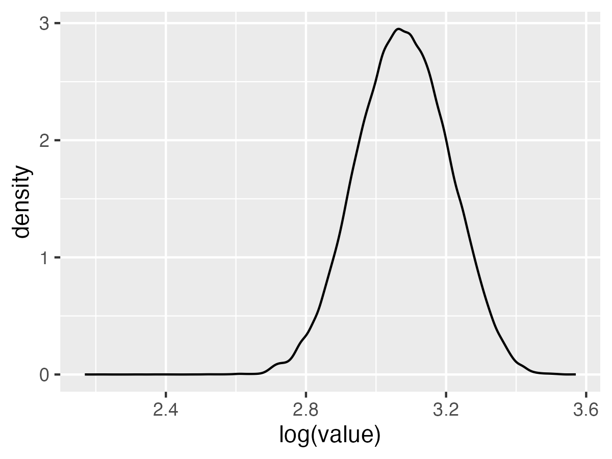
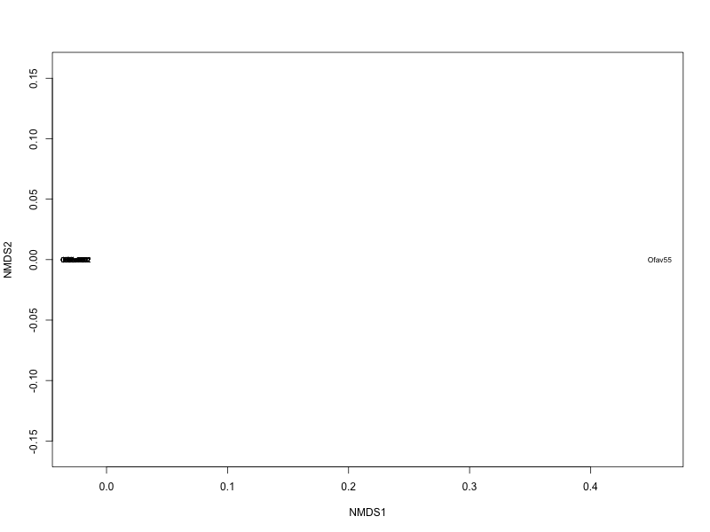
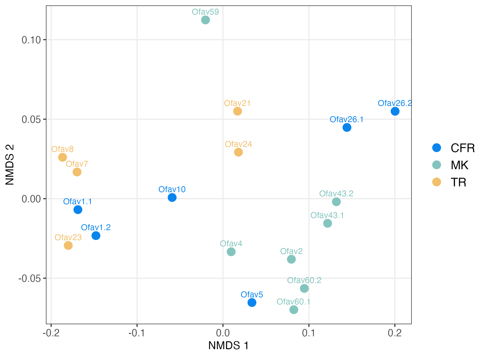
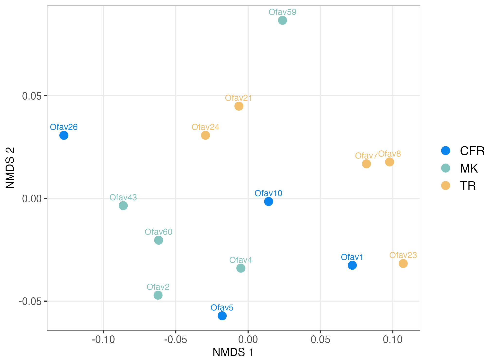
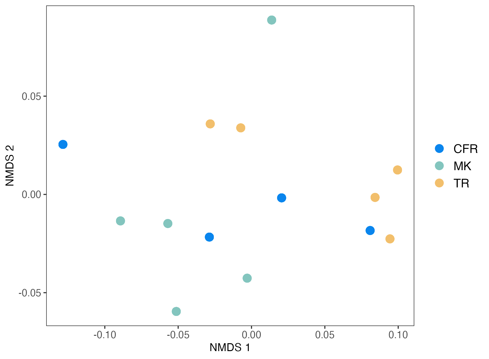
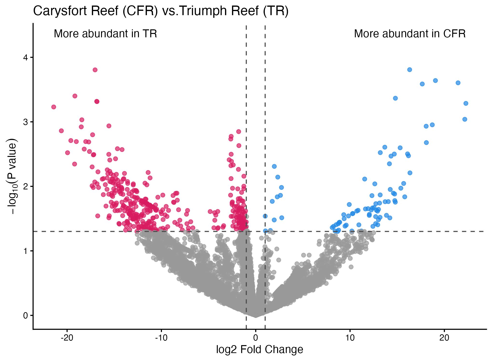
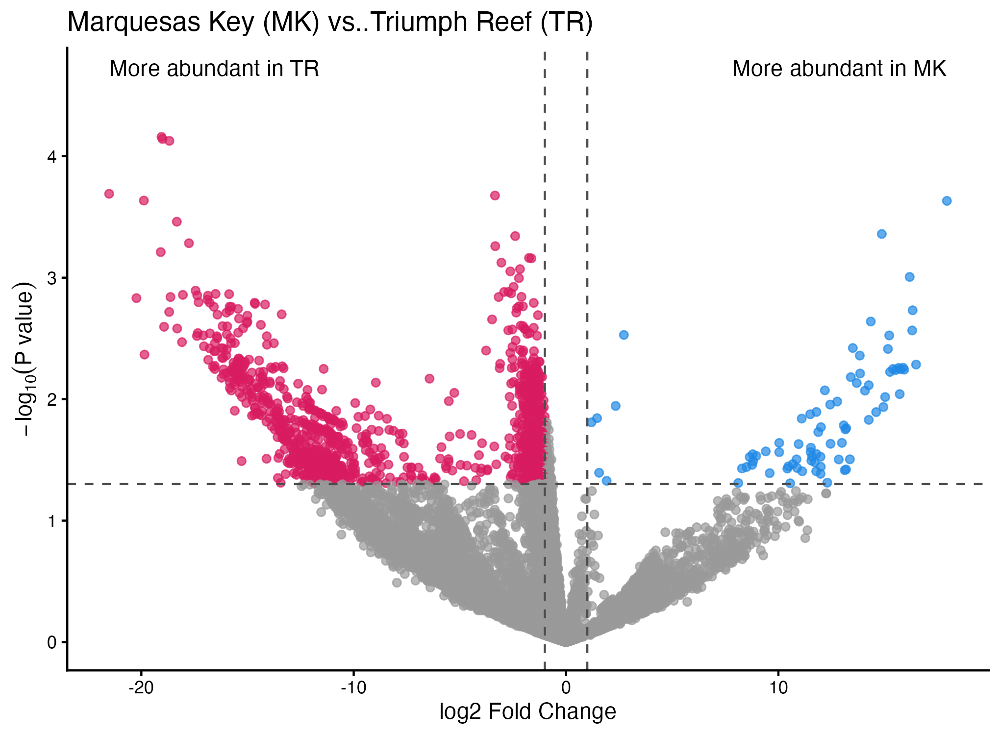
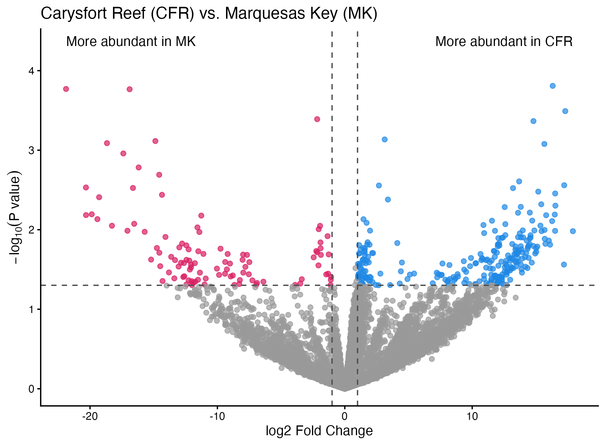

```{r eval=FALSE, message=FALSE, warning=FALSE, include=TRUE}
source("BaseScripts.R")
library(limma) 
library(tidyr)
require(data.table)
library(vegan)
library(WGCNA)
```

# Read the output file & format the data 
```{r eval=FALSE, message=FALSE, warning=FALSE, include=TRUE}
ofav.dia<-fread("../Data/MSstats_ofav.csv")
colnames(ofav.dia)<-gsub(" ",".",colnames(ofav.dia))

#remove spike proteins
ofav.dia<-ofav.dia[!grepl("sp\\|",ofav.dia$Protein.Name),]

#format the data
ofav.tic<-subset(ofav.dia, select=c(File.Name, Protein.Name,Peptide.Modified.Sequence, Normalized.Area))

#Normalized Area is already showing aggregated values for each peptide
ofav.tic2<-ofav.tic[!duplicated(ofav.tic[,c('File.Name', 'Protein.Name','Peptide.Modified.Sequence')]),] #183312

# Assign 0 to NAs
ofav.tic2$Normalized.Area[is.na(ofav.tic2$Normalized.Area)]<-0

ProtSums.tic<-aggregate(Normalized.Area ~ File.Name+Protein.Name, data=ofav.tic2, FUN=sum)

# this is a simple log2 transformation
ProtSums.tic$log2.norm<-log2((ProtSums.tic$Normalized.Area)+1)


```

# Pool the technical replicates (using median values)
```{r eval=FALSE, message=FALSE, warning=FALSE, include=TRUE}
# Pool technical replicates
meta<-read.csv('../Data/20250311_UWPRLumos_Richmond_sequence.csv')
meta$Sample.ID<-gsub('\\.','',meta$Sample.ID)
meta$Sample<-gsub(' ','',meta$Sample)
meta<-meta[,c(1,9)]
# Ofav 54 is supposed to be Ofav59
meta$Sample[meta$Sample=="Ofav54"]<-"Ofav59"

ProtSums.tic$File.Name<-gsub(".mzML","",ProtSums.tic$File.Name)
ProtSums.tic<-merge(ProtSums.tic, meta, by="File.Name", all.x=T)

ProtSums.tic<-ProtSums.tic[,c("File.Name","Protein.Name","log2.norm","Sample")]

# Pool samples with tech reps
corals<-c("Ofav1", "Ofav26", "Ofav43", "Ofav60")
Tech_median<-data.frame()
data<-ProtSums.tic
for (i in 1:length(corals)){
    df<-data[data$Sample==corals[i],]
    runs<-unique(df$File.Name)
    dfm<-df[df$File.Name==runs[1],]
    
    for(j in 1:nrow(dfm)){
        dfm$log2.norm[j]<-median(df$log2.norm[df$Protein==dfm$Protein.Name[j]])
    }
    Tech_median<-rbind(Tech_median,dfm)
}
ProtSums<-ProtSums.tic[!(ProtSums.tic$Sample %in% corals),]
ProtSums<-rbind(ProtSums, Tech_median)
write.csv(ProtSums,"../Output/Ofav.log2norm_pooled.csv",row.names = F)

```

# Run NMDS on pooled and non-pooled data

## Non-pooled Data
### Formatting the data for NMDS 
```{r eval=FALSE, message=FALSE, warning=FALSE, include=TRUE}
#ProtSums<-read.csv("../Output/Ofav.log2norm_pooled.csv")
meta<-meta[grepl("Ofav", meta$Sample),]
meta<-meta[!grepl("Ofavpool", meta$Sample),]

#Assign a second sample name for those with duplicates
corals<-c("Ofav1", "Ofav26", "Ofav43", "Ofav60")
meta$Sample2<-meta$Sample
for (i in 1:nrow(meta)){
    df<-meta[meta$Sample==corals[i],]
    for (j in 1:nrow(df)){
        meta$Sample2[meta$File.Name==df$File.Name[j]]<-paste0(corals[i],".",j)    
    }    

protsum2<-ProtSums.tic
protsum2<-merge(protsum2, meta[c(1,3)], by="File.Name", all.x=T)
protsum2<-protsum2[,c("Protein.Name","log2.norm","Sample2")]

#reformat so that column File.Name is column headers and Protein.Name is row names
protsums_nonpooled<-pivot_wider(protsum2, names_from=Sample2, values_from=log2.norm)
row.nms2<-protsums_nonpooled$Protein.Name
protsums_nonpooled<-protsums_nonpooled[,-1]
rownames(protsums_nonpooled)<-row.nms2

#
prot.t2<-as.data.frame(t(protsums_nonpooled))
#check to see if normally distributed
df_tidy2<-gather(prot.t2)
ggplot(df_tidy2, aes(x=log(value))) +
    geom_density()
ggsave("../Output/Ofav_non-pooled_data_check.png", width = 4, height = 3, dpi=300)
# Yes
```



### Continued with NMDS
```{r eval=FALSE, message=FALSE, warning=FALSE, include=TRUE}

#reorganize the data columns based on Location
info<-read.csv('../Data/runsample_summary.csv')
info<-info[!duplicated(info$BioReplicate),]
colnames(info)[1]<-"Sample"

cc<-c("Ofav1.1","Ofav1.2","Ofav10","Ofav26.1","Ofav26.2", "Ofav5","Ofav55")
mm<-c("Ofav2","Ofav4","Ofav43.1","Ofav43.2","Ofav59","Ofav60.1","Ofav60.2")
t<-info$Sample[info$Condition=="TR"]
npcfr<-protsums_nonpooled[,c(colnames(protsums_nonpooled) %in% cc)]
npmk <-protsums_nonpooled[,c(colnames(protsums_nonpooled) %in% mm)]
nptr <-protsums_nonpooled[,c(colnames(protsums_nonpooled) %in% t)]

npall<-cbind(npcfr, npmk, nptr)
rownames(npall)<-row.nms2
#write.csv(npall, "../Output/Ofav_non-pooled_samples_ordered.csv")

#NMDS 
npall.t<-t(npall)
nmds.npall<-metaMDS(npall.t,distance='bray', autotransform = F)
{png("../Output/Ofav_nmds_check1.png", width = 800, height = 600)
ordiplot(nmds.npall, type='text', display='sites')
dev.off()}
```

* Remove Ofav55
```{r eval=FALSE, message=FALSE, warning=FALSE, include=TRUE}
# remove ofav55
npall.t<-npall.t[-which(rownames(npall.t)=="Ofav55"),]
nmds.npall<-metaMDS(npall.t,distance='bray')
ordiplot(nmds.npall, type='text', display='sites')


ofavnp = data.frame(nmds.npall$points)
ofavnp$site<-c(rep("CFR", times=6),rep("MK", times=7),rep("TR", times=5))
ofavnp$sample<-rownames(ofavnp)

ggplot(ofavnp, aes(x=MDS1,y=MDS2,color=site)) + 
    geom_point(size=3.5) + theme_bw() +
    theme(legend.text = element_text(size=12), legend.title = element_text(size=13))+
    xlab("NMDS 1") + ylab("NMDS 2")+
    theme(axis.text=element_text(size=10), legend.title = element_blank())+
    scale_color_manual(values=c("#0A85ED","#83c5be","#F2BF6C"))+
    theme(panel.grid.minor = element_blank())+
    geom_text(aes(label = rownames(ofavnp)),show.legend = FALSE,
              vjust = -0.9,    # vertical adjustment
              size = 3)
ggsave("../Output/Ofav_nmds.non_pooled.png", height = 5, width = 6.8, dpi=300)
```



## Pooled Data
```{r eval=FALSE, message=FALSE, warning=FALSE, include=TRUE}
#ProtSums<-read.csv("../Output/Ofav.log2norm_pooled.csv")

#reformat so that column File.Name is column headers and Protein.Name is row names
ProtSums.df<-pivot_wider(ProtSums[,c(2:4)], names_from=Sample, values_from=log2.norm)
row.nms<-ProtSums.df$Protein.Name

ProtSums.df<-ProtSums.df[,-1]
rownames(ProtSums.df)<-row.nms

# Reorder the columns based on Location 
info<-read.csv('../Data/runsample_summary.csv')
info<-info[!duplicated(info$BioReplicate),]
colnames(info)[1]<-"Sample"

c<-info$Sample[info$Condition=="CFR"]
m<-info$Sample[info$Condition=="MK"]
t<-info$Sample[info$Condition=="TR"]
cfr<-ProtSums.df[,c(colnames(ProtSums.df) %in% c)]
mk <-ProtSums.df[,c(colnames(ProtSums.df) %in% m)]
tr <-ProtSums.df[,c(colnames(ProtSums.df) %in% t)]

all<-cbind(cfr, mk, tr)
rownames(all)<-row.nms
#write.csv(all, "Output/Ofav_proteins_ordered.csv")

#NMDS 
all.t<-t(all)
nmds.all<-metaMDS(all.t,distance='bray', autotransform=F)
ordiplot(nmds.all, type='text', display='sites')

# remove ofav55
all.t2<-all.t[-which(rownames(all.t)=="Ofav55"),]
nmds.all2<-metaMDS(all.t2,distance='bray', autotransform=F)
ordiplot(nmds.all2, type='text', display='sites')

#check for outliers
goodSamplesGenes(all, verbose=3) #Iterative filtering of samples and genes with too many missing entries
#$allOK
#[1] TRUE


ofav2 <- data.frame(nmds.all2$points)
ofav2$site<-c(rep("CFR", times=4),rep("MK", times=5),rep("TR", times=5))

ggplot(ofav2, aes(x=MDS1,y=MDS2,color=site)) + 
    geom_point(size=3.5) + theme_bw() +
    theme(legend.text = element_text(size=12), legend.title = element_text(size=13))+
    xlab("NMDS 1") + ylab("NMDS 2")+
    theme(axis.text=element_text(size=10), legend.title = element_blank())+
    scale_color_manual(values=c("#0A85ED","#83c5be","#F2BF6C"))+
    theme(panel.grid.minor = element_blank())+
    geom_text(aes(label = rownames(ofav2)),show.legend = FALSE,
              vjust = -0.9,   
              size = 3)
ggsave("../Output/Ofav_nmds.allproteins.png", height = 5, width = 6.8, dpi=300)
```



### NMDS with coral proteins only
```{r eval=FALSE, message=FALSE, warning=FALSE, include=TRUE}
# create a data frame with only coral proteins. 
allcorals2<-all[grepl("^XP", rownames(all)),] #8134

all.c2<-t(allcorals2)
all.c2<-all.c2[-which(rownames(all.c2)=="Ofav55"),]

nmds.c2<-metaMDS(all.c2,distance='bray', autotransform=F)
ordiplot(nmds.c2, type='text', display='sites')

ofav1 = as.data.frame(scores(nmds.c2))
ofav1$site<-c(rep("CFR", times=4),rep("MK", times=5),rep("TR", times=5))

ggplot(ofav1, aes(x=sites.NMDS1,y=sites.NMDS2,color=site)) + 
    geom_point(size=3.5) + theme_bw() +
    theme(legend.text = element_text(size=12), legend.title = element_text(size=13))+
    xlab("NMDS 1") + ylab("NMDS 2")+
    theme(axis.text=element_text(size=10), legend.title = element_blank())+
    scale_color_manual(values=c("#0A85ED","#83c5be","#F2BF6C"))+
    theme(panel.grid = element_blank())
ggsave("../Output/Ofav_nmds.coralproteins.png", height = 5, width = 6.8, dpi=300)

```


<br>
<br>

# LIMMA analysis
```{r eval=FALSE, message=FALSE, warning=FALSE, include=TRUE}
# Remove ofav55
all<-all[,-which(colnames(all)=="Ofav55")]

# Create design matrix for 3 sites -this does not have intercept
info<-info[order(info$Condition),]
info$Condition <- factor(info$Condition)
info<-info[info$Sample!="Ofav55",]
design <- model.matrix(~0 + info$Condition)
colnames(design) <- levels(info$Condition)

#Create contrasts
contrast.mat<-makeContrasts(CFR-TR, MK-TR, CFR-MK, levels=design)

#Fit the linear model
fit1 <- limma::lmFit(all, design = design)

#Run contrats
fit2 <- contrasts.fit(fit1, contrast.mat)
fit2<-eBayes(fit2, robust = TRUE, trend = TRUE)
#tab_CT <- topTable(fit2, coef = "CFR - TR", number = Inf, adjust.method = "BH")

diffCT <- lapply(colnames(fit2$coefficients), function(co) {
    tt <- topTable(fit2, coef = "CFR - TR", number = Inf, sort.by = "P")
    tt <- tt %>% rownames_to_column("FeatureID") %>% mutate(contrast = co, .before = 1)
    tt
}) %>% bind_rows()

# Overall “any difference among A/B/C?” (F-test)
fitF<-eBayes(fit1, robust = TRUE, trend = TRUE)
tab_any <- topTable(fitF, number = Inf, sort.by = "F")  
nrow(tab_any[tab_any$adj.P.Val<0.05,])
#8252 protein abundance is different among the 3 sites

summary(decideTests(fit2, adjust.method = "BH", p.value = 0.05))
#       CFR - TR MK - TR CFR - MK
#Down          0       0        0
#NotSig     9648    9648     9648
#Up            0       0        0

summary(decideTests(fit2, adjust.method = "none", p.value = 0.05))
#       CFR - TR MK - TR CFR - MK
#Down        385    1388      102
#NotSig     9177    8178     9282
#Up           86      82      264

diff <- lapply(colnames(fit2$coefficients), function(co) {
    tt <- topTable(fit2, coef = co, number = Inf, sort.by = "P")
    tt <- tt %>% rownames_to_column("ProteinID") %>% mutate(contrast = co, .before = 1)
    tt
}) %>% bind_rows()

write.csv(diff, "../Output/Ofav_Limma_results_all.csv", row.names = F)

```

## Plot the LIMMA analysis results -Volcano Plots
```{r eval=FALSE, message=FALSE, warning=FALSE, include=TRUE}
ct<-diff[diff$contrast=="CFR - TR",]
mt<-diff[diff$contrast=="MK - TR",]
cm<-diff[diff$contrast=="CFR - MK",]

fc_thresh  <- 1        # |log2FC| ≥ 1 (i.e., ≥2-fold)
fdr_thresh <- 0.05
ct$negLog10<-(-log10(ct$P.Value))
ct <- ct %>%
    mutate(fc_dir = case_when(
        logFC >=  1& P.Value<0.05  ~ "pos",
        logFC <= -1& P.Value<0.05  ~ "neg",
        TRUE         ~ "none"
    ))

mt$negLog10<-(-log10(mt$P.Value))
mt <- mt %>%
    mutate(fc_dir = case_when(
        logFC >=  1& P.Value<0.05  ~ "pos",
        logFC <= -1& P.Value<0.05  ~ "neg",
        TRUE         ~ "none"
    ))
cm$negLog10<-(-log10(cm$P.Value))
cm <- cm %>%
    mutate(fc_dir = case_when(
        logFC >=  1 & P.Value<0.05 ~ "pos",
        logFC <= -1 & P.Value<0.05 ~ "neg",
        TRUE         ~ "none"
    ))


ggplot(ct, aes(x = logFC, y = negLog10, color=fc_dir)) +
    geom_point(alpha = 0.7, size = 1.6) +
    scale_color_manual(values = c("none"="grey60", "pos"="#1E88E5","neg"="#D81B60"))+
    geom_vline(xintercept = c(-fc_thresh, fc_thresh), linetype = "dashed",color="gray30", linewidth=0.5) +
    geom_hline(yintercept = -log10(fdr_thresh), linetype = "dashed", color="gray30", linewidth=0.5) +
    labs(x = "log2 Fold Change", y = expression(-log[10]("P value")), title="Carysfort Reef (CFR) vs.Triumph Reef (TR)") +
    theme_classic()+theme(legend.position = "none") +
    annotate("text",
             x = max(ct$logFC, na.rm = TRUE), y = max(ct$negLog10, na.rm = TRUE) + 0.5,
             hjust = 1, vjust = 0,
             label = "More abundant in CFR") +
    annotate("text",
             x = min(ct$logFC, na.rm = TRUE), y = max(ct$negLog10, na.rm = TRUE)+ 0.5,
             hjust = 0, vjust = 0,
             label = "More abundant in TR")

ggsave("../Output/Ofav_CFR-TR.volcano.plot.png", height = 5, width = 6.8, dpi=300)


ggplot(mt, aes(x = logFC, y = negLog10, color=fc_dir)) +
    geom_point(alpha = 0.7, size = 1.6) +
    scale_color_manual(values = c("none"="grey60", "pos"="#1E88E5","neg"="#D81B60"))+
    geom_vline(xintercept = c(-fc_thresh, fc_thresh), linetype = "dashed",color="gray30", linewidth=0.5) +
    geom_hline(yintercept = -log10(fdr_thresh), linetype = "dashed", color="gray30", linewidth=0.5) +
    labs(x = "log2 Fold Change", y = expression(-log[10]("P value")), title="Marquesas Key (MK) vs..Triumph Reef (TR) ") +
    theme_classic()+theme(legend.position = "none") +
    annotate("text",
             x = max(mt$logFC, na.rm = TRUE), y = max(mt$negLog10, na.rm = TRUE) + 0.5,
             hjust = 1, vjust = 0,
             label = "More abundant in MK") +
    annotate("text",
             x = min(mt$logFC, na.rm = TRUE), y = max(mt$negLog10, na.rm = TRUE)+ 0.5,
             hjust = 0, vjust = 0,
             label = "More abundant in TR")
ggsave("../Output/Ofav_MK-TR.volcano.plot.png", height = 5, width = 6.8, dpi=300)


ggplot(cm, aes(x = logFC, y = negLog10,color=fc_dir)) +
    geom_point(alpha = 0.7, size = 1.6) +
    scale_color_manual(values = c("none"="grey60", "pos"="#1E88E5","neg"="#D81B60"))+
    geom_vline(xintercept = c(-fc_thresh, fc_thresh), linetype = "dashed",color="gray30", linewidth=0.5) +
    geom_hline(yintercept = -log10(fdr_thresh), linetype = "dashed", color="gray30", linewidth=0.5) +
    labs(x = "log2 Fold Change", y = expression(-log[10]("P value")), title="Carysfort Reef (CFR) vs. Marquesas Key (MK)") +
    theme_classic()+theme(legend.position = "none") +
    annotate("text",
             x = max(cm$logFC, na.rm = TRUE), y = max(cm$negLog10, na.rm = TRUE) + 0.5,
             hjust = 1, vjust = 0,
             label = "More abundant in CFR") +
    annotate("text",
             x = min(cm$logFC, na.rm = TRUE), y = max(cm$negLog10, na.rm = TRUE)+ 0.5,
             hjust = 0, vjust = 0,
             label = "More abundant in MK")

ggsave("../Output/Ofav_CFR-MK.volcano.plot.png", height = 5, width = 6.8, dpi=300)

```







```{r eval=FALSE, message=FALSE, warning=FALSE, include=TRUE}

#add annotation

prot<-read.csv("../Data/Ofav_protein_list.csv")

diff<-merge(diff, prot, by.x="ProteinID", by.y="Protein", all.x=T)
ct<-diff[diff$contrast=="CFR - TR",]
mt<-diff[diff$contrast=="MK - TR",]
cm<-diff[diff$contrast=="CFR - MK",]

#write.csv(ct, "../Output/Ofav_CFR_TR_comp_results.csv",row.names = F)
#write.csv(cm, "../Output/Ofav_CFR_MK_comp_results.csv",row.names = F)
#write.csv(mt, "../Output/Ofav_MK_TR_comp_results.csv",row.names = F)


dir.create("../Output/GO/Ofav.CFR>TR")
dir.create("../Output/GO/Ofav.CFR<TR")
dir.create("../Output/GO/Ofav.CFR>MK")
dir.create("../Output/GO/Ofav.CFR<MK")
dir.create("../Output/GO/Ofav.MK>TR")
dir.create("../Output/GO/Ofav.MK<TR")


## TR > CFR
c1<-ct[ct$logFC>2&ct$P.Value<0.05,] #80
c1.c<-c1[!grepl('tr',c1$ProteinID),] 
c1.c<-c1.c[!is.na(c1.c$ProteinID),] #57

#1 CFR>TR
t1<-ct[ct$logFC<(-2)&ct$P.Value<0.05,] #311 
t1.c<-t1[!grepl('tr',t1$ProteinID),] #248

sink("../Output/GO/Ofav.geneIDs_CFR>TR.txt")
cat(paste0(c1.c$ProteinID,"\n"))
sink(NULL)

sink("../Output/GO/Ofav.geneIDs_CFR<TR.txt")
cat(paste0(t1.c$ProteinID,"; "))
sink(NULL)

# 2 MK vs. TR
m1<-mt[mt$logFC>2&mt$P.Value<0.05,] #78
m1.c<-m1[!grepl('tr',m1$ProteinID),] #52

t2<-mt[mt$logFC<(-2)&mt$P.Value<0.05,] #791
t2.c<-t2[!grepl('tr',t2$ProteinID),] #683

sink("../Output/GO/Ofav.geneIDs_MK>TR.txt")
cat(paste0(m1.c$ProteinID,"; "))
sink(NULL)

sink("../Output/GO/Ofav.geneIDs_MK<TR.txt")
cat(paste0(t2.c$ProteinID,"; "))
sink(NULL)


# 3 CFR vs. MK
c2<-cm[cm$logFC>2&cm$P.Value<0.05,] #94
c2.c<-c2[!grepl('tr',c2$ProteinID),] #77

m2<-cm[cm$logFC<(-2)&cm$P.Value<0.05,] #91
m2.c<-m2[!grepl('tr',m2$ProteinID),]#58

sink("../Output/GO/Ofav.geneIDs_CFR>MK.txt")
cat(paste0(c2.c$ProteinID,"; "))
sink(NULL)

sink("../Output/GO/Ofav.geneIDs_CFR<MK.txt")
cat(paste0(m2.c$ProteinID,"; "))
sink(NULL)

# Background Genes
protc<-prot[grepl('XP',prot$Protein),]#8163
sink("../Output/GO/Ofav.geneIDs_corals_background.txt")
cat(paste0(protc$Protein,"; "))
sink(NULL)

# Analyzed in ShinyGo v0.82 (v.85 not working) 11.18.25
```


```{r eval=FALSE, message=FALSE, warning=FALSE, include=TRUE}

# Unitprot ID for iPath
proteins<-read.csv("../Output/Ofav.blast.uniprot_updated.csv")


ct<-merge(ct, proteins[,c(1,4)], by.x="ProteinID", by.y="Protein", all.x=T)
mt<-merge(mt, proteins[,c(1,4)], by.x="ProteinID", by.y="Protein", all.x=T)
cm<-merge(cm, proteins[,c(1,4)], by.x="ProteinID", by.y="Protein", all.x=T)


ct2<-ct
ct2$color<-""
ct2$color[ct2$logFC>0]<-""

ipath.ct1<-ct[ct$logFC>2&ct$P.Value<0.05,]
ipath.ct1$id<-paste0("UNIPROT:",ipath.ct1$UniprotID)
ipath.ct1$color<-"#0000FF"
ipath.ct1$width<-"W25"


```


```{r eval=FALSE, message=FALSE, warning=FALSE, include=TRUE}

```

```{r eval=FALSE, message=FALSE, warning=FALSE, include=TRUE}

```

```{r eval=FALSE, message=FALSE, warning=FALSE, include=TRUE}

```

