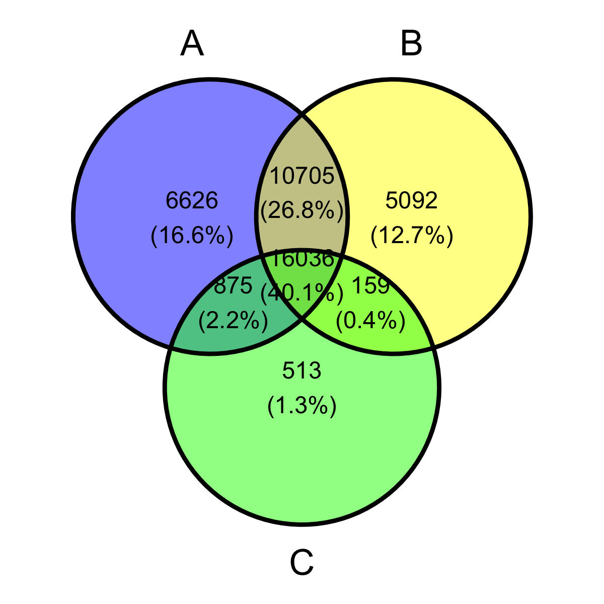
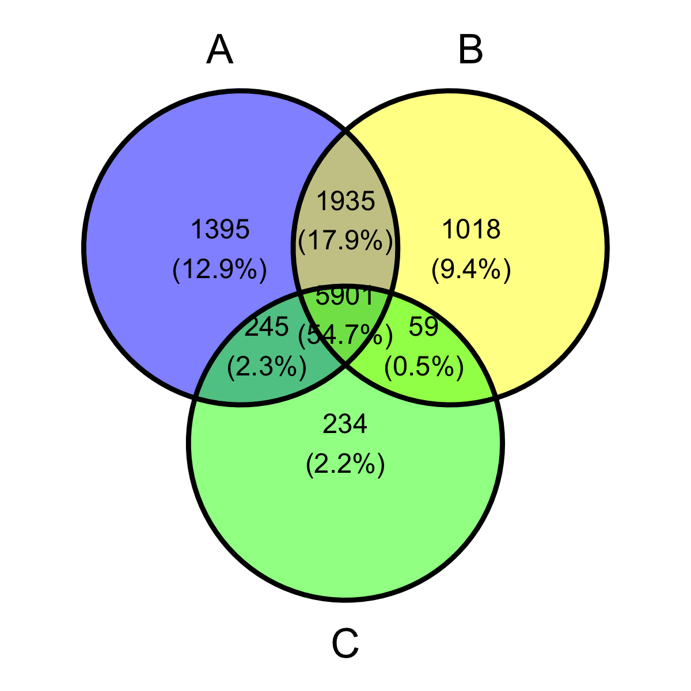
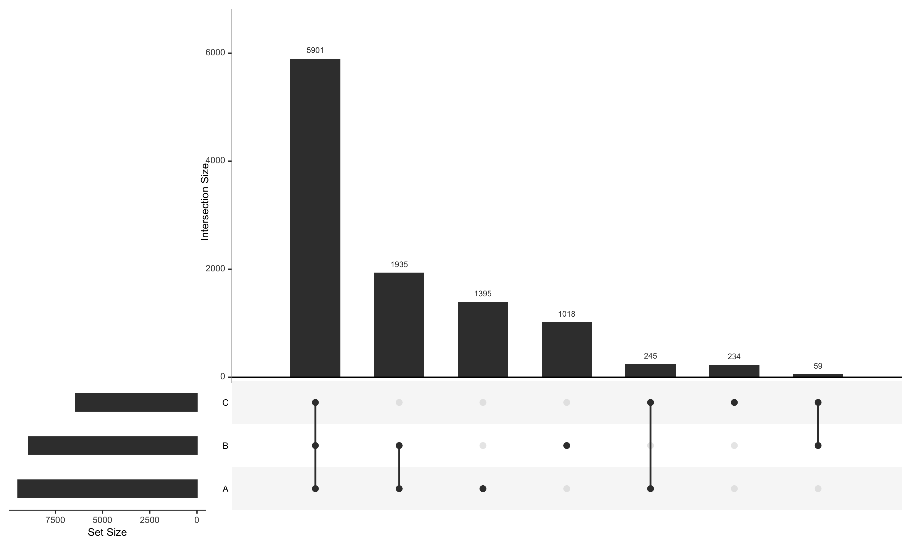
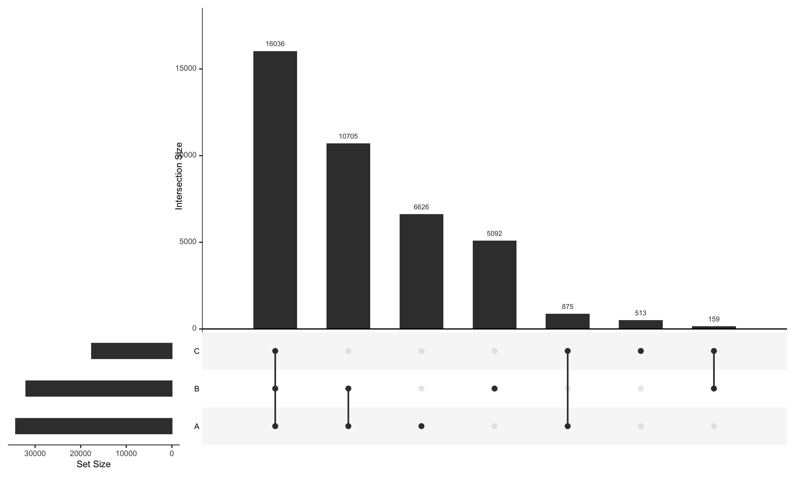
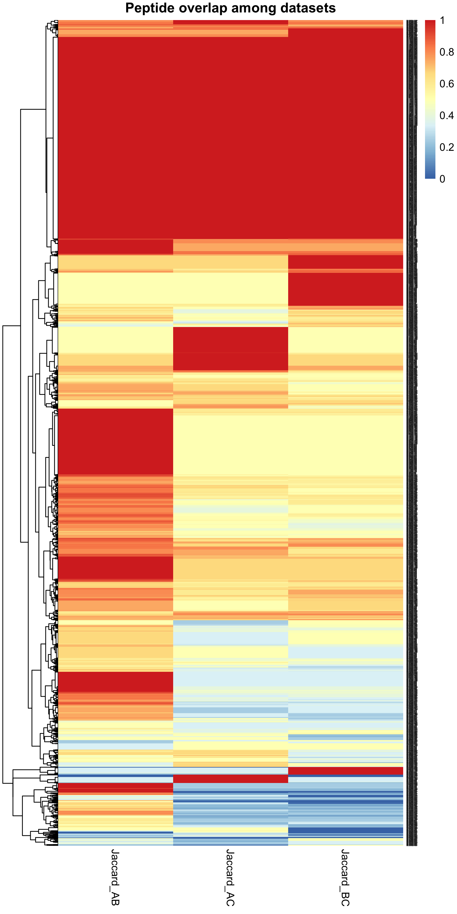

```{r eval=FALSE, message=FALSE, warning=FALSE, include=TRUE}
source("BaseScripts.R")
library(tibble)
library(kableExtra)
library(UpSetR)
#library(corrplot)
#library(clusterProfiler)
#library(enrichplot)

```

# Data formatting
## Create/Organize a metadata sheet
```{r eval=FALSE, message=FALSE, warning=FALSE, include=TRUE}
#extract metadata
#full<-fread('../Data/Keana/proteins_allinfo.csv')
#metadat<-full[full$Protein.Name==full$Protein.Name[1],c(2,4,5,6)]
#metadat<-metadat[!duplicated(metadat$Sample.ID, metadat$Treatment), ]
#write.csv(metadat, "../Data/Keana/metadata.csv", row.names=F)

meta<-read.csv("../Data/Keana/metadata.csv")

# Connect sample IDs to File Names
ids<-read.csv("../Data/Keana/Filename_sample.csv") #69
meta<-merge(ids,meta, by="Sample.ID", all.x=T)

freq<-data.frame(t(table(meta$Sample)))
dups<-freq$Var2[freq$Freq==2]
#H1  HA2 M24 W23 WA1

meta$Sample.ID2<-meta$Sample.ID
for (i in 1:nrow(meta)){
    df<-meta[meta$Sample.ID==dups[i],]
    for (j in 1:nrow(df)){
        meta$Sample.ID2[meta$File.Name==df$File.Name[j]]<-paste0(dups[i],".",j)    
    }
}

# Assign batch numbers to each sample
diaA<-fread("../Data/Keana/setAoct2025.csv") #8675318
#A<-unique(diaA$`File Name`)
diaB<-fread("../Data/Keana/setBoct2025.csv") #3302832
#B<-unique(diaB$`File Name`)
diaC<-fread("../Data/Keana/setCsep2026.csv") #3887379 
#C<-unique(diaC$`File Name`)


meta$Batch<-"A"
meta$Batch[meta$File.Name %in% B]<-"B"
meta$Batch[meta$File.Name %in% C]<-"C"

#write.csv(meta, "../Data/Keana/metadata_full.csv", row.names = F)


```

# Load 3 data sets and insepct
```{r eval=FALSE, message=FALSE, warning=FALSE, include=TRUE}
meta<-read.csv('../Data/Keana/metadata_full.csv') # manually updated the metadata

#Input files A, B, C

# Process each dataset to peptide abundnace 
diaA<-fread("../Data/Keana/setAoct2025.csv") #8675318

colnames(diaA)<-gsub(" ",".",colnames(diaA)) 
diaA<-diaA[!grepl("sp\\|",diaA$Protein.Name),] #8662598
diaA<-diaA[!grepl("gi\\|",diaA$Protein.Name),] #8641538

diaA$Normalized.Area<-as.numeric(diaA$Normalized.Area)
nrow(diaA[is.na(diaA$Normalized.Area),])  #532517

#obs with Q-val = NaN
length(diaA$Detection.Q.Value[is.na(diaA$Detection.Q.Value)])/nrow(diaA)
#0.5572172
range(diaA$Detection.Q.Value, na.rm=T)
# 0.0000 0.01
length(diaA$Detection.Q.Value[diaA$Detection.Q.Value>0.01& !is.na(diaA$Detection.Q.Value)])
#0

#subset the data
dele.tic<-subset(diaA, select=c(File.Name, Protein.Name, Peptide.Modified.Sequence, Normalized.Area))

## remove duplicated lines -> 1 line for each peptide 
dele.tic<-dele.tic[!duplicated(dele.tic[,c('File.Name','Protein.Name','Peptide.Modified.Sequence')]),] 

#attach metadata
dele.tic2<-merge(dele.tic, meta[,c("File.Name","Sample.ID")], by="File.Name", all.x=T) #1027228
names(dele.tic2)[3]<-"Peptide"
dele.tic2<-dele.tic2[,-1]

#reformat the data frame
dele.dfA<-pivot_wider(dele.tic2, names_from=Sample.ID, values_from=Normalized.Area) #34242 obs
deleA<-paste0(dele.dfA$Protein.Name,"_",dele.dfA$Peptide)

A2 <- dele.dfA %>%
  select(Protein.Name, Peptide) %>%
  filter(!is.na(Protein.Name), !is.na(Peptide)) %>%
  distinct() %>%
  mutate(Dataset = "A")
colnames(A2)[1]<-'Protein'


# B 
diaB<-fread("../Data/Keana/setBoct2025.csv") #3302832
colnames(diaB)<-gsub(" ",".",colnames(diaB)) 
diaB<-diaB[!grepl("sp\\|",diaB$Protein.Name),] 
diaB<-diaB[!grepl("gi\\|",diaB$Protein.Name),] #3287892
diaB$Normalized.Area<-as.numeric(diaB$Normalized.Area)
#obs with Q-val = NaN
length(diaB$Detection.Q.Value[is.na(diaB$Detection.Q.Value)])/nrow(diaB)
#0.4926232
range(diaB$Detection.Q.Value, na.rm=T)
# 0.00 0.01
#subset the data
dele.tic<-subset(diaB, select=c(File.Name, Protein.Name, Peptide.Modified.Sequence, Normalized.Area))
## remove duplicated lines -> 1 line for each peptide 
dele.tic<-dele.tic[!duplicated(dele.tic[,c('File.Name','Protein.Name','Peptide.Modified.Sequence')]),] 
#attach metadata
dele.tic2<-merge(dele.tic, meta[,c("File.Name","Sample.ID")], by="File.Name", all.x=T) #282898
names(dele.tic2)[3]<-"Peptide"
dele.tic2<-dele.tic2[,-1]

#reformat the data frame
dele.dfB<-pivot_wider(dele.tic2, names_from=Sample.ID, values_from=Normalized.Area) #31992 obs 10 
deleB<-paste0(dele.dfB$Protein.Name,"_",dele.dfB$Peptide)
B2 <- dele.dfB %>%
  select(Protein.Name, Peptide) %>%
  filter(!is.na(Protein.Name), !is.na(Peptide)) %>%
  distinct() %>%
  mutate(Dataset = "B")
colnames(B2)[1]<-'Protein'

# C
diaC<-fread("../Data/Keana/setCsep2026.csv") #3887379
colnames(diaC)<-gsub(" ",".",colnames(diaC)) 
diaC<-diaC[!grepl("sp\\|",diaC$Protein.Name),] #3882627
diaC<-diaC[!grepl("gi\\|",diaC$Protein.Name),] #3869694
diaC$Normalized.Area<-as.numeric(diaC$Normalized.Area)
#obs with Q-val = NaN
length(diaC$Detection.Q.Value[is.na(diaC$Detection.Q.Value)])/nrow(diaC)
#0.40002
range(diaC$Detection.Q.Value, na.rm=T)
# 0.0000 0.01
#subset the data
dele.tic<-subset(diaC, select=c(File.Name, Protein.Name, Peptide.Modified.Sequence, Normalized.Area))
## remove duplicated lines -> 1 line for each peptide 
dele.tic<-dele.tic[!duplicated(dele.tic[,c('File.Name','Protein.Name','Peptide.Modified.Sequence')]),] 
#attach metadata
dele.tic2<-merge(dele.tic, meta[,c("File.Name","Sample.ID")], by="File.Name", all.x=T) 
names(dele.tic2)[3]<-"Peptide"
dele.tic2<-dele.tic2[,-1]

#reformat the data frame
dele.dfC<-pivot_wider(dele.tic2, names_from=Sample.ID, values_from=Normalized.Area) #17583 obs 27 
deleC<-paste0(dele.dfC$Protein.Name,"_",dele.dfC$Peptide)
C2 <- dele.dfC %>%
  select(Protein.Name, Peptide) %>%
  filter(!is.na(Protein.Name), !is.na(Peptide)) %>%
  distinct() %>%
  mutate(Dataset = "C")
colnames(C2)[1]<-'Protein'


# Any empty rows?
nrow(dele.dfA[apply(dele.dfA, 1, function(x) all(is.na(x))), ])
nrow(dele.dfB[apply(dele.dfB, 1, function(x) all(is.na(x))), ])
nrow(dele.dfC[apply(dele.dfC, 1, function(x) all(is.na(x))), ])

# Summary Table
dele.set<-c("A","B","C")
sum_table<-data.frame(matrix(NA, nrow = 3))
rownames(sum_table)<-dele.set
for (i in 1:3){
    df<-get(paste0("dele.df",dele.set[i]))
    sum_table$N.obs[i]<-nrow(df)
    sum_table$N.peptides[i]<-length(unique(df$Peptide))
    sum_table$N.proteins[i]<-length(unique(df$Protein.Name))
    sum_table$N.samples[i]<-ncol(df)-2
}
sum_table<-sum_table[,-1]
sum_table
write.csv(sum_table,"../Output/Delegance/Sample_info_summary.csv")

#  N.obs N.peptides N.proteins N.samples
#A 34242      34242       9476        30
#B 31992      31992       8913        12
#C 17583      17583       6439        27


library(ggvenn)
peptides <- list(
  A=deleA,
  B=deleB,
  C=deleC
)
{png("../Output/Delegance/Overlapping_peptides_acrossBatches.png", res=300, unit='in',width = 4, heigh=4)
ggvenn(peptides, c("A", "B", "C"))

}
proteins <- list(
  A=unique(dele.dfA$Protein.Name),
  B=unique(dele.dfB$Protein.Name),
  C=unique(dele.dfC$Protein.Name)
)
{png("../Output/Delegance/Overlapping_proteins_acrossBatches.png", res=300, unit='in',width = 4, heigh=4)
ggvenn(proteins, c("A", "B", "C"))
}

```


```{r eval=TRUE, message=FALSE, warning=FALSE, include=TRUE}
sum_table<-read.csv("../Output/Delegance/Sample_info_summary.csv")
colnames(sum_table)[1]<-"Batch"
sum_table %>%
  knitr::kable(
    caption = "Sample information",
    format = "html"
  ) %>%
  kable_styling(
    bootstrap_options = c("striped", "hover", "condensed"),
    full_width = FALSE
  )

```


* Overlapping peptides
{width=51%}


*Overlapping proteins
{width=51%}


## Protein overlap among A, B, and C
```{r eval=FALSE, message=FALSE, warning=FALSE, include=TRUE}

all_data<-data.frame()
for (i in 1:3){
    df<-get(paste0("dele.df",dele.set[i]))
    df2<-df %>%
      select(Protein.Name, Peptide) %>%
        distinct() %>%
        mutate(Dataset = dele.set[i])
    colnames(df2)[1]<-"Protein"
    assign(paste0(dele.set[i],2),df2)
    all_data<-rbind(all_data,df2)
}
#write.csv(all_data, "../Output/Delegance/Protein.presence.check.csv", row.names = F)

protein_presence <- all_data %>%
  dplyr::distinct(Protein, Dataset) %>%
  dplyr::mutate(present = 1L) %>%
  tidyr::pivot_wider(
    id_cols = Protein,
    names_from = Dataset,
    values_from = present,
    values_fill = 0L,
    values_fn = max
  )

# Summary Table
protein_overlap_table <- protein_presence %>%
  dplyr::count(A, B, C, name = "n_proteins") %>%
  dplyr::arrange(desc(n_proteins))
protein_overlap_table <- protein_overlap_table %>%
  mutate(
    overlap = case_when(
      A == 1 & B == 0 & C == 0 ~ "A only",
      A == 0 & B == 1 & C == 0 ~ "B only",
      A == 0 & B == 0 & C == 1 ~ "C only",
      A == 1 & B == 1 & C == 0 ~ "A + B",
      A == 1 & B == 0 & C == 1 ~ "A + C",
      A == 0 & B == 1 & C == 1 ~ "B + C",
      A == 1 & B == 1 & C == 1 ~ "A + B + C"
    )
  ) %>%
  select(overlap, n_proteins, everything())
write.csv(protein_overlap_table, "../Output/Delegance/Protein_overlap_table.csv",row.names = F )
protein_overlap_table
#  overlap   n_proteins     A     B     C
#1 A + B + C       5901     1     1     1
#2 A + B           1935     1     1     0
#3 A only          1395     1     0     0
#4 B only          1018     0     1     0
#5 A + C            245     1     0     1
#6 C only           234     0     0     1
#7 B + C             59     0     1     1

# Present in all three
sum(protein_presence$A &
    protein_presence$B &
    protein_presence$C)
#5901

# A and B, regardless of C
sum(protein_presence$A &
    protein_presence$B)
#7847

# A and B only
sum(protein_presence$A &
    protein_presence$B &
    !protein_presence$C)
#1946

# Unique to A
sum(protein_presence$A &
    !protein_presence$B &
    !protein_presence$C)
#1395

# Proteins at least present in 2 datasets

protAB<-unique(protein_presence$Protein[protein_presence$A==1&protein_presence$B==1])
protBC<-unique(protein_presence$Protein[protein_presence$B==1&protein_presence$C==1])
protAC<-unique(protein_presence$Protein[protein_presence$A==1&protein_presence$C==1])
prots<-unique(c(protAB,protBC,protAC)) #8140

write.csv(prots, "../Output/Delegance/Proteins_2batches_8140.csv")

all_prots<-unique(protein_presence$Protein[protein_presence$A==1&protein_presence$B==1 &protein_presence$C==1 ])
write.csv(all_prots, "../Output/Delegance/Proteins_3batches_5901.csv")


protein_upset <- protein_presence %>%
  dplyr::select(A, B, C) %>%
  dplyr::mutate(
    A = as.integer(A),
    B = as.integer(B),
    C = as.integer(C)
  ) %>%
  as.data.frame()

{png("../Output/Delegance/Protein_overlaps.png", width = 10, height =6, units = "in", res=300 )
UpSetR::upset(
  protein_upset,
  sets = c("A", "B", "C"),
  order.by = "freq"
)
}
```


```{r eval=TRUE, message=FALSE, warning=FALSE, include=TRUE}
protein_overlap_table<-read.csv("../Output/Delegance/Protein_overlap_table.csv")
protein_overlap_table %>%
  knitr::kable(
    caption = "Protein overlap",
    format = "html"
  ) %>%
  kable_styling(
    bootstrap_options = c("striped", "hover", "condensed"),
    full_width = FALSE
  )

```




## Peptide overlap within each protein
```{r eval=FALSE, message=FALSE, warning=FALSE, include=TRUE}
peptide_presence <- all_data %>%
  distinct(Protein, Peptide, Dataset) %>%
  mutate(present = 1L) %>%
  pivot_wider(
    names_from = Dataset,
    values_from = present,
    values_fill = 0L
  )

peptide_overlap_table <- peptide_presence %>%
  dplyr::count(A, B, C, name = "n_peptides") %>%
  dplyr::mutate(
    overlap = case_when(
      A == 1 & B == 0 & C == 0 ~ "A only",
      A == 0 & B == 1 & C == 0 ~ "B only",
      A == 0 & B == 0 & C == 1 ~ "C only",
      A == 1 & B == 1 & C == 0 ~ "A + B",
      A == 1 & B == 0 & C == 1 ~ "A + C",
      A == 0 & B == 1 & C == 1 ~ "B + C",
      A == 1 & B == 1 & C == 1 ~ "A + B + C"
    )
  ) %>%
  select(overlap, n_peptides, everything())

peptide_overlap_table
#  overlap   n_peptides     A     B     C
#1 C only           513     0     0     1
#2 B only          5092     0     1     0
#3 B + C            159     0     1     1
#4 A only          6626     1     0     0
#5 A + C            875     1     0     1
#6 A + B          10705     1     1     0
#7 A + B + C      16036     1     1     1

peptide_list <- list(
  A = unique(A2$Peptide),
  B = unique(B2$Peptide),
  C = unique(C2$Peptide)
)

peptide_upset <- UpSetR::fromList(peptide_list)

{png("../Output/Delegance/Peptide_overlaps.png", width = 10, height =6, units = "in", res=300 )
UpSetR::upset(
  peptide_upset,
  sets = c("A", "B", "C"),
  order.by = "freq"
)
}
```



## Number of peptides supporting each protein
```{r eval=FALSE, message=FALSE, warning=FALSE, include=TRUE}
protein_peptide_counts <- all_data %>%
  group_by(Protein, Dataset) %>%
  summarise(
    n_peptides = n_distinct(Peptide),
    .groups = "drop"
  ) %>%
  pivot_wider(
    names_from = Dataset,
    values_from = n_peptides,
    values_fill = 0,
    names_prefix = "n_"
  )

protein_peptide_counts #first 10 rows

#  Protein            n_A   n_B   n_C
# 1 GOL.000002|m.2      10    10     2
# 2 GOL.000026|m.27      2     1     0
# 3 GOL.000058|m.68      1     1     1
# 4 GOL.000078|m.95      1     1     1
# 5 GOL.000140|m.182     1     0     0
# 6 GOL.000145|m.189     0     1     0
# 7 GOL.000160|m.207     1     0     0
# 8 GOL.000175|m.225     1     0     0
# 9 GOL.000184|m.233     0     1     0
#10 GOL.000266|m.336     7     6     3


compare_protein_peptides <- function(data1, data2,
                                     name1, name2) {
  proteins <- intersect(
    unique(data1$Protein),
    unique(data2$Protein)
  )

  bind_rows(lapply(proteins, function(p) {
    pep1 <- unique(data1$Peptide[data1$Protein == p])
    pep2 <- unique(data2$Peptide[data2$Protein == p])

    shared <- intersect(pep1, pep2)
    total  <- union(pep1, pep2)
    tibble(
      Protein = p,
      Comparison = paste0(name1, "-", name2),

      n_peptides_1 = length(pep1),
      n_peptides_2 = length(pep2),

      n_shared = length(shared),

      n_unique_1 = length(setdiff(pep1, pep2)),
      n_unique_2 = length(setdiff(pep2, pep1)),

      Jaccard = length(shared) / length(total)
    )
  }))
}

AB <- compare_protein_peptides(A2, B2, "A", "B")
AC <- compare_protein_peptides(A2, C2, "A", "C")
BC <- compare_protein_peptides(B2, C2, "B", "C")

protein_peptide_overlap <- bind_rows(AB, AC,BC)
#  Protein          Comparison n_peptides_1 n_peptides_2 n_shared n_unique_1 n_unique_2 Jaccard
# 1 GOL.000002|m.2   A-B                  10           10        9          1          1   0.818
# 2 GOL.000026|m.27  A-B                   2            1        1          1          0   0.5  
# 3 GOL.000058|m.68  A-B                   1            1        1          0          0   1    
# 4 GOL.000078|m.95  A-B                   1            1        1          0          0   1    
# 5 GOL.000266|m.336 A-B                   7            6        6          1          0   0.857
# 6 GOL.000364|m.467 A-B                   1            1        1          0          0   1    
# 7 GOL.000365|m.468 A-B                   2            2        2          0          0   1    
# 8 GOL.000401|m.518 A-B                   2            2        2          0          0   1    
# 9 GOL.000496|m.629 A-B                   1            2        1          0          1   0.5  
#10 GOL.000525|m.672 A-B                   2            2        2          0          0   1 
write.csv(protein_peptide_overlap, "../Output/Delegance/protein_peptide_overlap_batches.csv", row.names = F)


```

## Categorize proteins by peptide agreement
```{r eval=FALSE, message=FALSE, warning=FALSE, include=TRUE}
protein_peptide_overlap <- protein_peptide_overlap %>%
  mutate(
    Peptide_pattern = case_when(
      Jaccard == 0 ~ "No shared peptides",
      Jaccard == 1 ~ "Identical peptide set",
      TRUE ~ "Partial peptide overlap"
    )
  )

write.csv(protein_peptide_overlap, "../Output/Delegance//protein_peptide_overlap.csv", row.names = F)

peptide_pattern_summary <- protein_peptide_overlap %>%
  dplyr::count(Comparison, Peptide_pattern) %>%
  group_by(Comparison) %>%
  dplyr::mutate(
    percent = 100 * n / sum(n)
  ) %>%
  ungroup()

peptide_pattern_summary
#  Comparison Peptide_pattern             n percent
#  <chr>      <chr>                   <int>   <dbl>
#1 A-B        Identical peptide set    3524   45.0 
#2 A-B        No shared peptides        170    2.17
#3 A-B        Partial peptide overlap  4142   52.9 
#4 A-C        Identical peptide set    2018   32.8 
#5 A-C        No shared peptides         68    1.11
#6 A-C        Partial peptide overlap  4060   66.1 
#7 B-C        Identical peptide set    1939   32.5 
#8 B-C        No shared peptides        134    2.25
#9 B-C        Partial peptide overlap  3887   65.2 

write.csv(peptide_pattern_summary,"../Output/Delegance/peptide_pattern_summary.csv",row.names = F)
```

```{r eval=TRUE, message=FALSE, warning=FALSE, include=TRUE}
peptide_pattern_summary<-read.csv("../Output/Delegance/Protein_overlap_table.csv")
peptide_pattern_summary %>%
  knitr::kable(
    caption = "Peptide pattern summary",
    format = "html"
  ) %>%
  kable_styling(
    bootstrap_options = c("striped", "hover", "condensed"),
    full_width = FALSE
  )

```


## Peptide overlap within each protein 
```{r eval=FALSE, message=FALSE, warning=FALSE, include=TRUE}
#proteins detected in both datasets but from completely different peptides
AB_different_peptides <- AB %>%
  filter(n_shared == 0)
#170
AC_different_peptides <- AC %>%
  filter(n_shared == 0)
#68
BC_different_peptides <- BC %>%
  filter(n_shared == 0)
#134

different_peptide_proteins <- protein_peptide_overlap %>%
  filter(n_shared == 0)
length(unique(different_peptide_proteins$Protein))
#303 proteins 

## Should we keep these proteins in or not?
write.csv(different_peptide_proteins,"../Output/Delegance/Proteins_from_different_peptides_across.batches.csv")


#For proteins present in all three datasets, compare peptides similarity between datasets
proteins_ABC <- protein_presence %>%
  filter(A == 1, B == 1, C == 1) %>%
  pull(Protein)

ABC_peptide_summary <- bind_rows(
  lapply(proteins_ABC, function(p) {
    pa <- unique(A2$Peptide[A2$Protein == p])
    pb <- unique(B2$Peptide[B2$Protein == p])
    pc <- unique(C2$Peptide[C2$Protein == p])

    tibble(
      Protein = p,
      n_A = length(pa),
      n_B = length(pb),
      n_C = length(pc),

      shared_AB = length(intersect(pa, pb)),
      shared_AC = length(intersect(pa, pc)),
      shared_BC = length(intersect(pb, pc)),
      shared_ABC =length(Reduce(intersect, list(pa, pb, pc))),
      total_unique_peptides =length(Reduce(union, list(pa, pb, pc))),

      Jaccard_AB =length(intersect(pa, pb)) /length(union(pa, pb)),

      Jaccard_AC =length(intersect(pa, pc)) /length(union(pa, pc)),

      Jaccard_BC =length(intersect(pb, pc)) /length(union(pb, pc))
    )
  })
)

ABC_peptide_summary
write.csv(ABC_peptide_summary, "../Output/Delegance/ABC_Peptide_summary.csv", row.names = F)


ABC_different_peptides <- ABC_peptide_summary %>%
  filter(
    shared_AB == 0,
    shared_AC == 0,
    shared_BC == 0
  )

ABC_different_peptides
# Only 3 proteins have completely different peptides

#   Protein      n_A   n_B   n_C shared_AB shared_AC shared_BC shared_ABC total_unique_peptides
#1 GOL.035029…     2     1     1         0         0         0          0                     4  
#2 GOL.070972…     2     1     1         0         0         0          0                     4    
#3 PAC.058222…     1     1     1         0         0         0          0                     3 


# Heatmap
heatmap_data <- ABC_peptide_summary %>%
  select(
    Protein,
    Jaccard_AB,
    Jaccard_AC,
    Jaccard_BC
  ) %>%
  as.data.frame()

rownames(heatmap_data) <- heatmap_data$Protein
heatmap_data$Protein <- NULL

library(pheatmap)
{png("../Output/Delegance/Peptide_overlap_among_datasets.png", width=6, height =12, units = "in", res=300 )
pheatmap(
  as.matrix(heatmap_data),
  cluster_rows = TRUE,
  cluster_cols = FALSE,
  main = "Peptide overlap among datasets",
  fontsize_row=1
)
}
```



# Look at CV of peptides
```{r eval=FALSE, message=FALSE, warning=FALSE, include=TRUE}
# Peptides that appeared in only one batches
peptide_presence$sum<-rowSums(peptide_presence[,3:5])
peps1<-peptide_presence$Peptide[peptide_presence$sum==1]
peps2<-peptide_presence$Peptide[peptide_presence$sum==2]
peps3<-peptide_presence$Peptide[peptide_presence$sum==3]

# combien 3 datasets    
df_list<-list(dele.dfA,dele.dfB,dele.dfC)
all.df <- df_list %>% 
  purrr::reduce(full_join, by = c("Protein.Name", "Peptide"))

peps1.df<-all.df[all.df$Peptide %in% peps1, ]
peps2.df<-all.df[all.df$Peptide %in% peps2,]
peps3.df<-all.df[all.df$Peptide %in% peps3, ]

# calculate coefficient of variations
peps1.df$cv<-apply(peps1.df[,3:71], 1, function(x) (sd(x, na.rm=T)/mean(as.numeric(x), na.rm=T) *100))
peps2.df$cv<-apply(peps2.df[,3:71], 1, function(x) (sd(x, na.rm=T)/mean(as.numeric(x), na.rm=T) *100))
peps3.df$cv<-apply(peps3.df[,3:71], 1, function(x) (sd(x, na.rm=T)/mean(as.numeric(x), na.rm=T) *100))

mean(peps1.df$cv, na.rm=T)
# 149.5765
mean(peps2.df$cv, na.rm=T)
# 178.4505
mean(peps3.df$cv, na.rm=T)
# 100.3124


# Save a combined data frame
# Use Sample.ID2 (duplicates have different assigned name)
metaA<-meta[meta$Batch=='A',]
colnames(dele.dfA)[3:ncol(dele.dfA)]<-metaA$Sample.ID2[match(names(dele.dfA), metaA$Sample.ID)][3:ncol(dele.dfA)]
metaB<-meta[meta$Batch=='B',]
colnames(dele.dfB)[3:ncol(dele.dfB)]<-metaB$Sample.ID2[match(names(dele.dfB), metaB$Sample.ID)][3:ncol(dele.dfB)]
metaC<-meta[meta$Batch=='C',]
colnames(dele.dfC)[3:ncol(dele.dfC)]<-metaC$Sample.ID2[match(names(dele.dfC), metaC$Sample.ID)][3:ncol(dele.dfC)]

df_list<-list(dele.dfA,dele.dfB,dele.dfC)
all.df <- df_list %>% 
  purrr::reduce(full_join, by = c("Protein.Name", "Peptide"))


## Make sure no spike proteins/contaminants
df1<-all.df[!grepl("^PAC.*",all.df$Protein.Name),]
df1<-df1[!grepl("^GOL",df1$Protein.Name),]

# data check showed 1 NM_000039 -remove it
all.df<-all.df[!grepl('NM_000039', all.df$Protein.Name),]
write.csv(all.df,"../Output/Delegance/Dele_combined_raw.csv", row.names=F)

## See how 
no.overlaps<-all.df[all.df$Protein.Name %in%different_peptide_proteins$Protein, ]
no.overlaps<-no.overlaps[order(no.overlaps$Protein.Name),]

write.csv(no.overlaps,"../Output/Delegance/Proteins_no.overlapping.peptides.csv", row.names = F)

```


