```{r eval=FALSE, message=FALSE, warning=FALSE, include=TRUE}
source("BaseScripts.R")
library(limma) 
library(tidyr)
require(data.table)
library(vegan)
library(QFeatures)
library(WGCNA)
library(patchwork)
library(NormalyzerDE)
library(tibble)
library(corrplot)
library(clusterProfiler)
library(enrichplot)
```


# Read the pooled data and metadata 
```{r eval=FALSE, message=FALSE, warning=FALSE, include=TRUE}
meta<-read.csv("../Data/Keana/metadata_full.csv")

freq<-data.frame(t(table(meta$Sample.ID)))
dups<-freq$Var2[freq$Freq==2]
#H1  HA2 M24 W23 WA1


# Read the combined data processed in #0.ExploreData
dele.df<-read.csv("../Output/Delegance/Dele_combined_raw.csv") #40005 peptides

```


# All Proteins/ All Samples
## Read the data into QFetures
```{r eval=FALSE, message=FALSE, warning=FALSE, include=TRUE}

# Duplilcated samples are currently processed as separate samples
abundance<-colnames(dele.df[3:ncol(dele.df)]) #69

de_qf <- readQFeatures(dele.df,
                       ecol = abundance,
                       name = "raw")
de_qf[[1]]

## Add sample info as colData to QFeatures object
de_qf$label <- abundance
de_qf$sample <- abundance

# assign treatment info
de_qf$condition <- meta$Treatment[match(abundance, meta$Sample.ID2)]

## Verify
colData(de_qf)
#DataFrame with 30 rows and 3 columns

## Assign the colData to first assay as well
colData(de_qf[["raw"]]) <- colData(de_qf)


## Find out how many peptides are in the data
de_qf[["raw"]] %>%
dim()
# 40005    69

original_peps <- de_qf[["raw"]] %>%
rowData() %>%
as_tibble() %>%
pull(Peptide) %>%
unique() %>%
length() %>%
as.numeric()

original_prots <- de_qf[["raw"]] %>%
    rowData() %>%
    as_tibble() %>%
    pull(Protein.Name) %>%
    unique() %>%
    length() %>%
    as.numeric()
print(c(original_peps, original_prots))
#[1] 40005 10786

```


## Assess the missing values (At a peptide level)
```{r eval=FALSE, message=FALSE, warning=FALSE, include=TRUE}
# Missing values

assessNAs<-de_qf[["raw"]] %>%
    nNA()
assessNAs
#        nNA       pNA
#1   1136541  0.411739


cna<-data.frame(assessNAs$nNAcols)
rna<-data.frame(assessNAs$nNArows)
cna<-merge(cna, meta[,c('Sample.ID2','Treatment','Batch')], by.x='name',by.y="Sample.ID2")
cna<-cna[order(cna$name),]
cna<-cna[order(cna$Treatment),]
cna$name<-factor(cna$name, levels=cna$name)

batch_cols<-c("A"='red','B'='blue','C'='orange')
batch_cols<- cna %>%
  distinct(name, Treatment,Batch) %>%
  arrange(name,Treatment) %>% # Matches default alphabetical factor ordering
  mutate(color = batch_cols[Batch]) %>%
  pull(color)

ggplot(cna,aes(x = name, y = pNA*100, group = Treatment, fill = Treatment)) +
    geom_bar(stat = "identity", position = "dodge") +
    labs(x = "Sample", y = "Missing values (%)") +
    theme_bw()+
    theme(axis.text.x = element_text(angle=90))+
    theme(axis.text.x=element_text(color=batch_cols))
ggsave("../Output/Delegance/Dele_missing.proportions_allsets_batch_allproteins.png", width = 10,height = 5, dpi=300)

# A23, W23.1 A17 have >75% missing at a peptide level
```

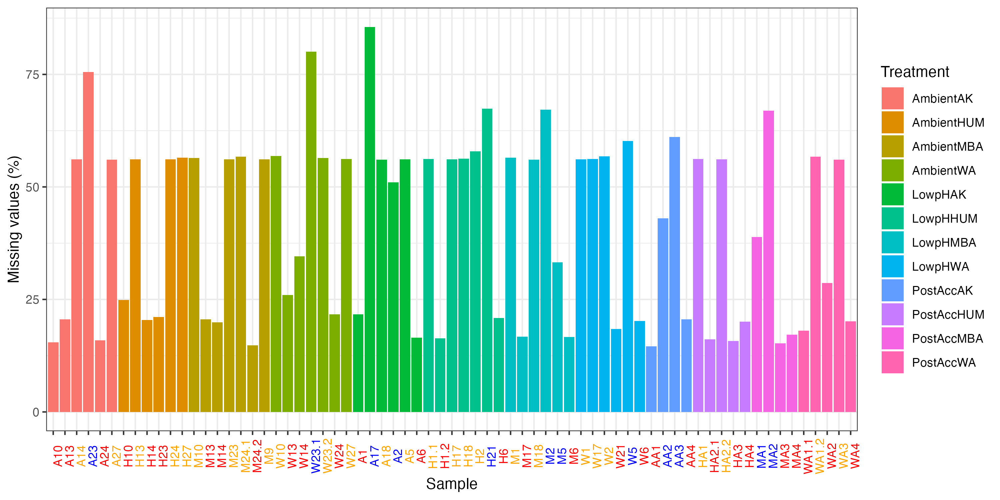

## Remove too many missing peptides
```{r eval=FALSE, message=FALSE, warning=FALSE, include=TRUE}
# Retained peptide list
pep<-data.frame(assay(de_qf[["raw"]]))
pep$Protein.Name<-dele.df$Protein.Name
pep$Peptide<-dele.df$Peptide


rna$Protein.Name<-dele.df$Protein.Name
rna$Peptide<-dele.df$Peptide
{png("../Output/Delegance/Histgram_missing_peptides_proportion.png", width = 6, height =4.5, units = "in", res=300 )
hist(rna$pNA)
}
# How many peptides will be removed? 
nrow(rna[rna$pNA>0.80,]) 
#5859
nrow(rna[rna$pNA>0.9,])
#5006


## Starting with removing >90% missing peptides 
de_qf <- de_qf %>%
    filterNA(pNA = 0.9,
    i = "raw")

deqf_final <- de_qf[["raw"]] %>%
nrow() %>%
as.numeric()
#34999 peptides

pep<-merge(pep, rna[,2:5], by=c('Protein.Name','Peptide'))
pep_0.8filtered<-pep[pep$pNA<0.9,] 

# Asess the missing value proportiaons again

# Missing values
assessNAs<-de_qf[["raw"]] %>%
    nNA()
assessNAs
#        nNA       pNA
#1   802465  0.332293

cna<-data.frame(assessNAs$nNAcols)
cna<-merge(cna, meta[,c('Sample.ID2','Treatment','Batch')], by.x='name',by.y="Sample.ID2")
cna<-cna[order(cna$name),]
cna<-cna[order(cna$Treatment),]
cna$name<-factor(cna$name, levels=cna$name)
batch_cols<-c("A"='red','B'='blue','C'='orange')
batch_cols<- cna %>%
  distinct(name, Treatment,Batch) %>%
  arrange(name,Treatment) %>% # Matches default alphabetical factor ordering
  mutate(color = batch_cols[Batch]) %>%
  pull(color)

ggplot(cna,aes(x = name, y = pNA*100, group = Treatment, fill = Treatment)) +
    geom_bar(stat = "identity", position = "dodge") +
    labs(x = "Sample", y = "Missing values (%)") +
    theme_bw()+
    theme(axis.text.x = element_text(angle=90))+
    theme(axis.text.x=element_text(color=batch_cols))
ggsave("../Output/Delegance/Dele_missing.proportions_allsets_batch_allproteins0.9.png", width = 10,height = 5, dpi=300)

# A23, W23.1 A17 have >75% missing at a peptide level
```

* After removing peptides missing in >90% of samples
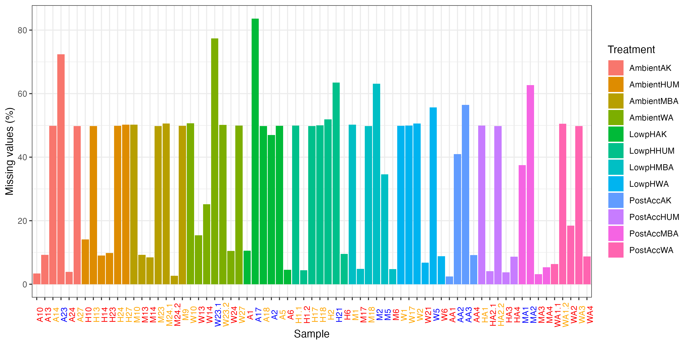

## Log transformation of quantitative data & aggregate into proteins

```{r eval=FALSE, message=FALSE, warning=FALSE, include=TRUE}
de_qf <- logTransform(object = de_qf,
    base = 2,
    i = "raw", pc=1,
    name = "log_peptides")
de_qf
# [1] raw: SummarizedExperiment with 34999 rows and 69 columns 
# [2] log_peptides: SummarizedExperiment with 34999 rows and 69 columns 


x <- assay(de_qf[["log_peptides"]])

# Each peptide appers in in how many samples?
dim(x)
sum(is.na(x))
colSums(is.na(x))
table(rowSums(!is.na(x)))
## 69 peptides in 7 samples only, 70 peptides in 8 samples only


# Check the number of peptides per protein
rd<-dele.df[,1:2]
table(table(rd$Protein.Name))
#   1    2    3    4    5    6    7    8    9   10   11   12   13   14   15   16   17   18 
#4791 1724 1059  708  520  427  291  234  165  139  105  107   79   66   41   40   42   37 
#  19   20   21   22   23   24   25   26   27   28   29   30   31   32   33   34   35   36 
#  25   16   17   18   15   13   12    9    5    5    8    5    2    3    5    4    5    3 
#  37   38   39   40   41   42   44   45   46   48   49   51   54   57   62   65   66   68 
#   4    2    3    2    1    3    3    2    2    1    1    1    1    1    1    1    1    1 
#  87   93   98  109  111  115  117  159  228 
#   1    1    1    2    1    1    1    1    1 

###  4791 proteins are represented by only 1 peptide  ###


## Aggregate peptides to protein
de_qf <- aggregateFeatures(de_qf,
        i = "log_peptides",
        fcol = "Protein.Name",
        name = "log_proteins",
        fun = MsCoreUtils::robustSummary,
        na.rm = TRUE)
de_qf
# [1] raw: SummarizedExperiment with 34999 rows and 69 columns 
# [2] log_peptides: SummarizedExperiment with 34999 rows and 69 columns 
# [3] log_proteins: SummarizedExperiment with 9804 rows and 69 columns 


dt1<-assay(de_qf[["log_proteins"]])
range(dt1, na.rm = T)
# -14.85109  70.86251
write.csv(dt1, "../Output/Delegance/Dele_proteins_matrix_log2transformed_full.csv")


#check data quickly for normal distribution
dt1.t<-as.data.frame(t(dt1))
df_tidy<-gather(dt1.t)

ggplot(df_tidy, aes(x=log(value))) +
  geom_density()
ggsave("../Output/Delegance/QC_Dele_data_check.png", width = 4, height = 3, dpi=300)

```
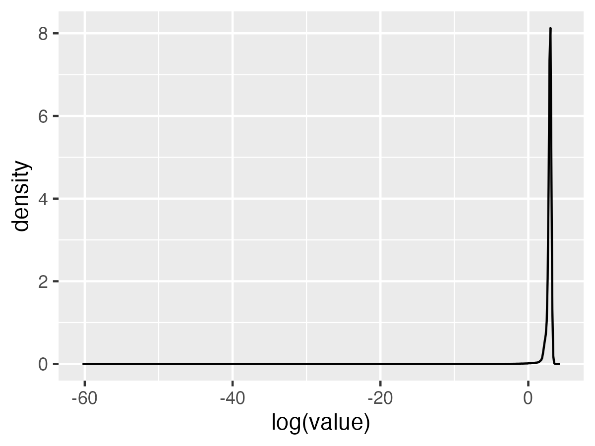


## See if colSums or medianPolish produces better aggregation results

```{r eval=FALSE, message=FALSE, warning=FALSE, include=TRUE}
de_qf <- aggregateFeatures(de_qf,
        i = "log_peptides",
        fcol = "Protein.Name",
        name = "log_proteins2",
        fun = base::colSums,
        na.rm = TRUE)
dt2<-assay(de_qf[["log_proteins2"]])
range(dt2, na.rm = T)
#[1]    0.000 4674.476

de_qf <- aggregateFeatures(de_qf,
        i = "log_peptides",
        fcol = "Protein.Name",
        name = "log_proteins3",
        fun = MsCoreUtils::medianPolish,
        na.rm = TRUE)

dt3<-assay(de_qf[["log_proteins3"]])
range(dt3, na.rm = T)
#[1] -22.02817  43.63552

```


## Normalization of quantitative data -find the best method
```{r eval=FALSE, message=FALSE, warning=FALSE, include=TRUE}
d_qf <- aggregateFeatures(de_qf,
            i = "raw",
            fcol = "Protein.Name",
            name = "proteins_direct",
            fun = base::colSums,
            na.rm = TRUE)

## Generate normalyzer report
normalyzer(jobName = "normalyzer_Dele",
            experimentObj = d_qf[["proteins_direct"]],
            sampleColName = "sample",
            groupColName = "condition",
            outputDir = ".")

# all look good. Stick to center.median

## normalize the log transformed peptide data by the 'center median' method
# robustSummary
de_qf <- normalize(de_qf,
    i = "log_proteins",
    name = "log_norm_proteins",
    method = "center.median")


de_qf <- normalize(de_qf,
    i = "log_proteins2",
    name = "log_norm_proteins2",
    method = "center.median")

de_qf <- normalize(de_qf,
    i = "log_proteins3",
    name = "log_norm_proteins3",
    method = "center.median")


# visulaize normalization
pre<-data.frame(assay(de_qf[["log_proteins"]]))
pre2<-data.frame(assay(de_qf[["log_proteins2"]]))
pre3<-data.frame(assay(de_qf[["log_proteins3"]]))

prem<-reshape2::melt(pre)
prem2<-reshape2::melt(pre2)
prem3<-reshape2::melt(pre3)

colnames(prem)<-c("Sample","log2")
colnames(prem2)<-c("Sample","log2")
colnames(prem3)<-c("Sample","log2")

prem<-merge(prem, meta[,c("Sample.ID2","Treatment")], by.x="Sample",by.y="Sample.ID2")
prem2<-merge(prem2, meta[,c("Sample.ID2","Treatment")], by.x="Sample",by.y="Sample.ID2")
prem3<-merge(prem3, meta[,c("Sample.ID2","Treatment")], by.x="Sample",by.y="Sample.ID2")

pre_norm<-ggplot(prem,aes(x = Sample, y = log2, fill = Treatment)) +
    geom_boxplot(outlier.color = "grey50",outlier.size = 0.3, alpha = 0.7) +
    labs(x = "Sample", y = "log2(abundance)", title = "Pre-normalization-robustSummary") +
    theme_bw()+theme(axis.text.x = element_text(angle=90))
pre_norm2<-ggplot(prem2,aes(x = Sample, y = log2, fill = Treatment)) +
    geom_boxplot(outlier.color = "grey50",outlier.size = 0.3, alpha = 0.7) +
    labs(x = "Sample", y = "log2(abundance)", title = "Pre-normalization-colSums") +
    theme_bw()+theme(axis.text.x = element_text(angle=90))+
    ylim(0,300)
pre_norm3<-ggplot(prem3,aes(x = Sample, y = log2, fill = Treatment)) +
    geom_boxplot(outlier.color = "grey50",outlier.size = 0.3, alpha = 0.7) +
    labs(x = "Sample", y = "log2(abundance)", title = "Pre-normalization-medianPolish") +
    theme_bw()+theme(axis.text.x = element_text(angle=90))
 
post1<-data.frame(assay(de_qf[["log_norm_proteins"]]))
postm1<-reshape2::melt(post1)
colnames(postm1)<-c("Sample","log2")
postm1<-merge(postm1, meta[,c("Sample.ID2","Treatment")], by.x="Sample",by.y="Sample.ID2")

post2<-data.frame(assay(de_qf[["log_norm_proteins2"]]))
postm2<-reshape2::melt(post2)
colnames(postm2)<-c("Sample","log2")
postm2<-merge(postm2, meta[,c("Sample.ID2","Treatment")], by.x="Sample",by.y="Sample.ID2")

post3<-data.frame(assay(de_qf[["log_norm_proteins3"]]))
postm3<-reshape2::melt(post3)
colnames(postm3)<-c("Sample","log2")
postm3<-merge(postm3, meta[,c("Sample.ID2","Treatment")], by.x="Sample",by.y="Sample.ID2")

post_norm1 <- ggplot(postm1,aes(x = Sample, y = log2, fill = Treatment)) +
    geom_boxplot(outlier.color = "grey50",outlier.size = 0.3, alpha = 0.7) +
    #ylim(-15,15)+
    labs(x = "Sample", y = "log2(abundance)", title = "Post-normalization1") +
    theme_bw()+theme(axis.text.x = element_text(angle=90))

post_norm2 <- ggplot(postm2,aes(x = Sample, y = log2, fill = Treatment)) +
    geom_boxplot(outlier.color = "grey50",outlier.size = 0.3, alpha = 0.7) +
    labs(x = "Sample", y = "log2(abundance)", title = "Post-normalization2") +
    theme_bw()+theme(axis.text.x = element_text(angle=90))+
    ylim(0,300)

post_norm3 <- ggplot(postm3,aes(x = Sample, y = log2, fill = Treatment)) +
    geom_boxplot(outlier.color = "grey50",outlier.size = 0.3, alpha = 0.7) +
    labs(x = "Sample", y = "log2(abundance)", title = "Post-normalization2") +
    theme_bw()+theme(axis.text.x = element_text(angle=90))


(pre_norm + theme(legend.position = "none")) +
post_norm1 & plot_layout(guides = "collect")
ggsave("../Output/Delegance/QC_Dele1_pre_post_normalization_robustSummary.png", width = 12, height = 4, unit="in", dpi=300)

(pre_norm2 + theme(legend.position = "none")) +
post_norm2 & plot_layout(guides = "collect")
ggsave("../Output/Delegance/QC_Dele1_pre_post_normalization_colSums.png", width = 12, height = 4, unit="in", dpi=300)

(pre_norm3 + theme(legend.position = "none")) +
post_norm3 & plot_layout(guides = "collect")
ggsave("../Output/Delegance/QC_Dele1_pre_post_normalization_medianPolish.png", width = 12, height = 4, unit="in", dpi=300)

```

* robustSummary
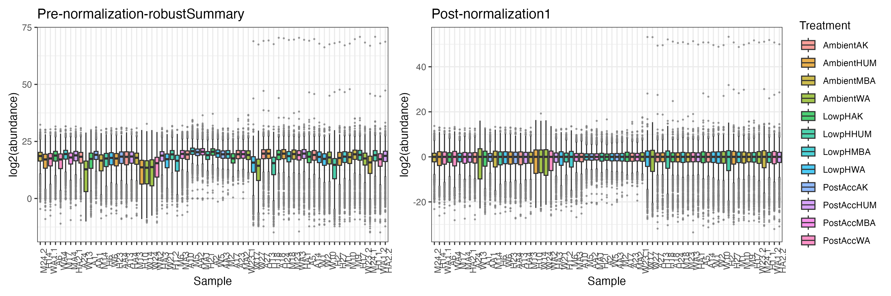


* colSums
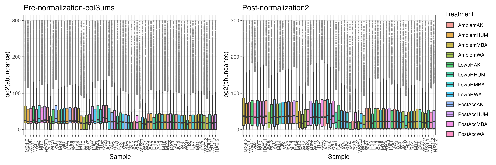


* medianPolish
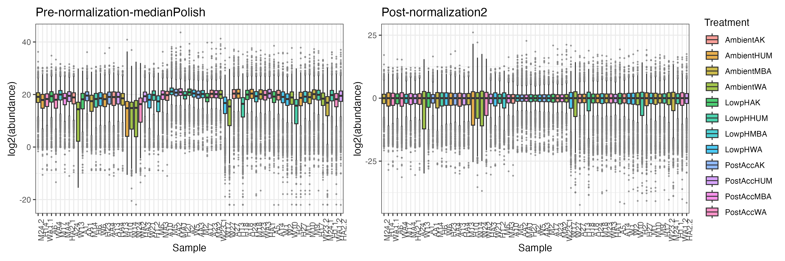


## Visualize the effects of normalization
```{r eval=FALSE, message=FALSE, warning=FALSE, include=TRUE}
{png("../Output/Delegance/QC_normalization_visualize1_robustSummary1.png", width = 10, height =5, units = "in", res=300 )
par(mfrow = c(1, 3))
de_qf[["raw"]] %>%
    assay() %>%
    plotDensities(legend = "topright",
    main = "Raw data")
de_qf[["log_peptides"]] %>%
    assay() %>%
    plotDensities(legend = FALSE,
    main = "log2(abundace)")
de_qf[["log_norm_proteins"]] %>%
    assay() %>%
    plotDensities(legend = FALSE,
    main = "log2(norm proteins)")
dev.off()}


{png("../Output/Delegance/QC_normalization_visualize1_colSums.png", width = 10, height =5, units = "in", res=300 )
par(mfrow = c(1, 3))
de_qf[["raw"]] %>%
    assay() %>%
    plotDensities(legend = "topright",
    main = "Raw data")
de_qf[["log_peptides"]] %>%
    assay() %>%
    plotDensities(legend = FALSE,
    main = "log2(abundace)")
de_qf[["log_norm_proteins2"]] %>%
    assay() %>%
    plotDensities(legend = FALSE,
    main = "log2(norm proteins)")
dev.off()}
```

* robustSummary results
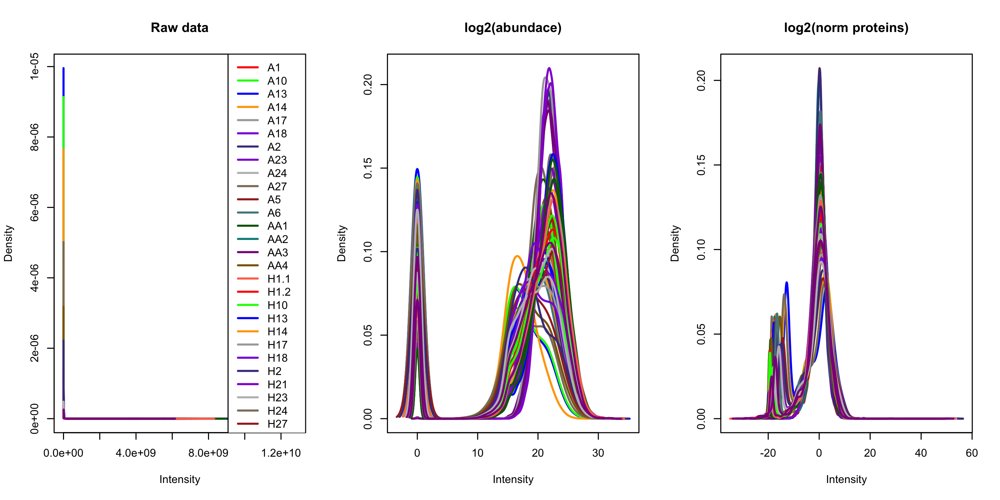

* colSums results
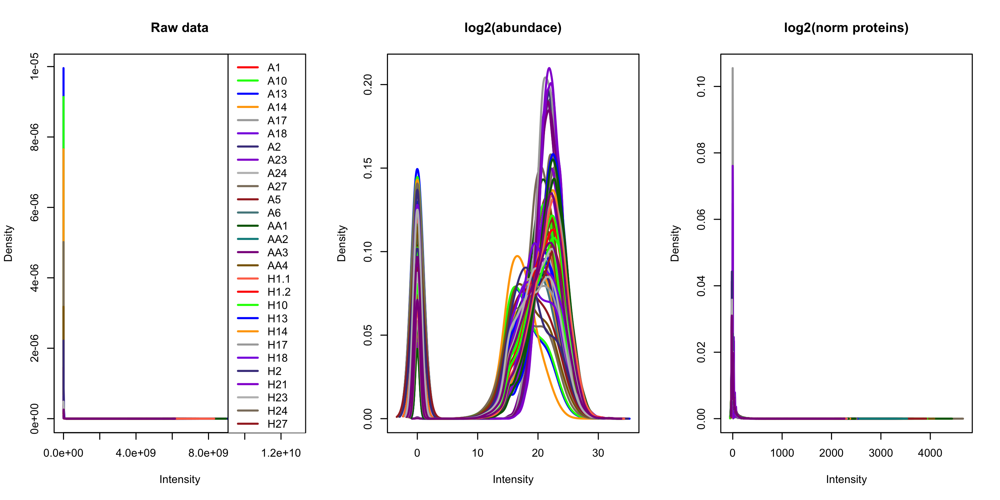


## Export the data.fram for LIMMA analysis
```{r eval=FALSE, message=FALSE, warning=FALSE, include=TRUE}

write.csv(post1, "../Output/Delegance/Dele1_center.median.norm_robustSummary.csv")
write.csv(post2, "../Output/Delegance/Dele1_center.median.norm_colSums.csv")
write.csv(post3, "../Output/Delegance/Dele1_center.median.norm_medianPolish.csv")

```


## correlation matrix
```{r eval=FALSE, message=FALSE, warning=FALSE, include=TRUE}

## Convert TMT CP protein assay into a dataframe
prot_df <-de_qf[["log_norm_proteins"]] %>%
            assay() %>%
            as.data.frame()

#reorder the samples based on Treatment
treats<-unique(meta$Treatment)
treats<-treats[order(treats)]

meta<-meta[order(meta$Treatment),]

prot_df<-prot_df[,meta$Sample.ID2] 


## Calculate a correlation matrix between samples
corr_matrix <- cor(prot_df,
        method = "pearson",
        use = "pairwise.complete.obs")
print(corr_matrix)
#write.csv(corr_matrix,"../Output/Delegance/Correlation_matrix_all_samples.csv") 

#Check the same samples

prot_df %>%
    ggplot(aes(x =W23.1, y =W23.2)) +
        geom_point(colour = "grey45", size = 0.5) +
        geom_abline(intercept = 0, slope = 1) +
        theme(panel.grid.major = element_blank(),
        panel.grid.minor = element_blank(),
        plot.background = element_rect(fill = "white"),
        panel.background = element_rect(fill = "white"),
        axis.title.x = element_text(size = 15, vjust = -2),
        axis.title.y = element_text(size = 15, vjust = 3),
        axis.text.x = element_text(size = 12, vjust = -1),
        axis.text.y = element_text(size = 12),
        axis.line = element_line(linewidth = 0.5, colour = "black"),
        plot.margin = margin(10, 10, 10, 10))+
        labs(x = "log2(abundance) W23.1", y = "log2(abundance) W23.2") +
        coord_fixed(ratio = 1)
ggsave("../Output/Delegance/Dele1.correlation.W23.png", width = 5, height = 5, units = 'in', dpi=300)

prot_df %>%
    ggplot(aes(x =H1.1, y =H1.2)) +
        geom_point(colour = "grey45", size = 0.5) +
        geom_abline(intercept = 0, slope = 1) +
        theme(panel.grid.major = element_blank(),
        panel.grid.minor = element_blank(),
        plot.background = element_rect(fill = "white"),
        panel.background = element_rect(fill = "white"),
        axis.title.x = element_text(size = 15, vjust = -2),
        axis.title.y = element_text(size = 15, vjust = 3),
        axis.text.x = element_text(size = 12, vjust = -1),
        axis.text.y = element_text(size = 12),
        axis.line = element_line(linewidth = 0.5, colour = "black"),
        plot.margin = margin(10, 10, 10, 10))+
        labs(x = "log2(abundance) H1.1", y = "log2(abundance) H1.2") +
        coord_fixed(ratio = 1)
ggsave("../Output/Delegance/Dele1.correlation.H1.png", width = 5, height = 5, units = 'in', dpi=300)


## Create colour palette for continuum
col <- colorRampPalette(c("#BB4444", "#EE9988", "#FFFFFF","#99CCFF","#000099"))
{png("../Output/Delegance/QC_correlation_matrix_robustSummary1.png", width = 20, height = 20, units="in", res=300 )
prot_df %>%
        cor(method = "pearson",
        use = "pairwise.complete.obs") %>%
        corrplot(method = "color",
        col = col(200),
        type = "upper",
        addCoef.col = "white",
        diag = FALSE,
        tl.col = "black",
        tl.srt = 45,
        outline = TRUE)
dev.off()}

# Washington Only
wa<-meta$Sample.ID2[meta$Site=="WA"]
wa<-wa[!is.na(wa)]
prot_df2<-prot_df[,wa]
{png("../Output/Delegance/QC_sample_correlation_matrix_WA_robustSummary1.png", width = 20, height = 20, units="in", res=300 )
prot_df2 %>%
        cor(method = "pearson",
        use = "pairwise.complete.obs") %>%
        corrplot(method = "color",
        col = col(200),
        type = "upper",
        addCoef.col = "white",
        diag = FALSE,
        tl.col = "black",
        tl.srt = 45,
        outline = TRUE)
dev.off()}


```

* Correlation between H1.1 & H1.2 
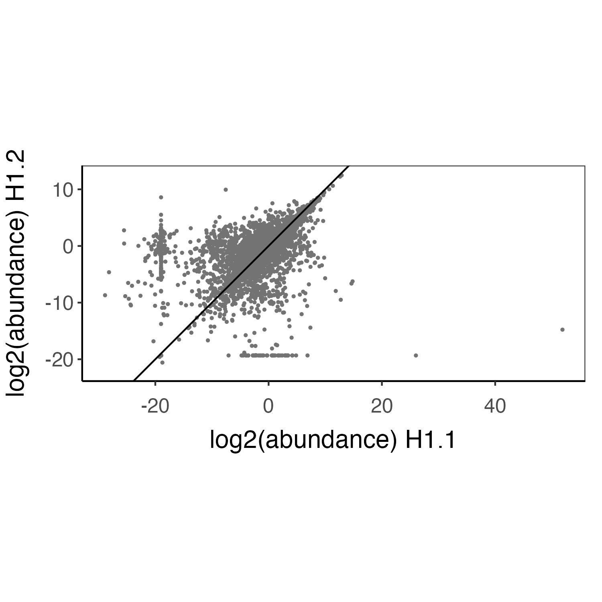
* Correlation between W23.1 & W23.2 

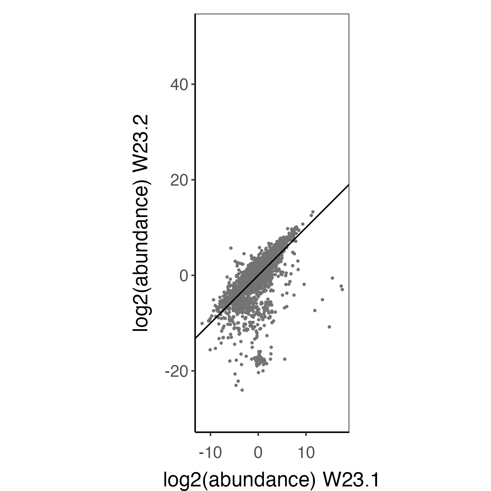


# Correlation matrix
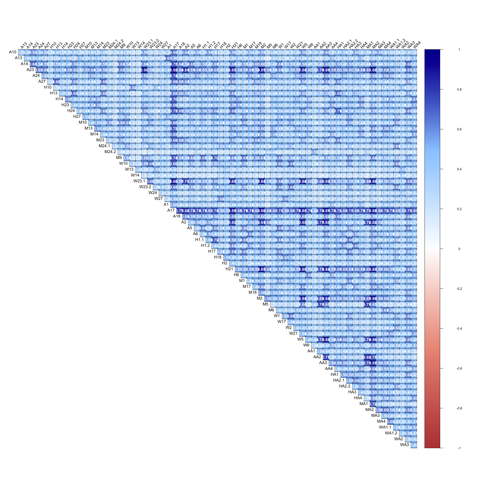


* WA samples only
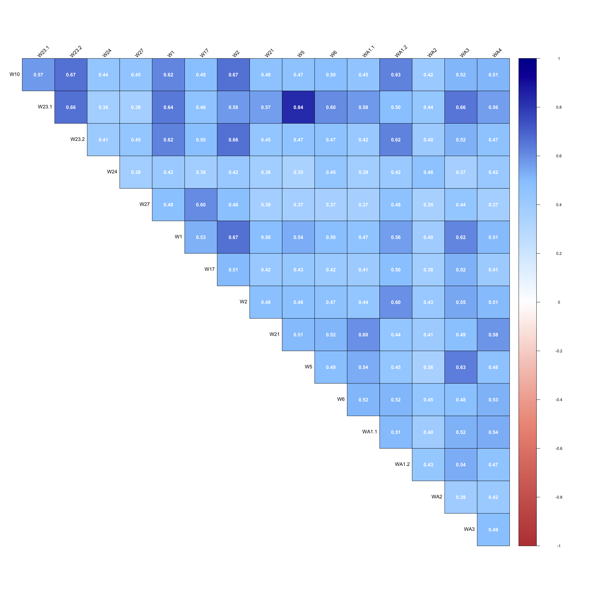


# Filter proteins and samples

## Remove 3 samples with too many missing data Data
```{r eval=FALSE, message=FALSE, warning=FALSE, include=TRUE}

remove<-c('A23', 'W23.1' ,'A17')
dele.df2<-dele.df[,!(colnames(dele.df) %in% remove)]

#remove empty rows
dele.df2<-dele.df2[rowSums(is.na(dele.df2)) < 66, ] #39974

# Duplilcated samples are currently processed as separate samples
abundance<-colnames(dele.df2[3:ncol(dele.df2)]) #66

de_qf2 <- readQFeatures(dele.df2,
                       ecol = abundance,
                       name = "raw")
de_qf2[[1]]

## Add sample info as colData to QFeatures object
de_qf2$label <- abundance
de_qf2$sample <- abundance

# assign treatment info
de_qf2$condition <- meta$Treatment[match(abundance, meta$Sample.ID2)]

## Verify
colData(de_qf2)
#DataFrame with 66 rows and 3 columns

## Assign the colData to first assay as well
colData(de_qf2[["raw"]]) <- colData(de_qf2)

## Find out how many peptides are in the data
original_peps <- de_qf[["raw"]] %>%
rowData() %>%
as_tibble() %>%
pull(Peptide) %>%
unique() %>%
length() %>%
as.numeric()

original_prots <- de_qf[["raw"]] %>%
    rowData() %>%
    as_tibble() %>%
    pull(Protein.Name) %>%
    unique() %>%
    length() %>%
    as.numeric()
print(c(original_peps, original_prots))
#[1] 34999 9804

```


## Assess the missing values (At a peptide level)
```{r eval=FALSE, message=FALSE, warning=FALSE, include=TRUE}
# Missing values

assessNAs<-de_qf2[["raw"]] %>%
    nNA()
assessNAs
#        nNA       pNA
#1   1038028  0.393448

cna<-data.frame(assessNAs$nNAcols)
rna<-data.frame(assessNAs$nNArows)
cna<-merge(cna, meta[,c('Sample.ID2','Treatment','Batch')], by.x='name',by.y="Sample.ID2")
cna<-cna[order(cna$name),]
cna<-cna[order(cna$Treatment),]
cna$name<-factor(cna$name, levels=cna$name)

batch_cols<-c("A"='red','B'='blue','C'='orange')
batch_cols<- cna %>%
  distinct(name, Treatment,Batch) %>%
  arrange(name,Treatment) %>% # Matches default alphabetical factor ordering
  mutate(color = batch_cols[Batch]) %>%
  pull(color)

ggplot(cna,aes(x = name, y = pNA*100, group = Treatment, fill = Treatment)) +
    geom_bar(stat = "identity", position = "dodge") +
    labs(x = "Sample", y = "Missing values (%)") +
    theme_bw()+
    theme(axis.text.x = element_text(angle=90))+
    theme(axis.text.x=element_text(color=batch_cols))
ggsave("../Output/Delegance/Dele_missing.proportions_allsets_batch_allproteins_remove3samples.png", width = 10,height = 5, dpi=300)


```


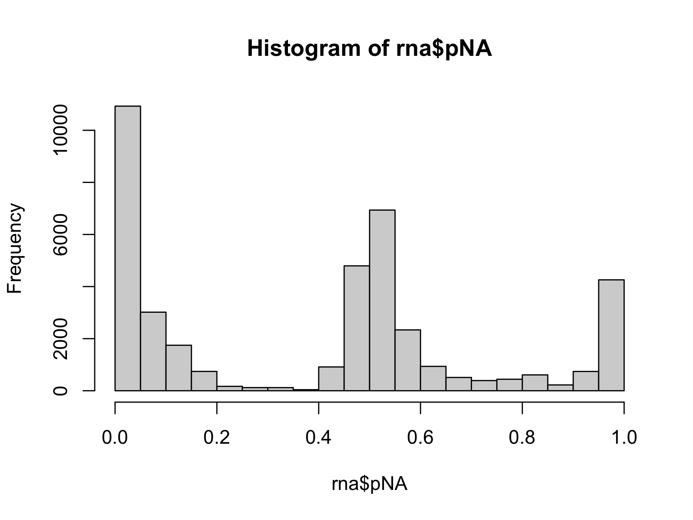

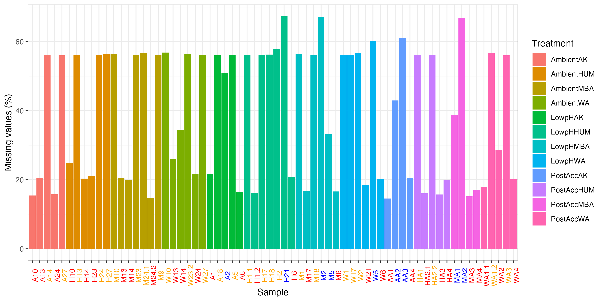

## Remove too many missing peptides
```{r eval=FALSE, message=FALSE, warning=FALSE, include=TRUE}
# Retained peptide list
pep<-data.frame(assay(de_qf2[["raw"]]))
pep$Protein.Name<-dele.df2$Protein.Name
pep$Peptide<-dele.df2$Peptide

rna$Protein.Name<-dele.df2$Protein.Name
rna$Peptide<-dele.df2$Peptide
{png("../Output/Delegance/Histgram_missing_peptides_proportion_remove3samples.png", width = 6, height =4.5, units = "in", res=300 )
hist(rna$pNA)
}
# How many peptides will be removed?
nrow(rna[rna$pNA>0.80,]) 
#5830
nrow(rna[rna$pNA>0.9,])
#5998


## Remove peptides missing in >80% of samples 
de_qf2 <- de_qf2 %>%
    filterNA(pNA = 0.8,
    i = "raw")

deqf_final <- de_qf2[["raw"]] %>%
nrow() %>%
as.numeric()
#34976 peptides (0.9)
#34144 (0.8)

#pep<-merge(pep, rna[,2:5], by=c('Protein.Name','Peptide'))
#pep_0.9filtered<-pep[pep$pNA<0.9,] #34976

# Asess the missing value proportions again

# Missing values
assessNAs<-de_qf2[["raw"]] %>%
    nNA()
assessNAs
#        nNA       pNA
#1    719398  0.311641 90%
#1    673332  0.298793 80%

cna<-data.frame(assessNAs$nNAcols)
cna<-merge(cna, meta[,c('Sample.ID2','Treatment','Batch')], by.x='name',by.y="Sample.ID2")
cna<-cna[order(cna$name),]
cna<-cna[order(cna$Treatment),]
cna$name<-factor(cna$name, levels=cna$name)
batch_cols<-c("A"='red','B'='blue','C'='orange')
batch_cols<- cna %>%
  distinct(name, Treatment,Batch) %>%
  arrange(name,Treatment) %>% # Matches default alphabetical factor ordering
  mutate(color = batch_cols[Batch]) %>%
  pull(color)
ggplot(cna,aes(x = name, y = pNA*100, group = Treatment, fill = Treatment)) +
    geom_bar(stat = "identity", position = "dodge") +
    labs(x = "Sample", y = "Missing values (%)") +
    theme_bw()+
    theme(axis.text.x = element_text(angle=90))+
    theme(axis.text.x=element_text(color=batch_cols))
ggsave("../Output/Delegance/Dele_missing.proportions1-3_batch_allproteins0.8.png", width = 10,height = 5, dpi=300)

```


* Removing 3 samples and >80% missing peptides
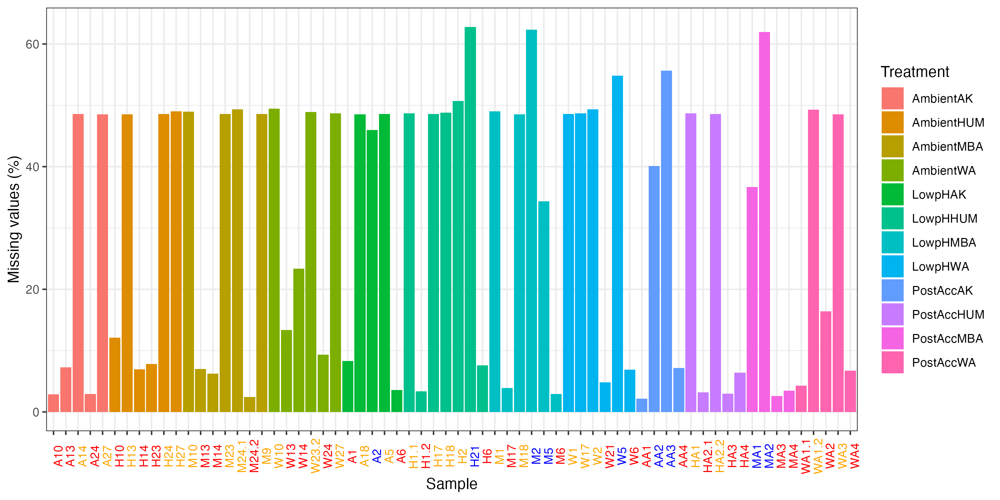


## Log transformation of quantitative data & aggregate into proteins

```{r eval=FALSE, message=FALSE, warning=FALSE, include=TRUE}
de_qf2 <- logTransform(object = de_qf2,
    base = 2,
    i = "raw", pc=1,
    name = "log_peptides")
de_qf2


x <- assay(de_qf2[["log_peptides"]])

# Each peptide appers in in how many samples?
dim(x)
sum(is.na(x))
colSums(is.na(x))
table(rowSums(!is.na(x)))

# Check number of peptides per protein
rd<-dele.df[,1:2]
table(table(rd$Protein.Name))


## Aggregate peptides to protein
de_qf2 <- aggregateFeatures(de_qf2,
        i = "log_peptides",
        fcol = "Protein.Name",
        name = "log_proteins",
        fun = MsCoreUtils::robustSummary,
        na.rm = TRUE)
de_qf2
#[1] raw: SummarizedExperiment with 34976 rows and 66 columns 
#[2] log_peptides: SummarizedExperiment with 34976 rows and 66 columns 
#[3] log_proteins: SummarizedExperiment with 9799 rows and 66 columns 

dt1<-assay(de_qf[["log_proteins"]])
range(dt1, na.rm = T)
# -14.85109  70.86251
write.csv(dt1, "../Output/Delegance/Dele1-3_proteins_matrix_log2transformed_full.csv")

#check data quickly for normal distribution
dt1.t<-as.data.frame(t(dt1))
df_tidy<-gather(dt1.t)

ggplot(df_tidy, aes(x=log(value))) +
  geom_density()

```


## Normalization of quantitative data
```{r eval=FALSE, message=FALSE, warning=FALSE, include=TRUE}

## normalize the log transformed peptide data by the 'center median' method
# robustSummary
de_qf2 <- normalize(de_qf2,
    i = "log_proteins",
    name = "log_norm_proteins",
    method = "center.median")

# visulaize normalization
pre<-data.frame(assay(de_qf[["log_proteins"]]))
prem<-reshape2::melt(pre)
colnames(prem)<-c("Sample","log2")
prem<-merge(prem, meta[,c("Sample.ID2","Treatment")], by.x="Sample",by.y="Sample.ID2")
pre_norm<-ggplot(prem,aes(x = Sample, y = log2, fill = Treatment)) +
    geom_boxplot(outlier.color = "grey50",outlier.size = 0.3, alpha = 0.7) +
    labs(x = "Sample", y = "log2(abundance)", title = "Pre-normalization-robustSummary") +
    theme_bw()+theme(axis.text.x = element_text(angle=90))

post1<-data.frame(assay(de_qf[["log_norm_proteins"]]))
postm1<-reshape2::melt(post1)
colnames(postm1)<-c("Sample","log2")
postm1<-merge(postm1, meta[,c("Sample.ID2","Treatment")], by.x="Sample",by.y="Sample.ID2")
post_norm1 <- ggplot(postm1,aes(x = Sample, y = log2, fill = Treatment)) +
    geom_boxplot(outlier.color = "grey50",outlier.size = 0.3, alpha = 0.7) +
    #ylim(-15,15)+
    labs(x = "Sample", y = "log2(abundance)", title = "Post-normalization1") +
    theme_bw()+theme(axis.text.x = element_text(angle=90))

(pre_norm + theme(legend.position = "none")) +
post_norm1 & plot_layout(guides = "collect")
ggsave("../Output/Delegance/QC_Dele1-3_pre_post_normalization_robustSummary.png", width = 12, height = 4, unit="in", dpi=300)

```

* robustSummary


## Export the data.fram for LIMMA analysis
```{r eval=FALSE, message=FALSE, warning=FALSE, include=TRUE}

write.csv(post1, "../Output/Delegance/Dele1-3_center.median.norm_robustSummary.csv")

```


