```{r eval=FALSE, message=FALSE, warning=FALSE, include=TRUE}
source("BaseScripts.R")
library(limma) 
library(tidyr)
require(data.table)
library(vegan)
library(QFeatures)
library(WGCNA)
library(patchwork)
library(NormalyzerDE)
library(tibble)
library(corrplot)
library(clusterProfiler)
library(enrichplot)
```

# Read the data files
* Use proteins appeared in at least 2 datasets or in all 3 datasets
```{r eval=FALSE, message=FALSE, warning=FALSE, include=TRUE}
meta<-read.csv("../Data/Keana/metadata_full.csv")

# Read the combined data processed in #0.ExploreData
dele.df<-read.csv("../Output/Delegance/Dele_combined_raw.csv") #40005 peptides

#Remove 3 samples with too many missing peptides
remove<-c('A23', 'W23.1' ,'A17')
dele.df2<-dele.df[,!(colnames(dele.df) %in% remove)]


## Set of porteins appeared across batches
prots<-read.csv('../Output/Delegance/Proteins_2batches_8140.csv', row.names = 1)
all_prots<-read.csv('../Output/Delegance/Proteins_3batches_5901.csv', row.names = 1)

dele2<-dele.df2[dele.df2$Protein.Name %in% prots$x,]

dele3<-dele.df2[dele.df2$Protein.Name %in% all_prots$x,]

```


# 8140 proteins (appeared at least in 2 datasets)
## Read the data into QFetures
```{r eval=FALSE, message=FALSE, warning=FALSE, include=TRUE}
abundance2<-colnames(dele2[3:ncol(dele2)]) #66

de_qf2 <- readQFeatures(dele2,
                       ecol = abundance2,
                       name = "raw")
de_qf2[[1]]

## Add sample info as colData to QFeatures object
de_qf2$label <- abundance2
de_qf2$sample <- abundance2

# Create condition info for X1-X3?
de_qf2$condition <- meta$Treatment[match(abundance2, meta$Sample.ID2)]

## Verify
colData(de_qf2)
#DataFrame with 69 rows and 3 columns

## Assign the colData to first assay as well
colData(de_qf2[["raw"]]) <- colData(de_qf2)


## Find out how many peptides are in the data
de_qf2[["raw"]] %>%
dim()
# 37128   66

original_peps <- de_qf2[["raw"]] %>%
rowData() %>%
as_tibble() %>%
pull(Peptide) %>%
unique() %>%
length() %>%
as.numeric()

original_prots <- de_qf2[["raw"]] %>%
    rowData() %>%
    as_tibble() %>%
    pull(Protein.Name) %>%
    unique() %>%
    length() %>%
    as.numeric()
print(c(original_peps, original_prots))
#[1] 37128  8140

```


## Assess the missing values (At a peptide level)
```{r eval=FALSE, message=FALSE, warning=FALSE, include=TRUE}
# Missing values
assessNAs<-de_qf2[["raw"]] %>%
    nNA()
assessNAs
#        nNA       pNA
#1    903215  0.368592


cna<-data.frame(assessNAs$nNAcols)
rna<-data.frame(assessNAs$nNArows)
cna<-merge(cna, meta[,c('Sample.ID2','Treatment','Batch')], by.x='name',by.y="Sample.ID2")
cna<-cna[order(cna$name),]
cna<-cna[order(cna$Treatment),]
cna$name<-factor(cna$name, levels=cna$name)

batch_cols<-c("A"='red','B'='blue','C'='orange')
batch_cols<- cna %>%
  distinct(name, Treatment,Batch) %>%
  arrange(name,Treatment) %>% # Matches default alphabetical factor ordering
  mutate(color = batch_cols[Batch]) %>%
  pull(color)


ggplot(cna,aes(x = name, y = pNA*100, group = Treatment, fill = Treatment)) +
    geom_bar(stat = "identity", position = "dodge") +
    labs(x = "Sample", y = "Missing values (%)") +
    theme_bw()+
    theme(axis.text.x = element_text(angle=90))+
    theme(axis.text.x=element_text(color=batch_cols))
ggsave("../Output/Delegance/Dele_missing.proportions_8140prots.png", width = 10,height = 5, dpi=300)
```

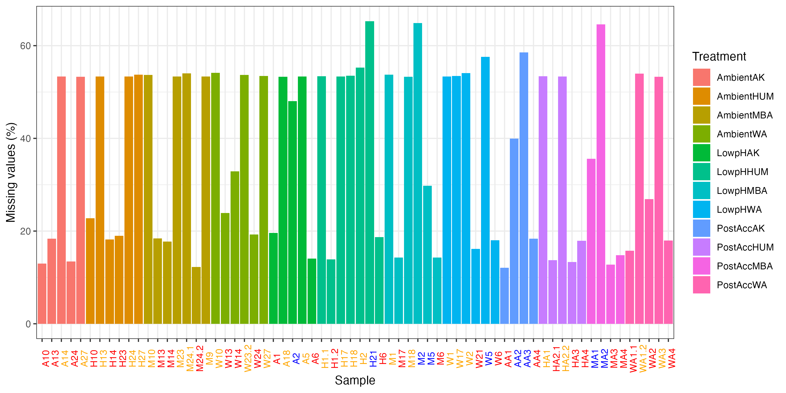


## Remove too many missing peptides
```{r eval=FALSE, message=FALSE, warning=FALSE, include=TRUE}
# Retained peptide list
pep2<-data.frame(assay(de_qf2[["raw"]]))
pep2$Protein.Name<-dele2$Protein.Name
pep2$Peptide<-dele2$Peptide


rna$Protein.Name<-dele2$Protein.Name
rna$Peptide<-dele2$Peptide
hist(rna$pNA)

# Remove Peptides that are missing in many samples 
nrow(rna[rna$pNA>0.90,])
#3947
nrow(rna[rna$pNA>0.80,]) # Missing in >85 % (55 samples out of 69 missing)
#4726
nrow(rna[rna$pNA>0.7,])
#5530


## Start with >80% missing peptides for comparison 
# Save de_qf2 for later analysis
de_qf2.90<-de_qf2

de_qf2 <- de_qf2 %>%
    filterNA(pNA = 0.8,
    i = "raw")

deqf2_final <- de_qf2[["raw"]] %>%
nrow() %>%
as.numeric()
#32402 peptides

#pep2_0.8<-merge(pep2, rna[,2:5], by=c('Protein.Name','Peptide'))
#pep2_0.8filtered<-pep2_0.8[pep2_0.8$pNA<0.8,] 

```

## Log transformation of quantitative data & aggregate into proteins
```{r eval=FALSE, message=FALSE, warning=FALSE, include=TRUE}
de_qf2 <- logTransform(object = de_qf2,
    base = 2,
    i = "raw", pc=1,
    name = "log_peptides")
de_qf2
# [1] raw: SummarizedExperiment with 32402 rows and 66 columns 
# [2] log_peptides: SummarizedExperiment with 32402 rows and 66 columns

 
# replace Nan with NA
assay(de_qf2[["log_peptides"]]) %>%
is.nan() %>%
table()
#deqf2_final*66
#no NaN

x <- assay(de_qf2[["log_peptides"]])
colSums(is.na(x))
table(rowSums(!is.na(x)))

# Check number of peptides per protein
rd<-dele2[,1:2]
table(table(rd$Protein.Name))
#   1    2    3    4    5    6    7    8    9   10   11   12   13   14   15   16   17   18   19   20 
#2337 1562 1037  701  519  427  291  234  165  139  105  107   79   66   41   40   42   37   25   16 
#  21   22   23   24   25   26   27   28   29   30   31   32   33   34   35   36   37   38   39   40 
#  17   18   15   13   12    9    5    5    8    5    2    3    5    4    5    3    4    2    3    2 
#  41   42   44   45   46   48   49   51   54   57   62   65   66   68   87   93   98  109  111  115 
#   1    3    3    2    2    1    1    1    1    1    1    1    1    1    1    1    1    2    1    1 
# 117  159  228 
#   1    1    1 
#2337 proteins are represented by only 1 peptide 

## Aggregate peptides to protein
de_qf2<- aggregateFeatures(de_qf2,
        i = "log_peptides",
        fcol = "Protein.Name",
        name = "log_proteins",
        fun = MsCoreUtils::robustSummary,
        na.rm = TRUE)
de_qf2
#

dt1<-assay(de_qf2[["log_proteins"]])
range(dt1, na.rm = T)
# -62.41910  95.36013
write.csv(dt1, "../Output/Delegance/Dele_proteins_matrix_log2transformed_2overlaps.csv")


#check data quickly for normal distribution
dt1.t<-as.data.frame(t(dt1))
df_tidy<-gather(dt1.t)

ggplot(df_tidy, aes(x=log(value))) +
  geom_density()
ggsave("../Output/Delegance/QC_Dele_data_check2.png", width = 4, height = 3, dpi=300)

```
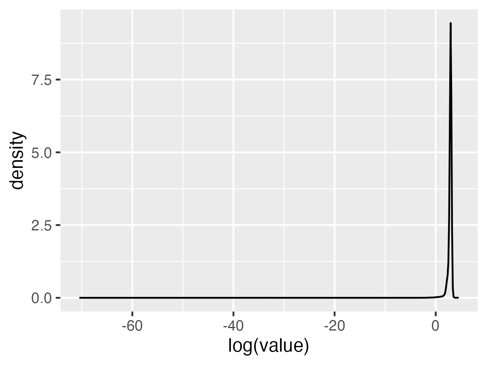


## See if colSums or medianPolish produces better aggregation results

```{r eval=FALSE, message=FALSE, warning=FALSE, include=TRUE}
de_qf2 <- aggregateFeatures(de_qf2,
        i = "log_peptides",
        fcol = "Protein.Name",
        name = "log_proteins2",
        fun = base::colSums,
        na.rm = TRUE)
dt2<-assay(de_qf2[["log_proteins2"]])
range(dt2, na.rm = T)
#[1]   0.000 4654.787

de_qf2 <- aggregateFeatures(de_qf2,
        i = "log_peptides",
        fcol = "Protein.Name",
        name = "log_proteins3",
        fun = MsCoreUtils::medianPolish,
        na.rm = TRUE)

dt3<-assay(de_qf2[["log_proteins3"]])
range(dt3, na.rm = T)
#[1] -21.96166  43.63552

```


## Normalization of quantitative data -find the best method
```{r eval=FALSE, message=FALSE, warning=FALSE, include=TRUE}
de_qf2 <- aggregateFeatures(de_qf2,
            i = "raw",
            fcol = "Protein.Name",
            name = "proteins_direct",
            fun = base::colSums,
            na.rm = TRUE)

## Generate normalyzer report
normalyzer(jobName = "normalyzer_Dele2",
            experimentObj = de_qf2[["proteins_direct"]],
            sampleColName = "sample",
            groupColName = "condition",
            outputDir = ".")


## normalize the log transformed peptide data by the 'center median' method
# robustSummary
de_qf2 <- normalize(de_qf2,
    i = "log_proteins",
    name = "log_norm_proteins",
    method = "center.median")


de_qf2 <- normalize(de_qf2,
    i = "log_proteins2",
    name = "log_norm_proteins2",
    method = "center.median")

de_qf2 <- normalize(de_qf2,
    i = "log_proteins3",
    name = "log_norm_proteins3",
    method = "center.median")


# visulaize normalization
pre<- data.frame(assay(de_qf2[["log_proteins"]]))
pre2<-data.frame(assay(de_qf2[["log_proteins2"]]))
pre3<-data.frame(assay(de_qf2[["log_proteins3"]]))

prem<-reshape2::melt(pre)
prem2<-reshape2::melt(pre2)
prem3<-reshape2::melt(pre3)

colnames(prem)<-c("Sample","log2")
colnames(prem2)<-c("Sample","log2")
colnames(prem3)<-c("Sample","log2")

prem<-merge(prem, meta[,c("Sample.ID2","Treatment")], by.x="Sample",by.y="Sample.ID2")
prem2<-merge(prem2, meta[,c("Sample.ID2","Treatment")], by.x="Sample",by.y="Sample.ID2")
prem3<-merge(prem3, meta[,c("Sample.ID2","Treatment")], by.x="Sample",by.y="Sample.ID2")

pre_norm<-ggplot(prem,aes(x = Sample, y = log2, fill = Treatment)) +
    geom_boxplot(outlier.color = "grey50",outlier.size = 0.3, alpha = 0.7) +
    labs(x = "Sample", y = "log2(abundance)", title = "Pre-normalization-robustSummary") +
    theme_bw()+theme(axis.text.x = element_text(angle=90))
pre_norm2<-ggplot(prem2,aes(x = Sample, y = log2, fill = Treatment)) +
    geom_boxplot(outlier.color = "grey50",outlier.size = 0.3, alpha = 0.7) +
    labs(x = "Sample", y = "log2(abundance)", title = "Pre-normalization-colSums") +
    theme_bw()+theme(axis.text.x = element_text(angle=90))+
    ylim(0,300)
pre_norm3<-ggplot(prem3,aes(x = Sample, y = log2, fill = Treatment)) +
    geom_boxplot(outlier.color = "grey50",outlier.size = 0.3, alpha = 0.7) +
    labs(x = "Sample", y = "log2(abundance)", title = "Pre-normalization-medianPolish") +
    theme_bw()+theme(axis.text.x = element_text(angle=90))
 
post1<-data.frame(assay(de_qf2[["log_norm_proteins"]]))
postm1<-reshape2::melt(post1)
colnames(postm1)<-c("Sample","log2")
postm1<-merge(postm1, meta[,c("Sample.ID2","Treatment")], by.x="Sample",by.y="Sample.ID2")

post2<-data.frame(assay(de_qf2[["log_norm_proteins2"]]))
postm2<-reshape2::melt(post2)
colnames(postm2)<-c("Sample","log2")
postm2<-merge(postm2, meta[,c("Sample.ID2","Treatment")], by.x="Sample",by.y="Sample.ID2")

post3<-data.frame(assay(de_qf2[["log_norm_proteins3"]]))
postm3<-reshape2::melt(post3)
colnames(postm3)<-c("Sample","log2")
postm3<-merge(postm3, meta[,c("Sample.ID2","Treatment")], by.x="Sample",by.y="Sample.ID2")

post_norm1 <- ggplot(postm1,aes(x = Sample, y = log2, fill = Treatment)) +
    geom_boxplot(outlier.color = "grey50",outlier.size = 0.3, alpha = 0.7) +
    #ylim(-15,15)+
    labs(x = "Sample", y = "log2(abundance)", title = "Post-normalization1") +
    theme_bw()+theme(axis.text.x = element_text(angle=90))

post_norm2 <- ggplot(postm2,aes(x = Sample, y = log2, fill = Treatment)) +
    geom_boxplot(outlier.color = "grey50",outlier.size = 0.3, alpha = 0.7) +
    labs(x = "Sample", y = "log2(abundance)", title = "Post-normalization2") +
    theme_bw()+theme(axis.text.x = element_text(angle=90))+
    ylim(0,300)

post_norm3 <- ggplot(postm3,aes(x = Sample, y = log2, fill = Treatment)) +
    geom_boxplot(outlier.color = "grey50",outlier.size = 0.3, alpha = 0.7) +
    labs(x = "Sample", y = "log2(abundance)", title = "Post-normalization2") +
    theme_bw()+theme(axis.text.x = element_text(angle=90))


(pre_norm + theme(legend.position = "none")) +
post_norm1 & plot_layout(guides = "collect")
ggsave("../Output/Delegance/QC_Dele2_pre_post_normalization_robustSummary.png", width = 12, height = 4, unit="in", dpi=300)

(pre_norm2 + theme(legend.position = "none")) +
post_norm2 & plot_layout(guides = "collect")
ggsave("../Output/Delegance/QC_Dele2_pre_post_normalization_colSums.png", width = 12, height = 4, unit="in", dpi=300)

(pre_norm3 + theme(legend.position = "none")) +
post_norm3 & plot_layout(guides = "collect")
ggsave("../Output/Delegance/QC_Dele2_pre_post_normalization_medianPolish.png", width = 12, height = 4, unit="in", dpi=300)

```

* robustSummary
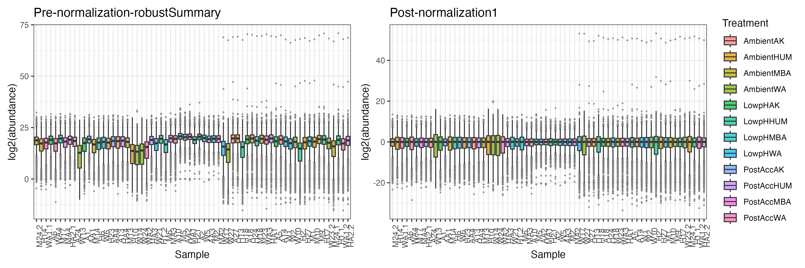


* colSums
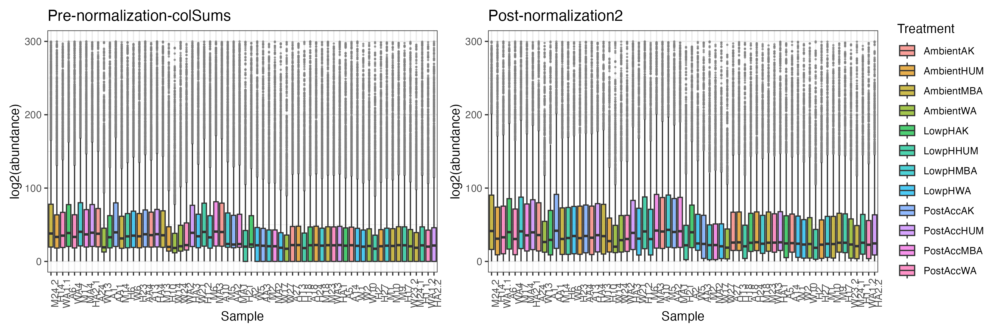


* medianPolish
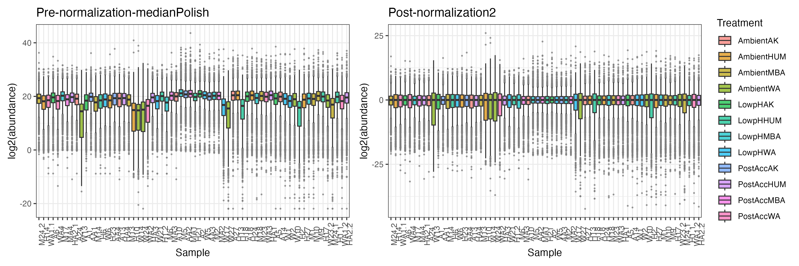


## Visualize the effects of normalization
```{r eval=FALSE, message=FALSE, warning=FALSE, include=TRUE}
{png("../Output/Delegance/QC_normalization_visualize2_robustSummary.png", width = 10, height =5, units = "in", res=300 )
par(mfrow = c(1, 3))
de_qf2[["raw"]] %>%
    assay() %>%
    plotDensities(legend = "topright",
    main = "Raw data")
de_qf2[["log_peptides"]] %>%
    assay() %>%
    plotDensities(legend = FALSE,
    main = "log2(abundace)")
de_qf2[["log_norm_proteins"]] %>%
    assay() %>%
    plotDensities(legend = FALSE,
    main = "log2(norm proteins)")
dev.off()}


{png("../Output/Delegance/QC_normalization_visualize2_colSums.png", width = 10, height =5, units = "in", res=300 )
par(mfrow = c(1, 3))
de_qf2[["raw"]] %>%
    assay() %>%
    plotDensities(legend = "topright",
    main = "Raw data")
de_qf2[["log_peptides"]] %>%
    assay() %>%
    plotDensities(legend = FALSE,
    main = "log2(abundace)")
de_qf2[["log_norm_proteins2"]] %>%
    assay() %>%
    plotDensities(legend = FALSE,
    main = "log2(norm proteins)")
dev.off()}
```

* robustSummary results
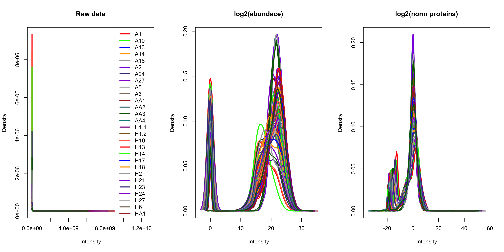

* colSums results
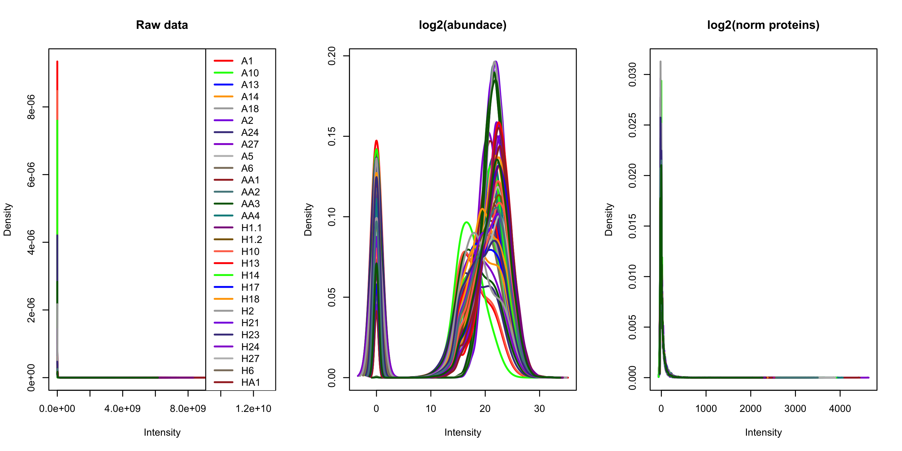


## Export the data.fram for LIMMA analysis
```{r eval=FALSE, message=FALSE, warning=FALSE, include=TRUE}

write.csv(post1, "../Output/Delegance/Dele2_center.median.norm_robustSummary.csv")
write.csv(post2, "../Output/Delegance/Dele2_center.median.norm_colSums.csv")
write.csv(post3, "../Output/Delegance/Dele2_center.median.norm_medianPolish.csv")

```


## Remove >90% missing peptides for comparison (robustSummary onlt)
```{r eval=FALSE, message=FALSE, warning=FALSE, include=TRUE}
de_qf2.90<- de_qf2.90 %>%
    filterNA(pNA = 0.9,
    i = "raw")

deqf2.90_final <- de_qf2.90[["raw"]] %>%
nrow() %>%
as.numeric()
#33181 peptides

# Log transformation of quantitative data & aggregate into proteins
de_qf2.90 <- logTransform(object = de_qf2.90,
    base = 2,
    i = "raw", pc=1,
    name = "log_peptides")

## Aggregate peptides to protein
de_qf2.90<- aggregateFeatures(de_qf2.90,
        i = "log_peptides",
        fcol = "Protein.Name",
        name = "log_proteins",
        fun = MsCoreUtils::robustSummary,
        na.rm = TRUE)
de_qf2.90
# [1] raw: SummarizedExperiment with 33181 rows and 66 columns 
# [2] log_peptides: SummarizedExperiment with 33181 rows and 66 columns 
# [3] log_proteins: SummarizedExperiment with 8139 rows and 66 columns 

dt1.90<-assay(de_qf2.90[["log_proteins"]])
range(dt1.90, na.rm = T)
# -15.26915  70.86251
write.csv(dt1.90, "../Output/Delegance/Dele_proteins_matrix_log2transformed_2overlaps_90p.csv")

# normalization
de_qf2.90 <- normalize(de_qf2.90,
    i = "log_proteins",
    name = "log_norm_proteins",
    method = "center.median")

post1.90<-data.frame(assay(de_qf2.90[["log_norm_proteins"]]))

write.csv(post1.90, "../Output/Delegance/Dele2_center.median.norm_robustSummary_90p.csv")

```


# Use 6102 common proteins across 3 batches

## Read into QFeaeture
```{r eval=FALSE, message=FALSE, warning=FALSE, include=TRUE}
abundance3<-colnames(dele3[3:ncol(dele3)]) #66

de_qf3 <- readQFeatures(dele3,
                       ecol = abundance3,
                       name = "raw")
de_qf3[[1]]

## Add sample info as colData to QFeatures object
de_qf3$label <- abundance3
de_qf3$sample <- abundance3

# Create condition info for X1-X3?
de_qf3$condition <- meta$Treatment[match(abundance3, meta$Sample.ID2)]

## Verify
colData(de_qf3)
#DataFrame with 69 rows and 3 columns

## Assign the colData to first assay as well
colData(de_qf3[["raw"]]) <- colData(de_qf3)


## Find out how many peptides are in the data
de_qf3[["raw"]] %>%
dim()
# 33154    66

original_peps <- de_qf3[["raw"]] %>%
rowData() %>%
as_tibble() %>%
pull(Peptide) %>%
unique() %>%
length() %>%
as.numeric()

original_prots <- de_qf3[["raw"]] %>%
    rowData() %>%
    as_tibble() %>%
    pull(Protein.Name) %>%
    unique() %>%
    length() %>%
    as.numeric()
print(c(original_peps, original_prots))
#[1] 33154  5901

```


## Assess the missing values (At a peptide level)
```{r eval=FALSE, message=FALSE, warning=FALSE, include=TRUE}
# Missing values

assessNAs<-de_qf3[["raw"]] %>%
    nNA()
assessNAs
#        nNA       pNA
#1    752820  0.344042


cna<-data.frame(assessNAs$nNAcols)
rna<-data.frame(assessNAs$nNArows)
cna<-merge(cna, meta[,c('Sample.ID2','Treatment','Batch')], by.x='name',by.y="Sample.ID2")
cna<-cna[order(cna$name),]
cna<-cna[order(cna$Treatment),]
cna$name<-factor(cna$name, levels=cna$name)

batch_cols<-c("A"='red','B'='blue','C'='orange')
batch_cols<- cna %>%
  distinct(name, Treatment,Batch) %>%
  arrange(name,Treatment) %>% # Matches default alphabetical factor ordering
  mutate(color = batch_cols[Batch]) %>%
  pull(color)


ggplot(cna,aes(x = name, y = pNA*100, group = Treatment, fill = Treatment)) +
    geom_bar(stat = "identity", position = "dodge") +
    labs(x = "Sample", y = "Missing values (%)") +
    theme_bw()+
    theme(axis.text.x = element_text(angle=90))+
    theme(axis.text.x=element_text(color=batch_cols))
ggsave("../Output/Delegance/Dele_missing.proportions_5901prots.png", width = 10,height = 5, dpi=300)
```

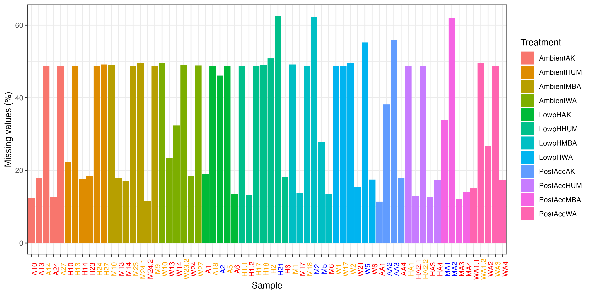

## Remove too many missing peptides
```{r eval=FALSE, message=FALSE, warning=FALSE, include=TRUE}

rna$Protein.Name<-dele3$Protein.Name
rna$Peptide<-dele3$Peptide
hist(rna$pNA)

# Remove Peptides that are missing in many samples 
nrow(rna[rna$pNA>0.80,]) # Missing in >85 % (55 samples out of 69 missing)
#4038
nrow(rna[rna$pNA>0.9,])
#3343


## Starting with removing >80%  missing peptides 
de_qf3 <- de_qf3 %>%
    filterNA(pNA = 0.8,
    i = "raw")

deqf3_final <- de_qf3[["raw"]] %>%
nrow() %>%
as.numeric()
#29116 peptides

```

## Log transformation of quantitative data & aggregate into proteins
```{r eval=FALSE, message=FALSE, warning=FALSE, include=TRUE}
de_qf3 <- logTransform(object = de_qf3,
    base = 2,
    i = "raw", pc=1,
    name = "log_peptides")
de_qf3
# [1] raw: SummarizedExperiment with 29116 rows and 66 columns 
# [2] log_peptides: SummarizedExperiment with 29116 rows and 66 columns 


x <- assay(de_qf3[["log_peptides"]])
colSums(is.na(x))
table(rowSums(!is.na(x)))


# Check number of peptides per protein
rd<-dele3[,1:2]
table(table(rd$Protein.Name))
#   1    2    3    4    5    6    7    8    9   10   11   12   13   14   15   16   17   18 
#1123  966  770  608  481  407  286  229  165  138  105  107   79   66   41   40   42   37 
#  19   20   21   22   23   24   25   26   27   28   29   30   31   32   33   34   35   36 
#  25   16   17   18   15   13   12    9    5    5    8    5    2    3    5    4    5    3 
#  37   38   39   40   41   42   44   45   46   48   49   51   54   57   62   65   66   68 
#   4    2    3    2    1    3    3    2    2    1    1    1    1    1    1    1    1    1 
#  87   93   98  109  111  115  117  159  228 
#   1    1    1    2    1    1    1    1    1 

# 1123 proteins are represented by only 1 peptide 


## Aggregate peptides to protein
de_qf3<- aggregateFeatures(de_qf3,
        i = "log_peptides",
        fcol = "Protein.Name",
        name = "log_proteins",
        fun = MsCoreUtils::robustSummary,
        na.rm = TRUE)
de_qf3
# [1] raw: SummarizedExperiment with 29116 rows and 66 columns 
# [2] log_peptides: SummarizedExperiment with 29116 rows and 66 columns 
# [3] log_proteins: SummarizedExperiment with 5901 rows and 66 columns 

dt1<-assay(de_qf3[["log_proteins"]])
range(dt1, na.rm = T)
#-15.26915  70.8625
write.csv(dt1, "../Output/Delegance/Dele_proteins_matrix_log2transformed_3overlaps.csv")
#write.csv(dt1, "../Output/Delegance/Dele_proteins_matrix_log2transformed_3overlaps_90p.csv")


#check data quickly for normal distribution
dt1.t<-as.data.frame(t(dt1))
df_tidy<-gather(dt1.t)

ggplot(df_tidy, aes(x=log(value))) +
  geom_density()
ggsave("../Output/Delegance/QC_Dele_data_check3.png", width = 4, height = 3, dpi=300)

```
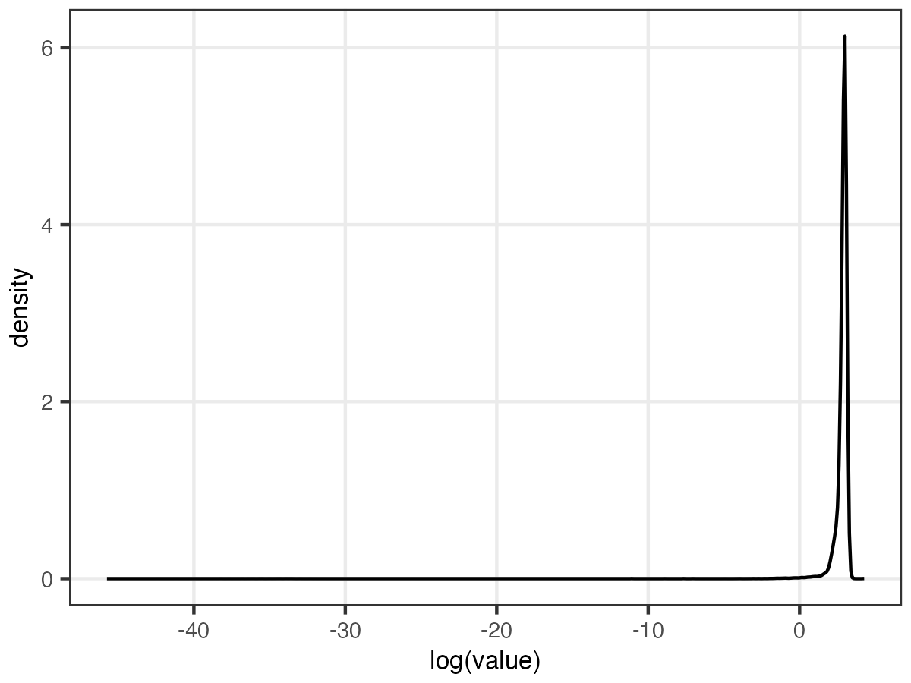


## Normalization of quantitative data 
```{r eval=FALSE, message=FALSE, warning=FALSE, include=TRUE}
de_qf3 <- aggregateFeatures(de_qf3,
            i = "raw",
            fcol = "Protein.Name",
            name = "proteins_direct",
            fun = base::colSums,
            na.rm = TRUE)

## Generate normalyzer report
normalyzer(jobName = "normalyzer_Dele3",
            experimentObj = de_qf3[["proteins_direct"]],
            sampleColName = "sample",
            groupColName = "condition",
            outputDir = ".")


## normalize the log transformed peptide data by the 'center median' method
# robustSummary
de_qf3 <- normalize(de_qf3,
    i = "log_proteins",
    name = "log_norm_proteins",
    method = "center.median")


# visulaize normalization
pre<- data.frame(assay(de_qf3[["log_proteins"]]))
prem<-reshape2::melt(pre)
colnames(prem)<-c("Sample","log2")
prem<-merge(prem, meta[,c("Sample.ID2","Treatment")], by.x="Sample",by.y="Sample.ID2")
pre_norm<-ggplot(prem,aes(x = Sample, y = log2, fill = Treatment)) +
    geom_boxplot(outlier.color = "grey50",outlier.size = 0.3, alpha = 0.7) +
    labs(x = "Sample", y = "log2(abundance)", title = "Pre-normalization-robustSummary") +
    theme_bw()+theme(axis.text.x = element_text(angle=90))

post<-data.frame(assay(de_qf3[["log_norm_proteins"]]))
postm<-reshape2::melt(post)
colnames(postm)<-c("Sample","log2")
postm<-merge(postm, meta[,c("Sample.ID2","Treatment")], by.x="Sample",by.y="Sample.ID2")

post_norm <- ggplot(postm,aes(x = Sample, y = log2, fill = Treatment)) +
    geom_boxplot(outlier.color = "grey50",outlier.size = 0.3, alpha = 0.7) +
    labs(x = "Sample", y = "log2(abundance)", title = "Post-normalization1") +
    theme_bw()+theme(axis.text.x = element_text(angle=90))

(pre_norm + theme(legend.position = "none")) +
post_norm & plot_layout(guides = "collect")
ggsave("../Output/Delegance/QC_Dele3_pre_post_normalization_robustSummary.png", width = 12, height = 4, unit="in", dpi=300)

```

* robustSummary
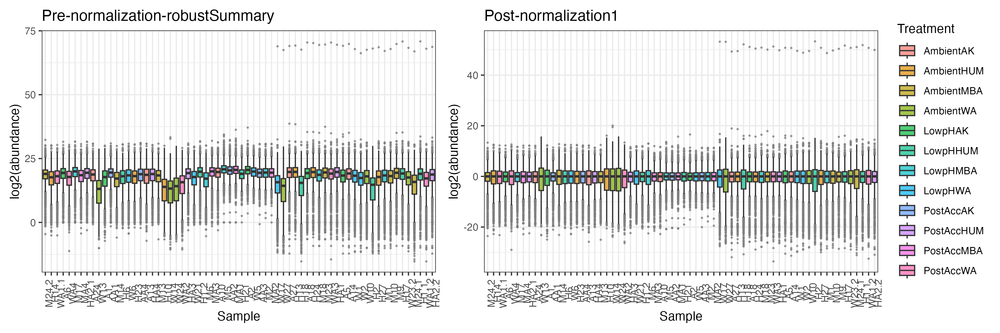


## Visualize the effects of normalization
```{r eval=FALSE, message=FALSE, warning=FALSE, include=TRUE}
{png("../Output/Delegance/QC_normalization_visualize3_robustSummary.png", width = 10, height =5, units = "in", res=300 )
par(mfrow = c(1, 3))
de_qf3[["raw"]] %>%
    assay() %>%
    plotDensities(legend = "topright",
    main = "Raw data")
de_qf3[["log_peptides"]] %>%
    assay() %>%
    plotDensities(legend = FALSE,
    main = "log2(abundace)")
de_qf3[["log_norm_proteins"]] %>%
    assay() %>%
    plotDensities(legend = FALSE,
    main = "log2(norm proteins)")
dev.off()}
```

* robustSummary results
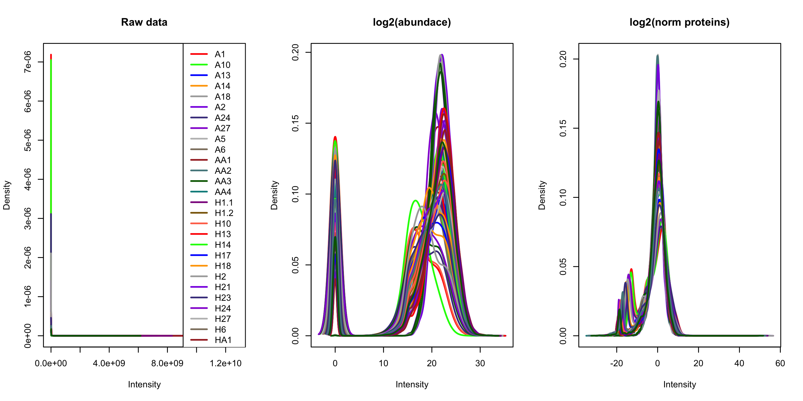


## Export the data.fram for LIMMA analysis
```{r eval=FALSE, message=FALSE, warning=FALSE, include=TRUE}

write.csv(post, "../Output/Delegance/Dele3_center.median.norm_robustSummary.csv")
#write.csv(post, "../Output/Delegance/Dele3_center.median.norm_robustSummary_90p.csv")

```


