```{r eval=FALSE, message=FALSE, warning=FALSE, include=TRUE}
source("BaseScripts.R")
library(limma) 
library(tidyr)
require(data.table)
library(vegan)
library(WGCNA)
library(patchwork)

colors<-c(  "#D73027","#B3B3B3" ,"#4575B4")
```

# Read the trasnformed and normalized output file generated through QFeature

```{r eval=FALSE, message=FALSE, warning=FALSE, include=TRUE}
#9804 proteins
dele1<-read.csv("../Output/Delegance/Dele1-3_center.median.norm_robustSummary.csv", row.names = 1)

#8107 proteins
dele2<-read.csv("../Output/Delegance/Dele2_center.median.norm_robustSummary.csv", row.names = 1)

#5901 proteins
dele3<-read.csv("../Output/Delegance/Dele3_center.median.norm_robustSummary.csv", row.names = 1)

#Read the metadata info
meta<-read.csv('../Data/Keana/metadata_full.csv')

```

# Create design matrix for LIMMA anaylsis
```{r eval=FALSE, message=FALSE, warning=FALSE, include=TRUE}
# Create design matrix

# Only focus on post experiment ambient vs. lowPH
meta<-meta[order(meta$Treatment),]

meta2 <- meta %>%
  filter(!grepl("Post", Treatment))
# remove 3 samples
remove<-c('A23', 'W23.1' ,'A17')

meta2<-meta2[!(meta2$Sample.ID2 %in% remove),] #48

meta2$Treatment <- factor(meta2$Treatment)
meta2$Batch<-factor(meta2$Batch)

design <- model.matrix(~ 0+ Treatment + Batch, data=meta2)
colnames(design)

#Create a contrast matrix
contrast.matrix <- makeContrasts(TreatmentAmbientAK-TreatmentLowpHAK, 
                                 TreatmentAmbientHUM-TreatmentLowpHHUM, 
                                 TreatmentAmbientWA-TreatmentLowpHWA,
                                 TreatmentAmbientMBA-TreatmentLowpHMBA,
                                 TreatmentAmbientAK-TreatmentAmbientHUM, 
                                 TreatmentAmbientAK-TreatmentAmbientMBA, 
                                 TreatmentAmbientAK-TreatmentAmbientWA,
                                 TreatmentAmbientHUM-TreatmentAmbientMBA,
                                 TreatmentAmbientHUM-TreatmentAmbientWA,
                                 TreatmentAmbientMBA-TreatmentAmbientWA,
                                 TreatmentLowpHAK-TreatmentLowpHHUM,
                                 TreatmentLowpHAK-TreatmentLowpHMBA,
                                 TreatmentLowpHAK-TreatmentLowpHWA,
                                 TreatmentLowpHHUM-TreatmentLowpHMBA,
                                 TreatmentLowpHHUM-TreatmentLowpHWA,
                                 TreatmentLowpHMBA-TreatmentLowpHWA,
                                 levels=design)
```

# LIMMA analysis 
## A. 9804 Proteins/robustSummary aggregation 

```{r eval=FALSE, message=FALSE, warning=FALSE, include=TRUE}
# Focus on 48 samples
dele1<-dele1[,meta2$Sample.ID2]
#check column order
all(colnames(dele1)==meta2$Sample.ID2)


#Fit the linear model
fit1<-lmFit(dele1, design)
# Fit the contrast model
fit2<-contrasts.fit(fit1, contrast.matrix)
fit2 <- eBayes(fit2, robust = TRUE, trend = TRUE)

## Save results of the test
results1 <- lapply(colnames(fit2$coefficients), function(co) {
    tt <- topTable(fit2, coef = co, number = Inf, sort.by = "P")
    tt <- tt %>% rownames_to_column("Protein,Name") %>% mutate(contrast = co, .before = 1)
    tt
}) %>% bind_rows()


# Overall “any difference among A/B/C?” (F-test)
#diff1 <- topTable(fit2, number = Inf, sort.by = "F")  

nrow(results1[results1$adj.P.Val<0.05,])
# 3393

summary(decideTests(fit2, adjust.method = "BH", p.value = 0.05))

write.csv(results1, "../Output/Delegance/Dele_Limma_results_robustSummary1.csv", row.names = F)


# attach the protein annotation
#prot<-read.csv("../Data/Ofav_proteins_detected.csv")
#diff<-merge(results1, prot, by="ProteinID", all.x=T )
#write.csv(diff, "../Output/Ofav_Limma_results_robustSummary.imputed.csv", row.names = F)


```


## B. 8107 Proteins/robustSummary aggregation 
```{r eval=FALSE, message=FALSE, warning=FALSE, include=TRUE}
dele2<-dele2[,meta2$Sample.ID2]
#check column order
all(colnames(dele2)==meta2$Sample.ID2)

fitB1<-lmFit(dele2, design)
# Fit the contrast model
fitB2<-contrasts.fit(fitB1, contrast.matrix)
fitB2 <- eBayes(fitB2, robust = TRUE, trend = TRUE)


## Save results of the test
results2 <- lapply(colnames(fitB2$coefficients), function(co) {
    tt <- topTable(fitB2, coef = co, number = Inf, sort.by = "P")
    tt <- tt %>% rownames_to_column("Protein,Name") %>% mutate(contrast = co, .before = 1)
    tt
}) %>% bind_rows()


# Overall “any difference among A/B/C?” (F-test)
nrow(results2[results2$adj.P.Val<0.05,])
# 2320


summary(decideTests(fitB2, adjust.method = "BH", p.value = 0.05))

write.csv(results2, "../Output/Delegance/Dele_Limma_results_robustSummary2.csv", row.names = F)
```


## C. 5901 Proteins/robustSummary aggregation 
```{r eval=FALSE, message=FALSE, warning=FALSE, include=TRUE}
dele3<-dele3[,meta2$Sample.ID2]
#check column order
all(colnames(dele3)==meta2$Sample.ID2)

fitC1<-lmFit(dele3, design)
fitC2<-contrasts.fit(fitC1, contrast.matrix)
fitC2 <- eBayes(fitC2, robust = TRUE, trend = TRUE)


## Save results of the test
results3 <- lapply(colnames(fitC2$coefficients), function(co) {
    tt <- topTable(fitC2, coef = co, number = Inf, sort.by = "P")
    tt <- tt %>% rownames_to_column("Protein,Name") %>% mutate(contrast = co, .before = 1)
    tt
}) %>% bind_rows()


# Overall “any difference among A/B/C?” (F-test)
nrow(results3[results3$adj.P.Val<0.05,])
# 1484


summary(decideTests(fitB2, adjust.method = "BH", p.value = 0.05))

write.csv(results3, "../Output/Delegance/Dele_Limma_results_robustSummary3.csv", row.names = F)
```

# Plot the LIMMA analysis results -Volcano Plots (robustSummary)

## 9804 Proteins (all proteins)
```{r eval=FALSE, message=FALSE, warning=FALSE, include=TRUE}
# Positive fold change = More abundant in Left than Right (CFR - TR; more in CFR) 

results1<-read.csv("../Output/Delegance/Dele_Limma_results_robustSummary1.csv")

treat_contrasts<-colnames(contrast.matrix)
list_contrasts<-list()
for (i in 1:length(treat_contrasts)){
    treatA<-sub(" -.*","",treat_contrasts[i] )
    treatA<-sub('Treatment','',treatA)
    treatB<-sub("^[^-]*- ","",treat_contrasts[i] )
    treatB<-sub('Treatment','',treatB)
    df<-results1[results1$contrast==treat_contrasts[i],]
    assign(paste0(treatA,"-",treatB), df)
    list_contrasts[[i]]<-df
    names(list_contrasts)[i]<-paste0(treatA,"-",treatB)
}


# Create plots
fc_thresh  <- 1        # |log2FC| ≥ 1 (i.e., ≥2-fold)
fdr_thresh <- 0.05

# Volcano plot
plots<-list()
for (i in 1:length(list_contrasts)){
    df<-list_contrasts[[i]]
    df$negLog10<-(-log10(df$adj.P.Val))
    df <- df %>%
    mutate(fc_dir = case_when(
        logFC >=  fc_thresh & adj.P.Val<fdr_thresh  ~ "pos",
        logFC <= -fc_thresh & adj.P.Val<fdr_thresh  ~ "neg",
        TRUE         ~ "none"
    ))
    p<-ggplot(df, aes(x = logFC, y = negLog10, color=fc_dir)) +
        geom_point(alpha = 0.7, size = 1.6) +
        scale_color_manual(values = c("none"=colors[2], "pos"= colors[3],"neg"=colors[1]))+
        geom_vline(xintercept = c(-fc_thresh, fc_thresh), linetype = "dashed",color="gray30", linewidth=0.5) +
        geom_hline(yintercept = -log10(fdr_thresh), linetype = "dashed", color="gray30", linewidth=0.5) +
        labs(x = "log2 Fold Change", y=expression(-log[10]~"("~italic("Q")~"-value)"),    title=names(list_contrasts[i])) +
        theme_classic()+theme(legend.position = "none") 
    plots[[i]]<-p
}

{png("../Output/Delegance/VolcanoPlot1_Ambient-lowPH_9804proteins.png", width = 7, height =5.5, units = "in", res=300 )
(plots[[1]] | plots[[2]]) /
(plots[[3]] | plots[[4]]) 
}


#Site comparison 1 (lowPH)
{png("../Output/Delegance/VolcanoPlot1_Ambient-SiteComparison_9804proteins.png", width = 10, height = 5.5, units ="in", res=300 )
(plots[[5]] | plots[[6]]| plots[[7]]) /
(plots[[8]] | plots[[9]]| plots[[10]]) 
}

#Site comparison 2 (Ambient)
{png("../Output/Delegance/VolcanoPlot1_lowPH-SiteComparison_9804proteins.png", width = 10, height =5.5, units ="in", res=300 )
(plots[[11]] | plots[[12]]| plots[[13]]) /
(plots[[14]] | plots[[15]]| plots[[16]]) 
}


```

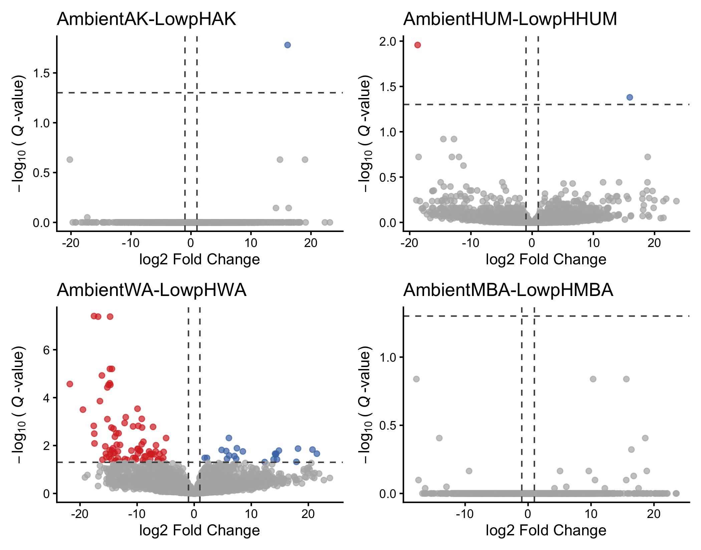{width=60%}
<br>
<br>
<br> 
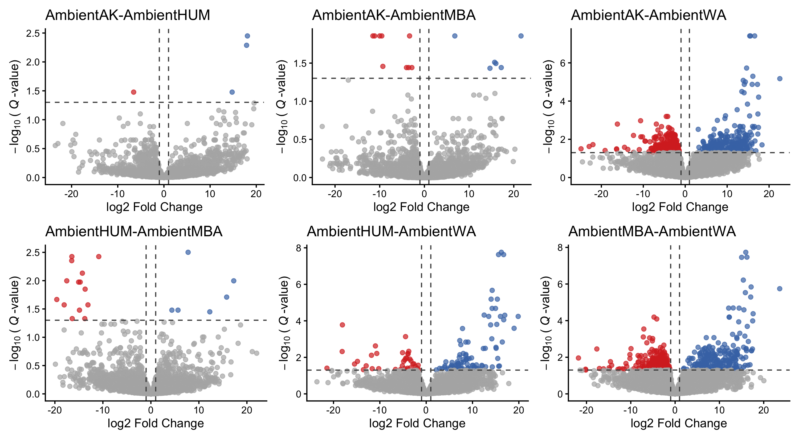

<br>
<br>
<br> 
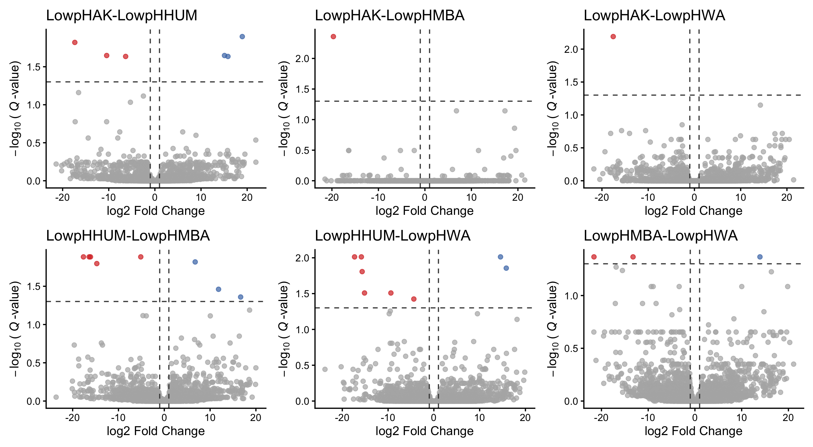
<br>
<br>
<br>

## 8107 Common proteins
```{r eval=FALSE, message=FALSE, warning=FALSE, include=TRUE}
# Positive fold change = More abundant in Left than Right (CFR - TR; more in CFR) 

results2<-read.csv("../Output/Delegance/Dele_Limma_results_robustSummary2.csv")

treat_contrasts<-colnames(contrast.matrix)
list_contrasts<-list()
for (i in 1:length(treat_contrasts)){
    treatA<-sub(" -.*","",treat_contrasts[i] )
    treatA<-sub('Treatment','',treatA)
    treatB<-sub("^[^-]*- ","",treat_contrasts[i] )
    treatB<-sub('Treatment','',treatB)
    df<-results2[results2$contrast==treat_contrasts[i],]
    assign(paste0(treatA,"-",treatB), df)
    list_contrasts[[i]]<-df
    names(list_contrasts)[i]<-paste0(treatA,"-",treatB)
}


# Create plots
fc_thresh  <- 1        # |log2FC| ≥ 1 (i.e., ≥2-fold)
fdr_thresh <- 0.05

plots<-list()
for (i in 1:length(list_contrasts)){
    df<-list_contrasts[[i]]
    df$negLog10<-(-log10(df$adj.P.Val))
    df <- df %>%
    mutate(fc_dir = case_when(
        logFC >=  fc_thresh & adj.P.Val<fdr_thresh  ~ "pos",
        logFC <= -fc_thresh & adj.P.Val<fdr_thresh  ~ "neg",
        TRUE         ~ "none"
    ))
    p<-ggplot(df, aes(x = logFC, y = negLog10, color=fc_dir)) +
        geom_point(alpha = 0.7, size = 1.6) +
        scale_color_manual(values = c("none"=colors[2], "pos"= colors[3],"neg"=colors[1]))+
        geom_vline(xintercept = c(-fc_thresh, fc_thresh), linetype = "dashed",color="gray30", linewidth=0.5) +
        geom_hline(yintercept = -log10(fdr_thresh), linetype = "dashed", color="gray30", linewidth=0.5) +
        labs(x = "log2 Fold Change", y=expression(-log[10]~"("~italic("Q")~"-value)"),    title=names(list_contrasts[i])) +
        theme_classic()+theme(legend.position = "none") 
    plots[[i]]<-p
}
{png("../Output/Delegance/VolcanoPlot2_Ambient-lowPH_8107proteins.png", width = 7, height =5.5, units = "in", res=300 )
(plots[[1]] | plots[[2]]) /
(plots[[3]] | plots[[4]]) 
}


#Site comparison 1
{png("../Output/Delegance/VolcanoPlot2_Ambient-SiteComparison_8107proteins.png", width = 10, height =5.5, units ="in", res=300 )
(plots[[5]] | plots[[6]]| plots[[7]]) /
(plots[[8]] | plots[[9]]| plots[[10]]) 
}

#Site comparison 2
{png("../Output/Delegance/VolcanoPlot2_lowPH-SiteComparison_8107proteins.png", width = 10, height =5.5, units ="in", res=300 )
(plots[[11]] | plots[[12]]| plots[[13]]) /
(plots[[14]] | plots[[15]]| plots[[16]]) 
}


```

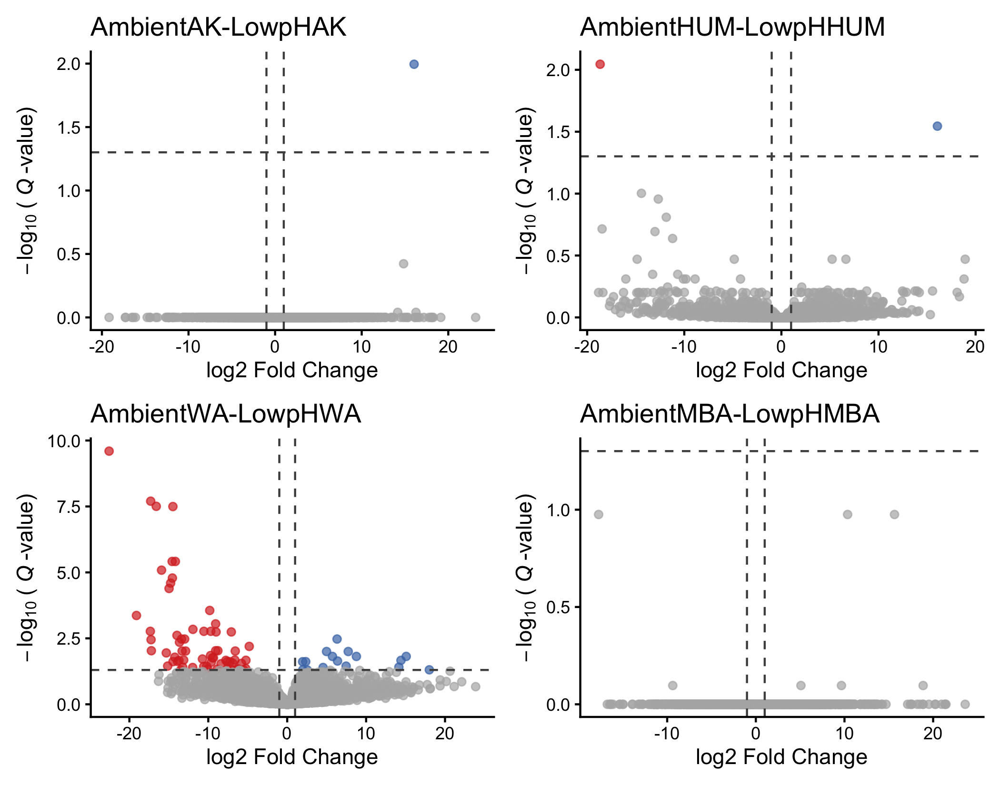{width=60%}
<br>
<br>
<br> 
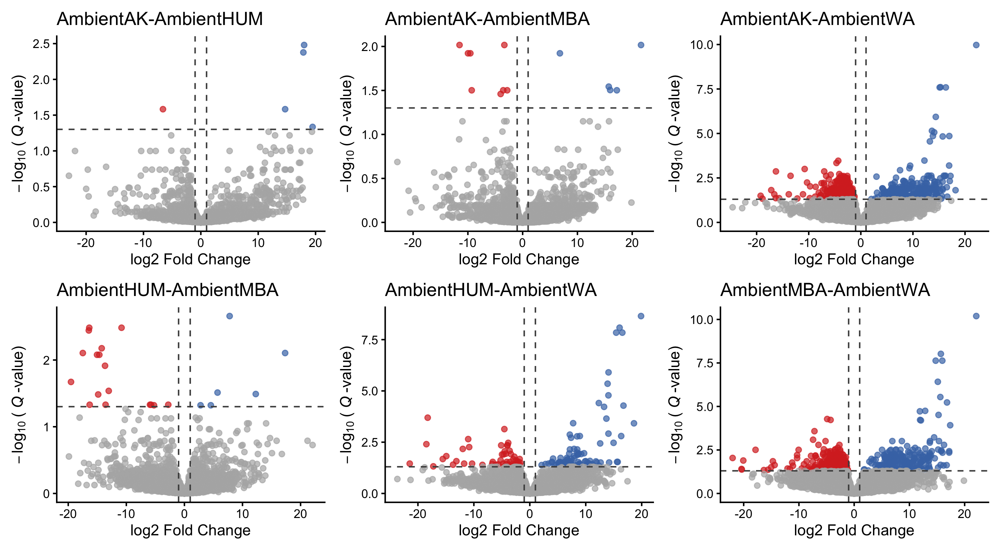
<br>
<br>
<br> 
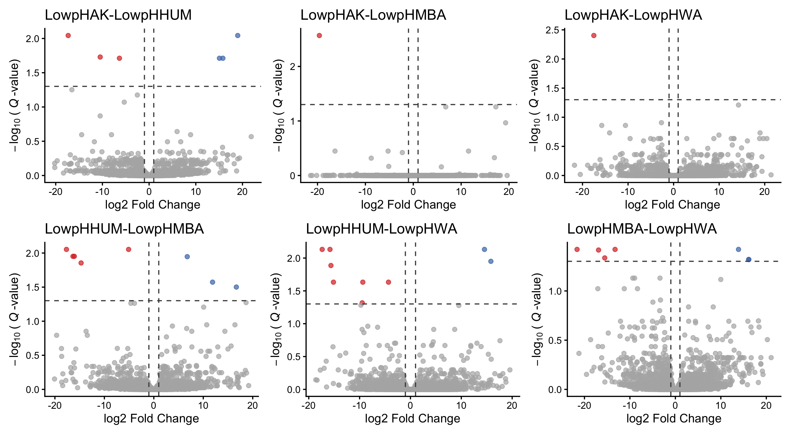
<br>
<br>
<br>

## 5901 All Common Proteins
```{r eval=FALSE, message=FALSE, warning=FALSE, include=TRUE}

## 5901 Proteines, robustSummary results
results3<-read.csv("../Output/Delegance/Dele_Limma_results_robustSummary3.csv")

treat_contrasts<-colnames(contrast.matrix)
list_contrasts<-list()
for (i in 1:length(treat_contrasts)){
    treatA<-sub(" -.*","",treat_contrasts[i] )
    treatA<-sub('Treatment','',treatA)
    treatB<-sub("^[^-]*- ","",treat_contrasts[i] )
    treatB<-sub('Treatment','',treatB)
    df<-results3[results3$contrast==treat_contrasts[i],]
    assign(paste0(treatA,"-",treatB), df)
    list_contrasts[[i]]<-df
    names(list_contrasts)[i]<-paste0(treatA,"-",treatB)
}


# Create plots
fc_thresh  <- 1        # |log2FC| ≥ 1 (i.e., ≥2-fold)
fdr_thresh <- 0.05

plots<-list()
for (i in 1:length(list_contrasts)){
    df<-list_contrasts[[i]]
    df$negLog10<-(-log10(df$adj.P.Val))
    df <- df %>%
    mutate(fc_dir = case_when(
        logFC >=  fc_thresh & adj.P.Val<fdr_thresh  ~ "pos",
        logFC <= -fc_thresh & adj.P.Val<fdr_thresh  ~ "neg",
        TRUE         ~ "none"
    ))
    p<-ggplot(df, aes(x = logFC, y = negLog10, color=fc_dir)) +
        geom_point(alpha = 0.7, size = 1.6) +
        scale_color_manual(values = c("none"=colors[2], "pos"= colors[3],"neg"=colors[1]))+
        geom_vline(xintercept = c(-fc_thresh, fc_thresh), linetype = "dashed",color="gray30", linewidth=0.5) +
        geom_hline(yintercept = -log10(fdr_thresh), linetype = "dashed", color="gray30", linewidth=0.5) +
        labs(x = "log2 Fold Change", y=expression(-log[10]~"("~italic("Q")~"-value)"),    title=names(list_contrasts[i])) +
        theme_classic()+theme(legend.position = "none") 
    plots[[i]]<-p
}
{png("../Output/Delegance/VolcanoPlot3_Ambient-lowPH_5901proteins.png", width = 7, height =5.5, units = "in", res=300 )
(plots[[1]] | plots[[2]]) /
(plots[[3]] | plots[[4]]) 
}


#Site comparison 1
{png("../Output/Delegance/VolcanoPlot3_Ambient-SiteComparison_5901proteins.png", width = 10, height =5.5, units ="in", res=300 )
(plots[[5]] | plots[[6]]| plots[[7]]) /
(plots[[8]] | plots[[9]]| plots[[10]]) 
}

#Site comparison 2
{png("../Output/Delegance/VolcanoPlot3_lowPH-SiteComparison_5901proteins.png", width = 10, height =5.5, units ="in", res=300 )
(plots[[11]] | plots[[12]]| plots[[13]]) /
(plots[[14]] | plots[[15]]| plots[[16]]) 
}


```

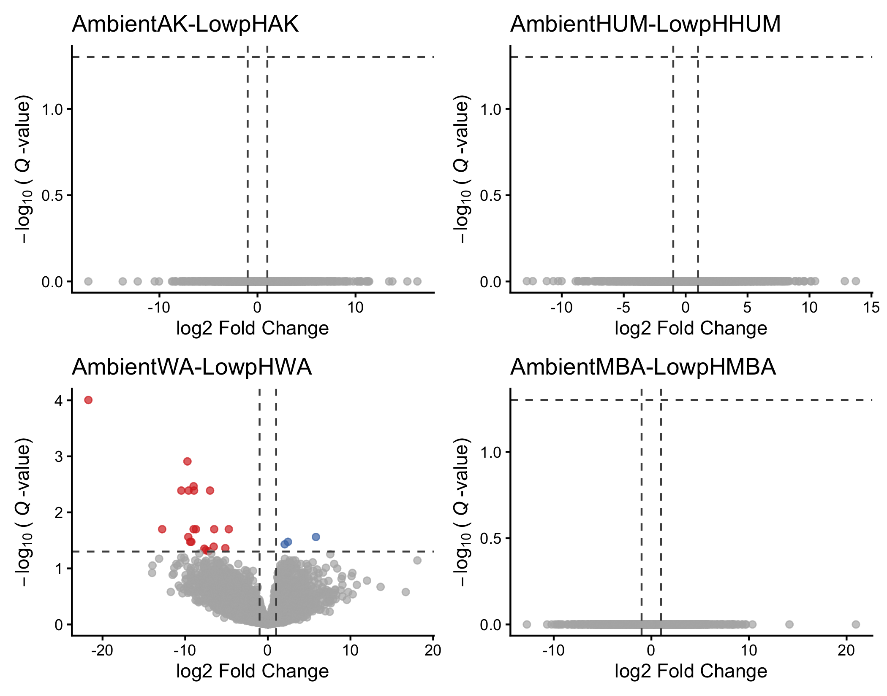{width=60%}
<br>
<br>
<br> 
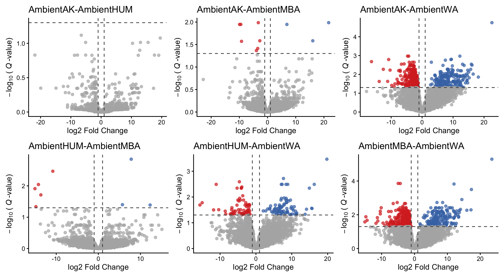
<br>
<br>
<br> 
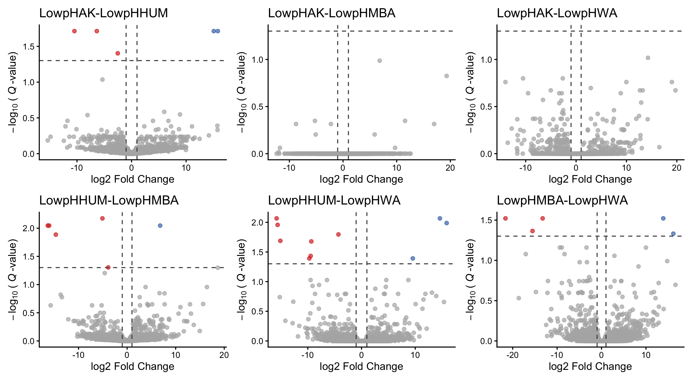
<br>
<br>
<br> 
# Create a summary table    
```{r eval=FALSE, message=FALSE, warning=FALSE, include=TRUE}

#library(dplyr)
#library(purrr)
#library(readr)
#library(stringr)

# Folder containing limma output files
files <- list.files(
  path = "../Output/Delegance/",
  pattern = "^Dele_Limma_results_",
  full.names = TRUE
)

# Significance thresholds
adj_p_cutoff <- 0.05
logFC_cutoff <- 1

summary_table <- map_dfr(files, function(f) {

  x <- read_csv(f, show_col_types = FALSE)

  tibble(
    Contrast = tools::file_path_sans_ext(basename(f)),
    Total_proteins = nrow(x),

    Significant = sum(
      x$adj.P.Val < adj_p_cutoff &
      abs(x$logFC) > logFC_cutoff,
      na.rm = TRUE
    ),

    Higher = sum(
      x$adj.P.Val < adj_p_cutoff &
      x$logFC > logFC_cutoff,
      na.rm = TRUE
    ),

    Lower = sum(
      x$adj.P.Val < adj_p_cutoff &
      x$logFC < -logFC_cutoff,
      na.rm = TRUE
    )
  )
})

summary_table


```

# Run NMDS 
## All proteins
```{r eval=FALSE, message=FALSE, warning=FALSE, include=TRUE}
meta<-meta[order(meta$Treatment),]

freq<-data.frame(t(table(meta$Sample.ID)))
dups<-freq$Var2[freq$Freq==2]

dupIDs<-meta$Sample.ID2[meta$Sample.ID %in% dups]


# NMDS plot -leaving 3 samples
dele1<-read.csv("../Output/Delegance/Dele1_center.median.norm_robustSummary.csv", row.names = 1)
dele1<-dele1[,meta$Sample.ID2]

dele1.t<-t(dele1) 
nmds.dele1<-metaMDS(dele1.t,distance='euclidean', trymax = 100)
{png('../Output/Delegance/Nmds.stressplot_all_non-corrected1.png', height = 5, width =6, unit='in', res=300) 
stressplot(nmds.dele1)
}

dele.mds1 = data.frame(nmds.dele1$points)
dele.mds1$Treatment<-meta$Treatment
dele.mds1$sample<-rownames(dele1.t)
ggplot(dele.mds1, aes(x=MDS1,y=MDS2,color=Treatment)) + 
    geom_point(size=3.5, position=position_jitter()) + theme_bw() +
    theme(legend.text = element_text(size=12), legend.title = element_text(size=13))+
    xlab("NMDS 1") + ylab("NMDS 2")+
    theme(axis.text=element_text(size=10), legend.title = element_blank())+
    theme(panel.grid.minor = element_blank())+
    geom_text(aes(label = dele.mds1$sample),show.legend = FALSE,
              vjust = -0.9,    # vertical adjustment
              size = 3)
ggsave("../Output/Delegance/Nmds1.non-batch-corrected1.png", height = 5, width = 6.8, dpi=300)


# plot tech-reps only
techreps<-dele.mds1[dele.mds1$sample %in% dupIDs, ]

ggplot(techreps, aes(x=MDS1,y=MDS2,color=Treatment)) + 
    geom_point(size=3.5, position=position_jitter()) + theme_bw() +
    theme(legend.text = element_text(size=12), legend.title = element_text(size=13))+
    xlab("NMDS 1") + ylab("NMDS 2")+
    theme(axis.text=element_text(size=10), legend.title = element_blank())+
    theme(panel.grid.minor = element_blank())+
    geom_text(aes(label = techreps$sample),show.legend = FALSE,vjust = -0.9,size = 3)
ggsave("../Output/Delegance/Nmds1.techreps_non-batch-corrected1.png", height = 4, width = 5.4, dpi=300)
```

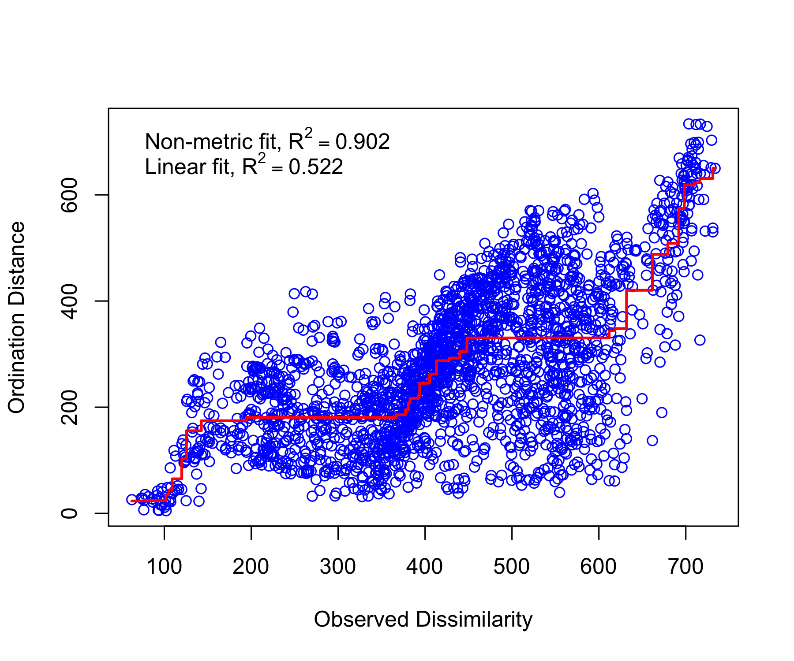{width=60%}

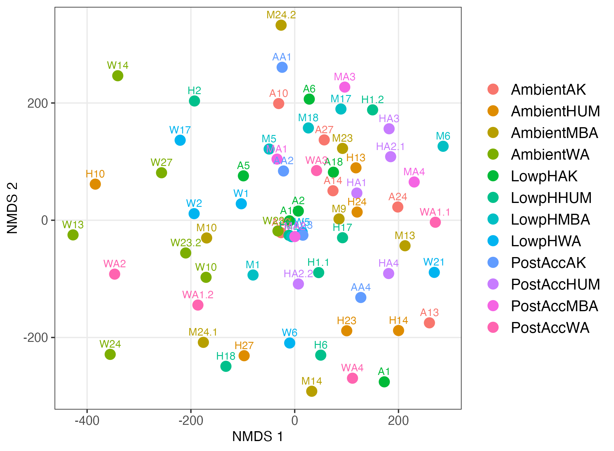{width=48%}
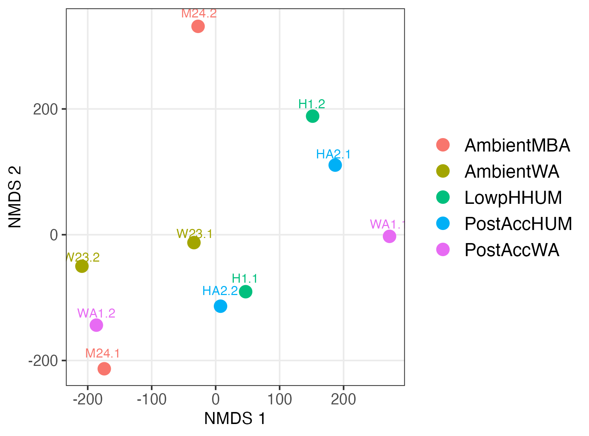{width=48%}

## 8107 Proteins -removing 3 samples
```{r eval=FALSE, message=FALSE, warning=FALSE, include=TRUE}
meta<-meta[order(meta$Treatment),]
meta2<-meta[!(meta$Sample.ID2 %in% remove),]

freq<-data.frame(t(table(meta2$Sample.ID)))
dups<-freq$Var2[freq$Freq==2]

dupIDs<-meta$Sample.ID2[meta$Sample.ID %in% dups]
dele2<-dele2[,(colnames(dele2) %in% meta2$Sample.ID2)]
dele2<-dele2[,meta2$Sample.ID2]

dele2.t<-t(dele2) 
nmds.dele2<-metaMDS(dele2.t,distance='euclidean', trymax = 100)
{png('../Output/Delegance/Nmds2.stressplot_all_non-corrected.png', height = 5, width =6, unit='in', res=300) 
stressplot(nmds.dele2)
}

dele.mds2 = data.frame(nmds.dele2$points)
dele.mds2$Treatment<-meta2$Treatment
dele.mds2$sample<-rownames(dele2.t)
ggplot(dele.mds2, aes(x=MDS1,y=MDS2,color=Treatment)) + 
    geom_point(size=3.5, position=position_jitter()) + theme_bw() +
    theme(legend.text = element_text(size=12), legend.title = element_text(size=13))+
    xlab("NMDS 1") + ylab("NMDS 2")+
    theme(axis.text=element_text(size=10), legend.title = element_blank())+
    theme(panel.grid.minor = element_blank())+
    geom_text(aes(label = dele.mds2$sample),show.legend = FALSE,
              vjust = -0.9,    # vertical adjustment
              size = 3)
ggsave("../Output/Delegance/Nmds2.non-batch-corrected.png", height = 5, width = 6.8, dpi=300)


# plot tech-reps only
techreps<-dele.mds2[dele.mds2$sample %in% dupIDs, ]

ggplot(techreps, aes(x=MDS1,y=MDS2,color=Treatment)) + 
    geom_point(size=3.5, position=position_jitter()) + theme_bw() +
    theme(legend.text = element_text(size=12), legend.title = element_text(size=13))+
    xlab("NMDS 1") + ylab("NMDS 2")+
    theme(axis.text=element_text(size=10), legend.title = element_blank())+
    theme(panel.grid.minor = element_blank())+
    geom_text(aes(label = techreps$sample),show.legend = FALSE,vjust = -0.9,size = 3)
ggsave("../Output/Delegance/Nmds2.techreps_non-batch-corrected.png", height = 4, width = 5.4, dpi=300)
```

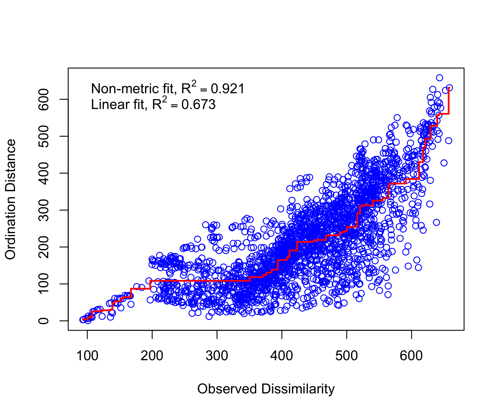


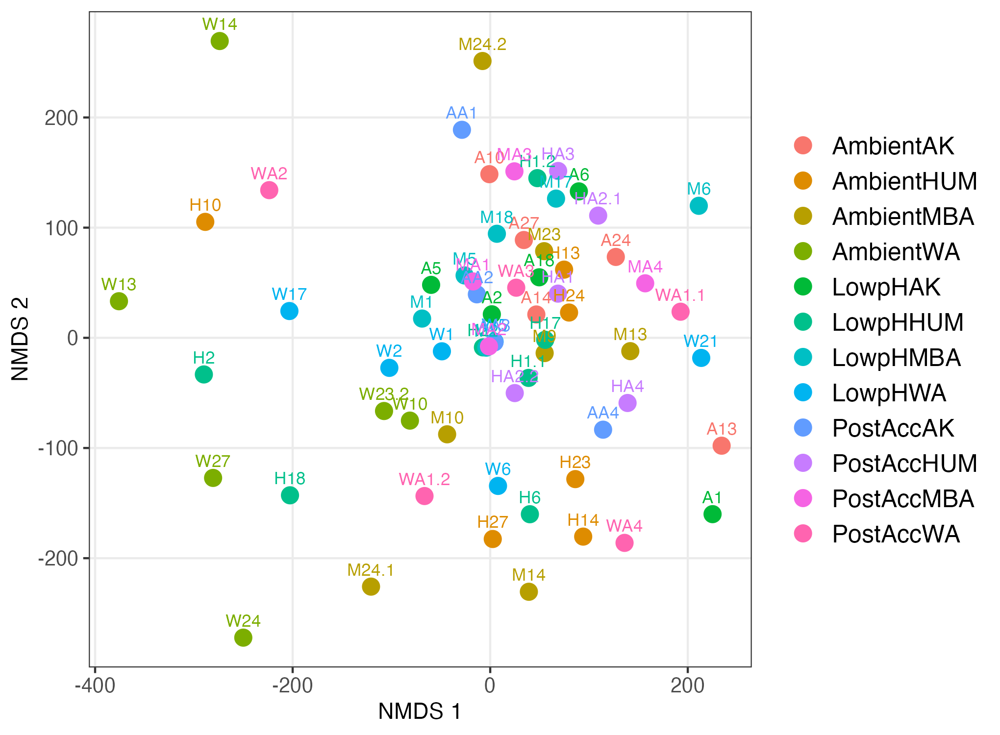{width=48%}
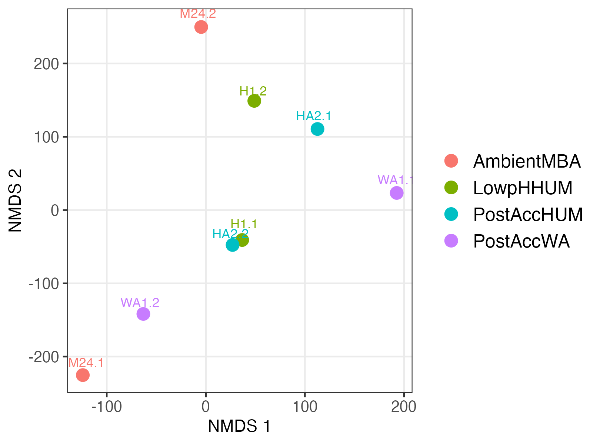{width=48%}


## 5901 Proteins -removing 3 samples
```{r eval=FALSE, message=FALSE, warning=FALSE, include=TRUE}
meta<-meta[order(meta$Treatment),]
meta2<-meta[!(meta$Sample.ID2 %in% remove),]
freq<-data.frame(t(table(meta2$Sample.ID)))
dups<-freq$Var2[freq$Freq==2]
dupIDs<-meta$Sample.ID2[meta$Sample.ID %in% dups]

dele3<-dele3[,(colnames(dele3) %in% meta2$Sample.ID2)]
dele3<-dele3[,meta2$Sample.ID2]

dele3.t<-t(dele3) 
nmds.dele3<-metaMDS(dele3.t,distance='euclidean', trymax = 100)
{png('../Output/Delegance/Nmds3.stressplot_all_non-corrected.png', height = 5, width =6, unit='in', res=300) 
stressplot(nmds.dele3)
}

dele.mds3 = data.frame(nmds.dele3$points)
dele.mds3$Treatment<-meta2$Treatment
dele.mds3$sample<-rownames(dele3.t)
ggplot(dele.mds3, aes(x=MDS1,y=MDS2,color=Treatment)) + 
    geom_point(size=3.5, position=position_jitter()) + theme_bw() +
    theme(legend.text = element_text(size=12), legend.title = element_text(size=13))+
    xlab("NMDS 1") + ylab("NMDS 2")+
    theme(axis.text=element_text(size=10), legend.title = element_blank())+
    theme(panel.grid.minor = element_blank())+
    geom_text(aes(label = dele.mds3$sample),show.legend = FALSE,
              vjust = -0.9,    # vertical adjustment
              size = 3)
ggsave("../Output/Delegance/Nmds3.non-batch-corrected.png", height = 5, width = 6.8, dpi=300)


# plot tech-reps only
techreps<-dele.mds3[dele.mds3$sample %in% dupIDs, ]

ggplot(techreps, aes(x=MDS1,y=MDS2,color=Treatment)) + 
    geom_point(size=3.5, position=position_jitter()) + theme_bw() +
    theme(legend.text = element_text(size=12), legend.title = element_text(size=13))+
    xlab("NMDS 1") + ylab("NMDS 2")+
    theme(axis.text=element_text(size=10), legend.title = element_blank())+
    theme(panel.grid.minor = element_blank())+
    geom_text(aes(label = techreps$sample),show.legend = FALSE,vjust = -0.9,size = 3)
ggsave("../Output/Delegance/Nmds3.techreps_non-batch-corrected.png", height = 4, width = 5.4, dpi=300)
```

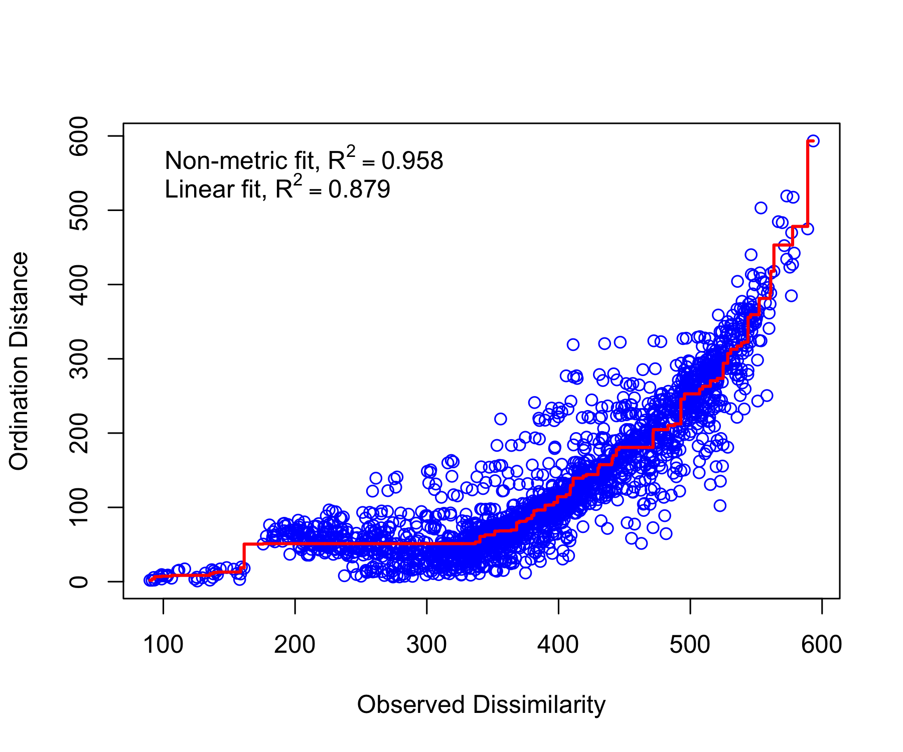


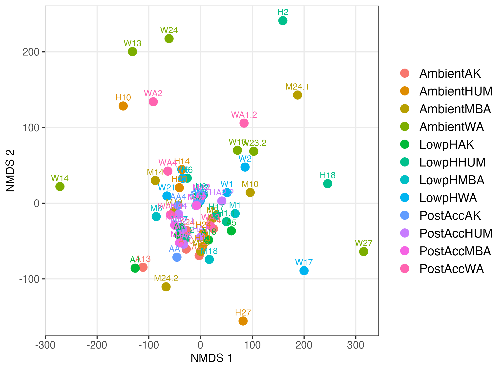{width=48%}
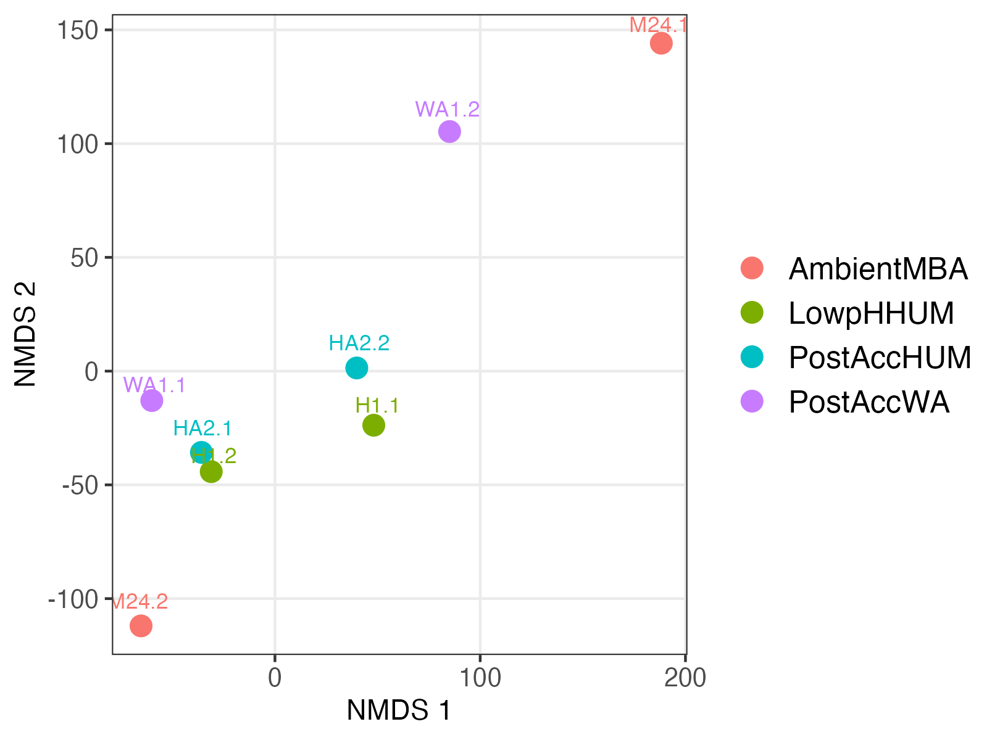{width=48%}


# Batch correction applied

```{r eval=FALSE, message=FALSE, warning=FALSE, include=TRUE}
## Remove batch effects before plotting

# No design default correction
dele1<-dele1[,(colnames(dele1) %in% meta2$Sample.ID2)]
dele1_corrected <- removeBatchEffect(as.matrix(dele1), batch=meta2$Batch) 
dele1.t<-t(dele1_corrected) 
nmds.dele1<-metaMDS(dele1.t,distance='euclidean', trymax=100)

dele.mds1 = data.frame(nmds.dele1$points)
dele.mds1$Treatment<-meta2$Treatment
dele.mds1$sample<-rownames(dele1.t)
ggplot(dele.mds1, aes(x=MDS1,y=MDS2,color=Treatment)) + 
    geom_point(size=3.5, position=position_jitter()) + theme_bw() +
    theme(legend.text = element_text(size=12), legend.title = element_text(size=13))+
    xlab("NMDS 1") + ylab("NMDS 2")+
    theme(axis.text=element_text(size=10), legend.title = element_blank())+
    theme(panel.grid.minor = element_blank())+
    geom_text(aes(label = dele.mds1$sample),show.legend = FALSE,
              vjust = -0.9,    # vertical adjustment
              size = 3)
ggsave("../Output/Delegance/Nmds1.batch-corrected.png", height = 5, width = 6.8, dpi=300)


# plot tech-reps only
techreps2<-dele.mds1[dele.mds1$sample %in% dupIDs, ]
ggplot(techreps2, aes(x=MDS1,y=MDS2,color=Treatment)) + 
    geom_point(size=3.5, position=position_jitter()) + theme_bw() +
    theme(legend.text = element_text(size=12), legend.title = element_text(size=13))+
    xlab("NMDS 1") + ylab("NMDS 2")+
    theme(axis.text=element_text(size=10), legend.title = element_blank())+
    theme(panel.grid.minor = element_blank())+
    geom_text(aes(label = techreps$sample),show.legend = FALSE,vjust = -0.9,size = 3)
ggsave("../Output/Delegance/Nmds1.techreps_batch-corrected.png", height = 5, width = 6.8, dpi=300)


```

* Batch correction applied to all samples 
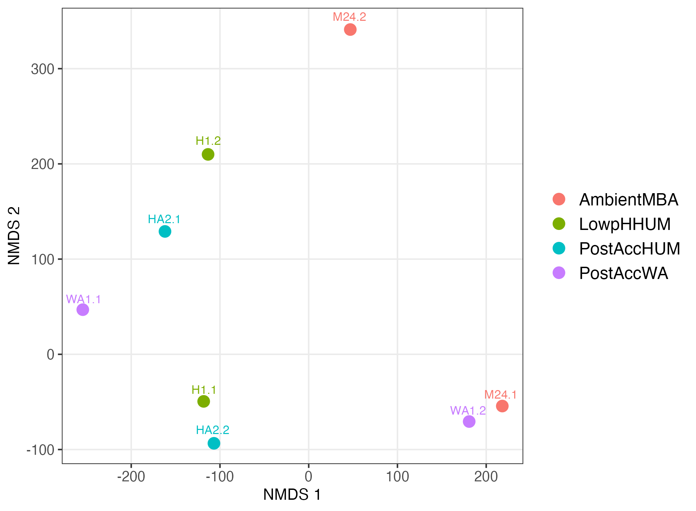{width=48%}


```{r eval=FALSE, message=FALSE, warning=FALSE, include=TRUE}

# More complex removal: Sample & Treatment adjusted
# Create a function -66 samples
plot_nmds<-function(df,k, method){
    dt<-t(df) 
    re<-metaMDS(dt,distance='euclidean', trymax=100,trace = 0)
    mds.dt = data.frame(re$points)
    mds.dt$Treatment<-meta2$Treatment
    mds.dt$sample<-rownames(dt)
    techrep<-mds.dt[mds.dt$sample %in% dups,]

    p1<-ggplot(techrep, aes(x=MDS1,y=MDS2,color=Treatment)) + 
            geom_point(size=3.5, position=position_jitter()) + theme_bw() +
            theme(legend.text = element_text(size=12), legend.title = element_text(size=13))+
            xlab("NMDS 1") + ylab("NMDS 2")+
            theme(axis.text=element_text(size=10), legend.title = element_blank())+
            theme(panel.grid.minor = element_blank())+
            geom_text(aes(label = techrep$sample),show.legend = FALSE,vjust = -0.9,size = 3)
    p1
    ggsave(paste0("../Output/Delegance/Nmds",k,".techreps_batch-",method,"-corrected2.png"), p1,height = 5, width = 6.8, dpi=300)

}

table(meta$Treatment, meta$Batch)

dele1_ID<-dele1
colnames(dele1_ID)<-sub("\\..*", '',colnames(dele1_ID))

batch<-factor(meta2$Batch)
sampleID<-factor(meta2$Sample.ID)
treatment<-factor(meta2$Treatment)
design_sample <- model.matrix(~ 0 + sampleID, data=meta2)
design_treatment <- model.matrix(~ 0 + treatment, data=meta2)

dele1_corrected_sample<-removeBatchEffect(
    dele1_ID,
    batch = batch,
    design = design_sample
)


dele1_corrected_treatment<-removeBatchEffect(
    dele1_ID,
    batch = batch,
    design = design_treatment
)

plot_nmds(dele1_corrected_sample, 1, "sample")
plot_nmds(dele1_corrected_treatment, 1,"treatment")

```


## 2-verlapping proteins
```{r eval=FALSE, message=FALSE, warning=FALSE, include=TRUE}
dele2_ID<-dele2
colnames(dele2_ID)<-sub("\\..*", '',colnames(dele2_ID))

batch<-factor(meta2$Batch)
sampleID<-factor(meta2$Sample.ID)
treatment<-factor(meta2$Treatment)
design_sample <- model.matrix(~ 0 + sampleID, data=meta2)
design_treatment <- model.matrix(~ 0 + treatment, data=meta2)

dele2_corrected_sample<-removeBatchEffect(
    dele2_ID,
    batch = batch,
    design = design_sample
)


dele2_corrected_treatment<-removeBatchEffect(
    dele2_ID,
    batch = batch,
    design = design_treatment
)

plot_nmds(dele2_corrected_sample, 2, "sample")
plot_nmds(dele2_corrected_treatment, 2,"treatment")

```

* Sample-corrected 8107 samples 
* Treatment-corrected

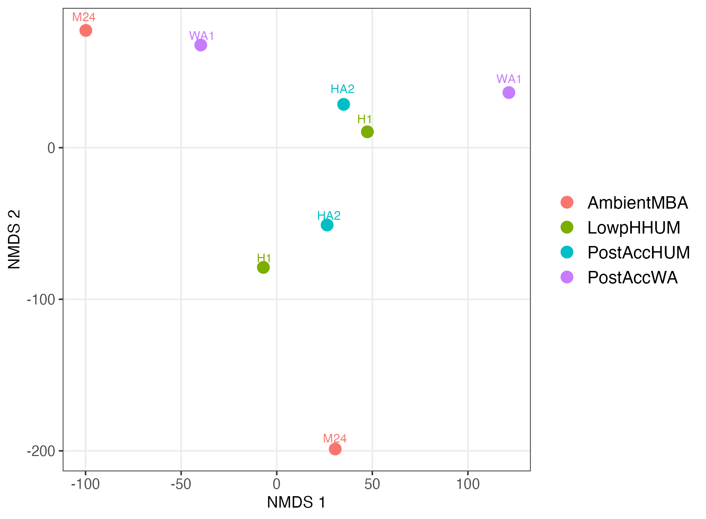{width=48%}

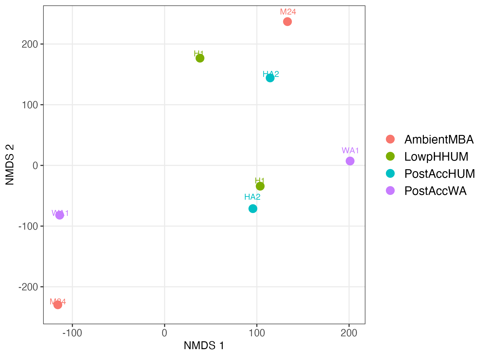{width=48%}


 
# Correct 48 samples with experimental desing 
```{r eval=FALSE, message=FALSE, warning=FALSE, include=TRUE}
 
#48 samples only

meta3<-meta2[!grepl('^Post', meta2$Treatment),]
dele1.1<- dele1[, colnames(dele1) %in% meta3$Sample.ID2]
design48<- model.matrix(~ 0+ Treatment + Batch, data=meta3)

dele1.1_corrected<-removeBatchEffect(
    dele1.1,
    batch = meta3$Batch,
    design = design48
)

dele1.2<- dele1_ID[, colnames(dele1_ID) %in% meta3$Sample.ID]
design48.2<- model.matrix(~ 0+ Treatment + Batch +Sample.ID, data=meta3)

dele1.2_corrected<-removeBatchEffect(
    dele1.2,
    batch = meta3$Batch,
    design = design48.2
)

plot_nmds48<-function(df,k, method){
    dt<-t(df) 
    re<-metaMDS(dt,distance='euclidean', trymax=100,trace = 0)
    mds.dt = data.frame(re$points)
    mds.dt$Treatment<-meta3$Treatment
    mds.dt$sample<-rownames(dt)
    techrep<-mds.dt[grepl('H1\\.|H1$|M24',mds.dt$sample),]

    p1<-ggplot(techrep, aes(x=MDS1,y=MDS2,color=Treatment)) + 
            geom_point(size=3.5, position=position_jitter()) + theme_bw() +
            theme(legend.text = element_text(size=12), legend.title = element_text(size=13))+
            xlab("NMDS 1") + ylab("NMDS 2")+
            theme(axis.text=element_text(size=10), legend.title = element_blank())+
            theme(panel.grid.minor = element_blank())+
            geom_text(aes(label = techrep$sample),show.legend = FALSE,vjust = -0.9,size = 3)
    ggsave(paste0("../Output/Delegance/Nmds",k,".techreps_batch-",method,"-corrected.png"), p1,height = 5, width = 6.8, dpi=300)

}

plot_nmds48(dele1.1, 1, "treat-48")
plot_nmds48(dele1.2, 1, "treat-sampleID-48")


## 8701 proteins
dele2.1<- dele2[, colnames(dele2) %in% meta3$Sample.ID2]
dele2.1_corrected<-removeBatchEffect(
    dele2.1,
    batch = meta3$Batch,
    design = design48
)

dele2.2<- dele2_ID[, colnames(dele2_ID) %in% meta3$Sample.ID]
design48.2<- model.matrix(~ 0+ Treatment + Batch +Sample.ID, data=meta3)
dele2.2_corrected<-removeBatchEffect(
    dele2.2,
    batch = meta3$Batch,
    design = design48.2
)

plot_nmds48(dele2.1,2, "treat-48")
plot_nmds48(dele2.2, 2, "treat-sampleID-48")


```


```{r eval=FALSE, message=FALSE, warning=FALSE, include=TRUE}
# Plots with Hull
## all proteins
dist_matrix <- vegdist(dele2.t2, method = "euclidean", na.rm = TRUE)

nmds_metadata <- as.data.frame(nmds.dele2.2$points) %>% 
  rownames_to_column(var="Sample.ID2") %>%
  left_join(meta2[, c("Sample.ID2","Treatment")],by="Sample.ID2")

#Permutational Multivariate Analysis of Variance Using Distance Matrices
permanova_result <- adonis2(dist_matrix ~Treatment, data = nmds_metadata)
p_value_loc <- permanova_result$`Pr(>F)`[1]
#0.001

hull.ak1 <- nmds_metadata[nmds_metadata$Treatment == "AmbientAK", ][chull(nmds_metadata[nmds_metadata$Treatment == "AmbientAK", c("MDS1", "MDS2")]), ]  
hull.ak2 <- nmds_metadata[nmds_metadata$Treatment == "LowpHAK", ][chull(nmds_metadata[nmds_metadata$Treatment == "LowpHAK", c("MDS1", "MDS2")]), ] 

hull.hm1 <- nmds_metadata[nmds_metadata$Treatment == "AmbientHUM", ][chull(nmds_metadata[nmds_metadata$Treatment == "AmbientHUM", c("MDS1", "MDS2")]), ]  
hull.hm2 <- nmds_metadata[nmds_metadata$Treatment == "LowpHHUM", ][chull(nmds_metadata[nmds_metadata$Treatment == "LowpHHUM", c("MDS1", "MDS2")]), ] 

hull.wa1 <- nmds_metadata[nmds_metadata$Treatment == "AmbientWA", ][chull(nmds_metadata[nmds_metadata$Treatment == "AmbientWA", c("MDS1", "MDS2")]), ]  
hull.wa2 <- nmds_metadata[nmds_metadata$Treatment == "LowpHWA", ][chull(nmds_metadata[nmds_metadata$Treatment == "LowpHWA", c("MDS1", "MDS2")]), ] 

hull.mb1 <- nmds_metadata[nmds_metadata$Treatment == "AmbientMBA", ][chull(nmds_metadata[nmds_metadata$Treatment == "AmbientMBA", c("MDS1", "MDS2")]), ]  
hull.mb2 <- nmds_metadata[nmds_metadata$Treatment == "LowpHMBA", ][chull(nmds_metadata[nmds_metadata$Treatment == "LowpHMBA", c("MDS1", "MDS2")]), ] 


hulls_condition<-rbind(hull.ak1, hull.ak2, hull.hm1,hull.hm2,hull.wa1,hull.wa2,hull.mb1,hull.mb2) 

ggplot(nmds_metadata, aes(x = MDS1, y = MDS2)) +
  geom_point(aes(color = Treatment)) +
  geom_polygon(data=hulls_condition,aes(x=MDS1, y=MDS2, fill=Treatment),alpha=0.30)+  
  theme_classic() +
  theme(panel.grid = element_blank())+
  xlab('NMDS1')+ylab('NMDS2')
    geom_text(aes(label = Sample.ID2, color=Treatment),show.legend = FALSE, vjust = -0.9, size = 2)+
    theme(legend.position = "inside", legend.position.inside = c(0.15, 0.87), legend.title=element_blank())
ggsave("../Output/Delegance/Nmds.with.hull2_batch_corrected_48samples.png", height = 5, width = 5.3, dpi=300)
ggsave("../Output/Delegance/Nmds.with.hull2_batch.design_corrected_48samples.png", height = 5, width = 5.3, dpi=300)


```

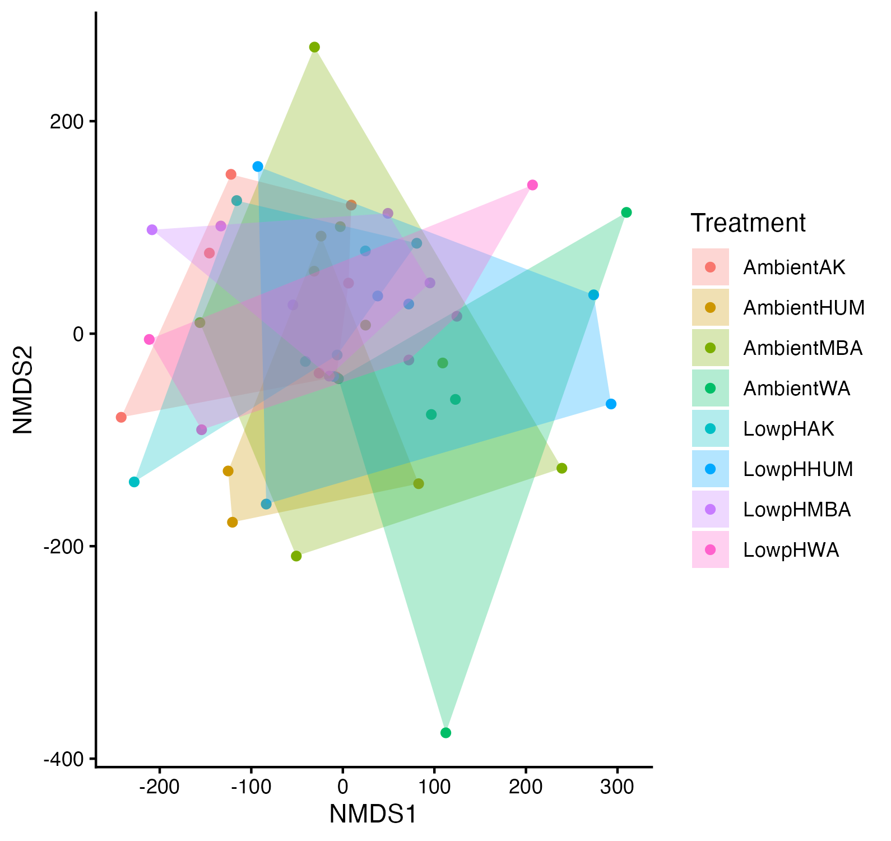

## Looka at specific comparisons 

```{r eval=FALSE, message=FALSE, warning=FALSE, include=TRUE}
#Ambient only
hulls2<-rbind(hull.ak1,hull.hm1, hull.wa1, hull.mb1)

ggplot(nmds_metadata, aes(x = MDS1, y = MDS2)) +
  geom_point(aes(color = Treatment)) +
  geom_polygon(data=hulls2,aes(x=MDS1, y=MDS2, fill=Treatment),alpha=0.30)+  
  theme_classic() +
  theme(panel.grid = element_blank())+
  xlab('NMDS1')+ylab('NMDS2')
ggsave("../Output/Delegance/Nmds.with.hull2_batch.design_corrected_48samples_AK.WA.png", height = 5, width = 6, dpi=300)
ggsave("../Output/Delegance/Nmds.with.hull2_batch.design_corrected_48samples_Ambient.png", height = 5, width = 6.2, dpi=300)

hulls3<-rbind(hull.ak2,hull.hm2,hull.wa2,hull.mb2)

ggplot(nmds_metadata, aes(x = MDS1, y = MDS2)) +
  geom_point(aes(color = Treatment)) +
  geom_polygon(data=hulls3,aes(x=MDS1, y=MDS2, fill=Treatment),alpha=0.30)+  
  theme_classic() +
  theme(panel.grid = element_blank())+
  xlab('NMDS1')+ylab('NMDS2')
ggsave("../Output/Delegance/Nmds.with.hull2_batch.design_corrected_48samples_AK.WA.png", height = 5, width = 6, dpi=300)
ggsave("../Output/Delegance/Nmds.with.hull2_batch.design_corrected_48samples_lowpH.png", height = 5, width = 6, dpi=300)

```

* Alaska vs. Washington -Ambient
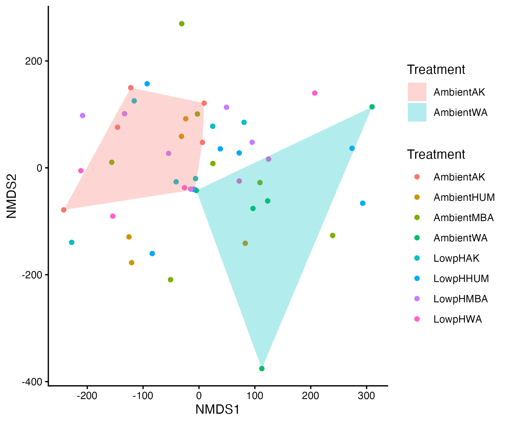

*Ambient 
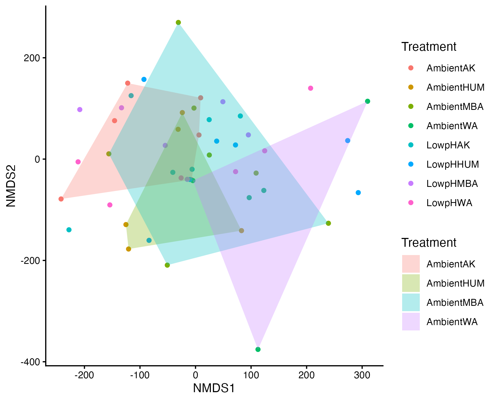

*lowPH

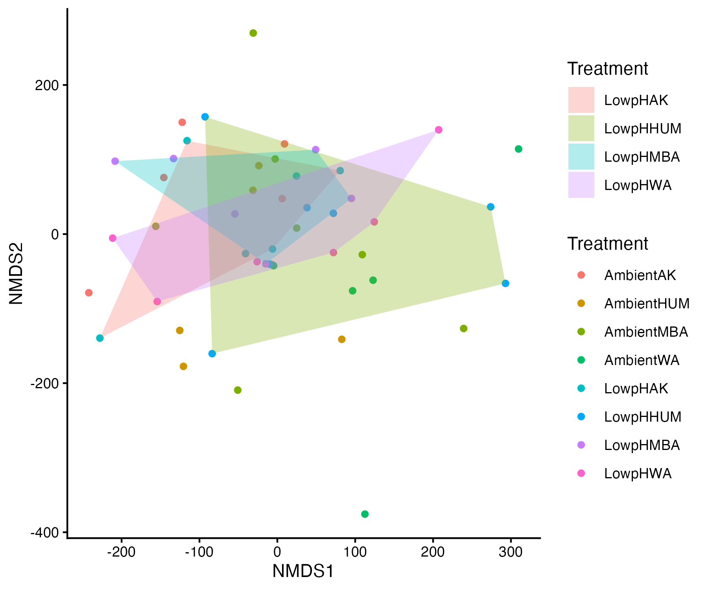

## 6102 Proteins
```{r eval=FALSE, message=FALSE, warning=FALSE, include=TRUE}
meta<-meta[order(meta$Treatment),]


dele3<-read.csv("../Output/Delegance/Dele3_center.median.norm_robustSummary.csv", row.names = 1)
dele3<-dele3[,meta$Sample.ID2]

dele3.t<-t(dele3) 
nmds.dele3<-metaMDS(dele3.t,distance='euclidean')

dele.mds3 = data.frame(nmds.dele3$points)
dele.mds3$Treatment<-meta$Treatment
dele.mds3$sample<-rownames(dele3.t)
ggplot(dele.mds3, aes(x=MDS1,y=MDS2,color=Treatment)) + 
    geom_point(size=3.5, position=position_jitter()) + theme_bw() +
    theme(legend.text = element_text(size=12), legend.title = element_text(size=13))+
    xlab("NMDS 1") + ylab("NMDS 2")+
    theme(axis.text=element_text(size=10), legend.title = element_blank())+
    theme(panel.grid.minor = element_blank())+
    geom_text(aes(label = dele.mds3$sample),show.legend = FALSE,
              vjust = -0.9,    # vertical adjustment
              size = 3)
ggsave("../Output/Delegance/Nmds.non-batch-corrected3.png", height = 5, width = 6.8, dpi=300)


# Remove batch effects before plotting
dele3_corrected <- removeBatchEffect(as.matrix(dele3), batch=meta$Batch) 

#NMDS 
dele3.t<-t(dele3_corrected) 
nmds.dele3<-metaMDS(dele3.t,distance='euclidean', trymax=100)
stressplot(nmds.dele3)

dele.mds3 = data.frame(nmds.dele3$points)
dele.mds3$Treatment<-meta$Treatment
dele.mds3$sample<-rownames(dele3.t)
ggplot(dele.mds3, aes(x=MDS1,y=MDS2,color=Treatment)) + 
    geom_point(size=3.5, position=position_jitter()) + theme_bw() +
    theme(legend.text = element_text(size=12), legend.title = element_text(size=13))+
    xlab("NMDS 1") + ylab("NMDS 2")+
    theme(axis.text=element_text(size=10), legend.title = element_blank())+
    theme(panel.grid.minor = element_blank())+
    geom_text(aes(label = dele.mds3$sample),show.legend = FALSE,
              vjust = -0.9,    # vertical adjustment
              size = 3)
ggsave("../Output/Delegance/Nmds.batch-corrected3.png", height = 5, width = 6.8, dpi=300)
```

*No batch correction
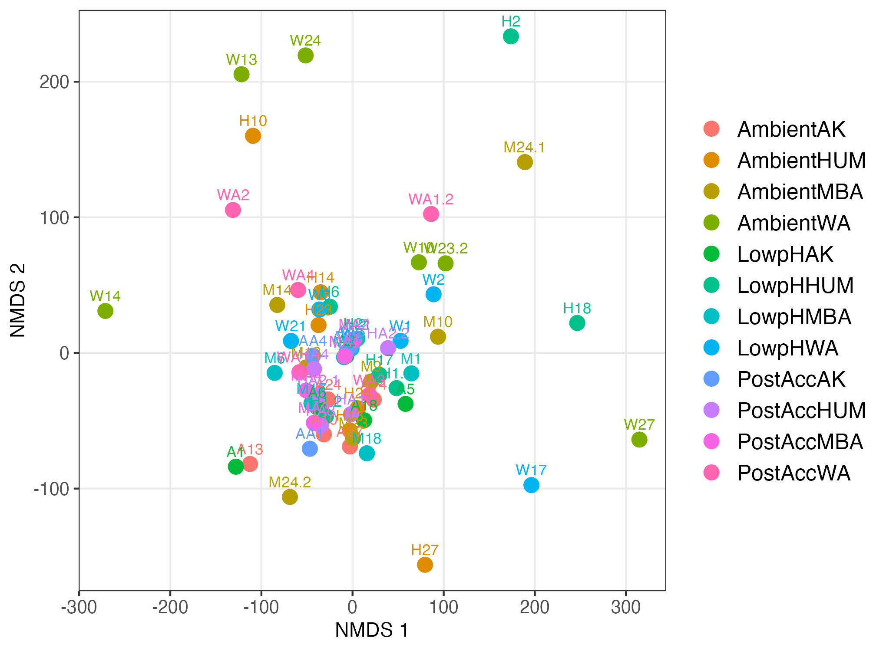


* Batch correction without design for all 69 samples
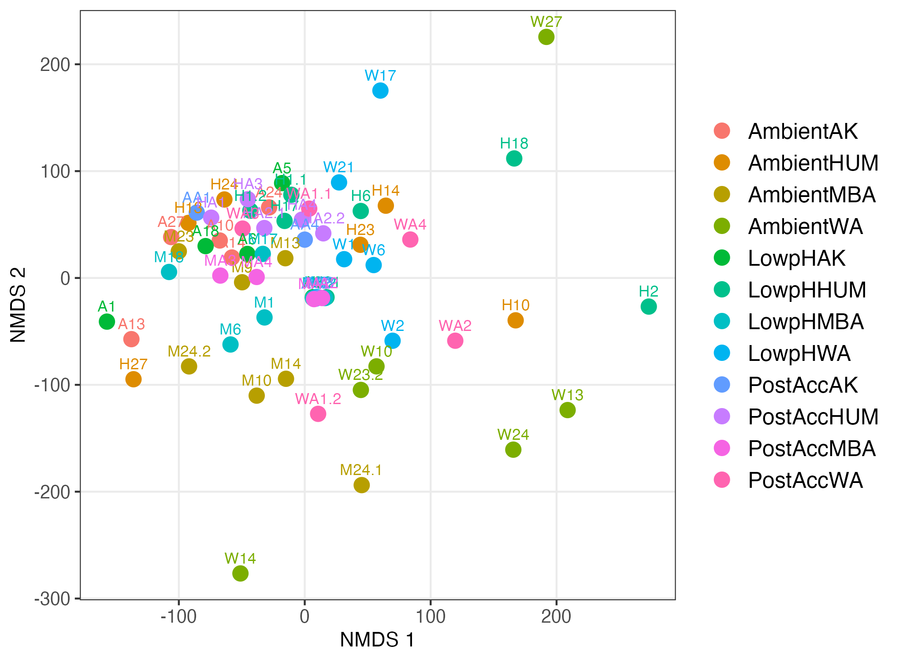

## 48 samples only
```{r eval=FALSE, message=FALSE, warning=FALSE, include=TRUE}
 
#48 samples only
dele3.2<-dele3[, meta2$Sample.ID2]

# Remove batch effects before plotting
dele3.2_corrected <- removeBatchEffect(as.matrix(dele3.2), batch=meta2$Batch) 
dele3.2_corrected2 <- removeBatchEffect(as.matrix(dele3.2), batch=meta2$Batch, design=design) 

#NMDS with batch correction without design
dele3.t2<-t(dele3.2_corrected) 
nmds.dele3.2<-metaMDS(dele3.t2,distance='euclidean', trymax=100)

dele.mds3.2 = data.frame(nmds.dele3.2$points)
dele.mds3.2$Treatment<-meta2$Treatment
dele.mds3.2$sample<-rownames(dele3.t2)
ggplot(dele.mds3.2, aes(x=MDS1,y=MDS2,color=Treatment)) + 
    geom_point(size=3.5, position=position_jitter()) + theme_bw() +
    theme(legend.text = element_text(size=12), legend.title = element_text(size=13))+
    xlab("NMDS 1") + ylab("NMDS 2")+
    theme(axis.text=element_text(size=10), legend.title = element_blank())+
    theme(panel.grid.minor = element_blank())+
    geom_text(aes(label = dele.mds3.2$sample),show.legend = FALSE,
              vjust = -0.9,    # vertical adjustment
              size = 3)
ggsave("../Output/Delegance/Nmds.batch-corrected3_48samples.png", height = 5, width = 6.8, dpi=300)

# correction with design, 48 samples
dele3.t2<-t(dele3.2_corrected2) 
dele3.t2<-t(dele3.2_corrected) 
nmds.dele3.2<-metaMDS(dele3.t2,distance='euclidean', trymax=100)
dele.mds3.2 = data.frame(nmds.dele3.2$points)
dele.mds3.2$Treatment<-meta2$Treatment
dele.mds3.2$sample<-rownames(dele3.t2)
ggplot(dele.mds3.2, aes(x=MDS1,y=MDS2,color=Treatment)) + 
    geom_point(size=3.5, position=position_jitter()) + theme_bw() +
    theme(legend.text = element_text(size=12), legend.title = element_text(size=13))+
    xlab("NMDS 1") + ylab("NMDS 2")+
    theme(axis.text=element_text(size=10), legend.title = element_blank())+
    theme(panel.grid.minor = element_blank())+
    geom_text(aes(label = dele.mds3.2$sample),show.legend = FALSE,
              vjust = -0.9, size = 3)
ggsave("../Output/Delegance/Nmds.batch.design-corrected3_48samples.png", height = 5, width = 6.8, dpi=300)


# Plots with Hull
## all proteins
dist_matrix <- vegdist(dele3.t2, method = "euclidean", na.rm = TRUE)

nmds_metadata <- as.data.frame(nmds.dele3.2$points) %>% 
  rownames_to_column(var="Sample.ID2") %>%
  left_join(meta2[, c("Sample.ID2","Treatment")],by="Sample.ID2")

#Permutational Multivariate Analysis of Variance Using Distance Matrices
permanova_result <- adonis2(dist_matrix ~Treatment, data = nmds_metadata)
p_value_loc <- permanova_result$`Pr(>F)`[1]
#0.001

hull.ak1 <- nmds_metadata[nmds_metadata$Treatment == "AmbientAK", ][chull(nmds_metadata[nmds_metadata$Treatment == "AmbientAK", c("MDS1", "MDS2")]), ]  
hull.ak2 <- nmds_metadata[nmds_metadata$Treatment == "LowpHAK", ][chull(nmds_metadata[nmds_metadata$Treatment == "LowpHAK", c("MDS1", "MDS2")]), ] 

hull.hm1 <- nmds_metadata[nmds_metadata$Treatment == "AmbientHUM", ][chull(nmds_metadata[nmds_metadata$Treatment == "AmbientHUM", c("MDS1", "MDS2")]), ]  
hull.hm2 <- nmds_metadata[nmds_metadata$Treatment == "LowpHHUM", ][chull(nmds_metadata[nmds_metadata$Treatment == "LowpHHUM", c("MDS1", "MDS2")]), ] 

hull.wa1 <- nmds_metadata[nmds_metadata$Treatment == "AmbientWA", ][chull(nmds_metadata[nmds_metadata$Treatment == "AmbientWA", c("MDS1", "MDS2")]), ]  
hull.wa2 <- nmds_metadata[nmds_metadata$Treatment == "LowpHWA", ][chull(nmds_metadata[nmds_metadata$Treatment == "LowpHWA", c("MDS1", "MDS2")]), ] 

hull.mb1 <- nmds_metadata[nmds_metadata$Treatment == "AmbientMBA", ][chull(nmds_metadata[nmds_metadata$Treatment == "AmbientMBA", c("MDS1", "MDS2")]), ]  
hull.mb2 <- nmds_metadata[nmds_metadata$Treatment == "LowpHMBA", ][chull(nmds_metadata[nmds_metadata$Treatment == "LowpHMBA", c("MDS1", "MDS2")]), ] 


hulls_condition<-rbind(hull.ak1, hull.ak2, hull.hm1,hull.hm2,hull.wa1,hull.wa2,hull.mb1,hull.mb2) 

ggplot(nmds_metadata, aes(x = MDS1, y = MDS2)) +
  geom_point(aes(color = Treatment)) +
  geom_polygon(data=hulls_condition,aes(x=MDS1, y=MDS2, fill=Treatment),alpha=0.30)+  
  theme_classic() +
  theme(panel.grid = element_blank())+
  xlab('NMDS1')+ylab('NMDS2')
ggsave("../Output/Delegance/Nmds.with.hull3_batch.design_corrected_48samples.png", height = 5, width = 5.3, dpi=300)

```
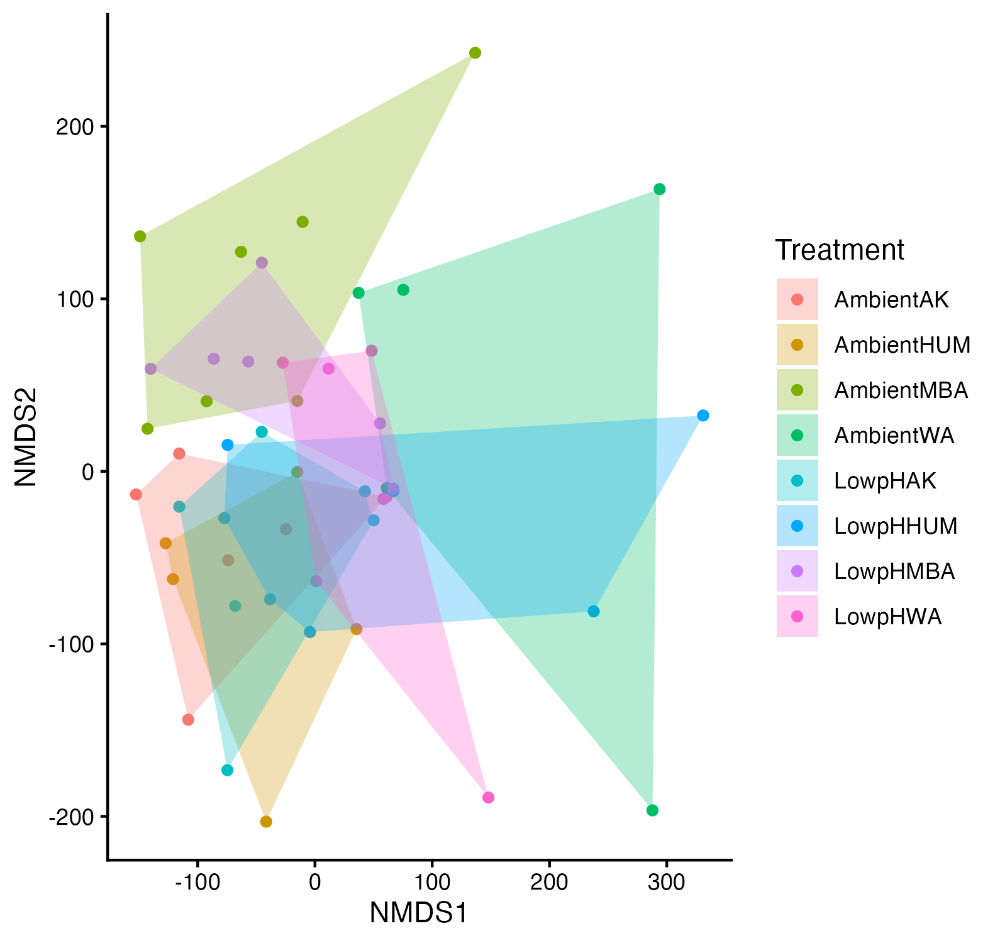


```{r eval=FALSE, message=FALSE, warning=FALSE, include=TRUE}
#Ambient only
hulls2<-rbind(hull.ak1,hull.hm1, hull.wa1, hull.mb1)

ggplot(nmds_metadata, aes(x = MDS1, y = MDS2)) +
  geom_point(aes(color = Treatment)) +
  geom_polygon(data=hulls2,aes(x=MDS1, y=MDS2, fill=Treatment),alpha=0.30)+  
  theme_classic() +
  theme(panel.grid = element_blank())+
  xlab('NMDS1')+ylab('NMDS2')
ggsave("../Output/Delegance/Nmds.with.hull3_batch.design_corrected_48samples_Ambient.png", height = 5, width = 6.2, dpi=300)

hulls3<-rbind(hull.ak2,hull.hm2,hull.wa2,hull.mb2)

ggplot(nmds_metadata, aes(x = MDS1, y = MDS2)) +
  geom_point(aes(color = Treatment)) +
  geom_polygon(data=hulls3,aes(x=MDS1, y=MDS2, fill=Treatment),alpha=0.30)+  
  theme_classic() +
  theme(panel.grid = element_blank())+
  xlab('NMDS1')+ylab('NMDS2')
ggsave("../Output/Delegance/Nmds.with.hull3_batch.design_corrected_48samples_lowpH.png", height = 5, width = 6, dpi=300)

```
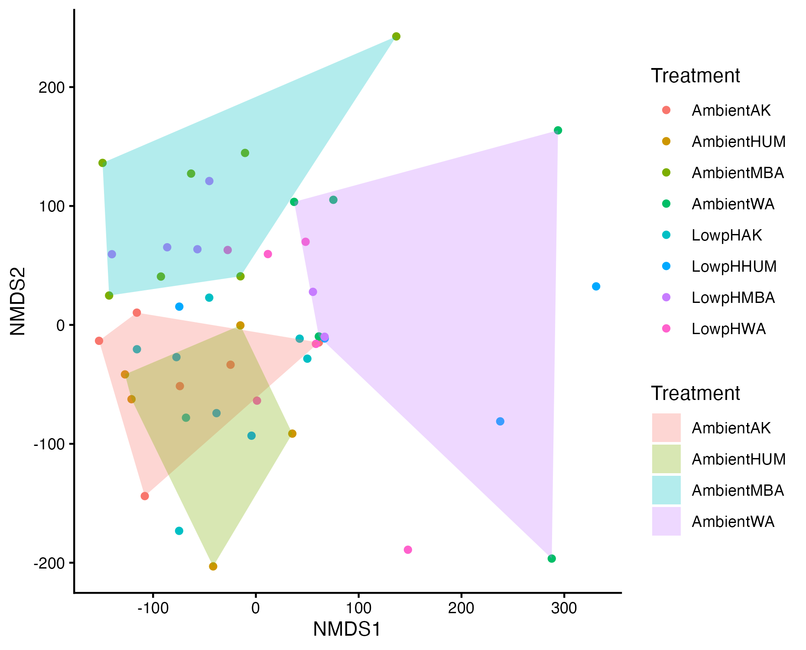
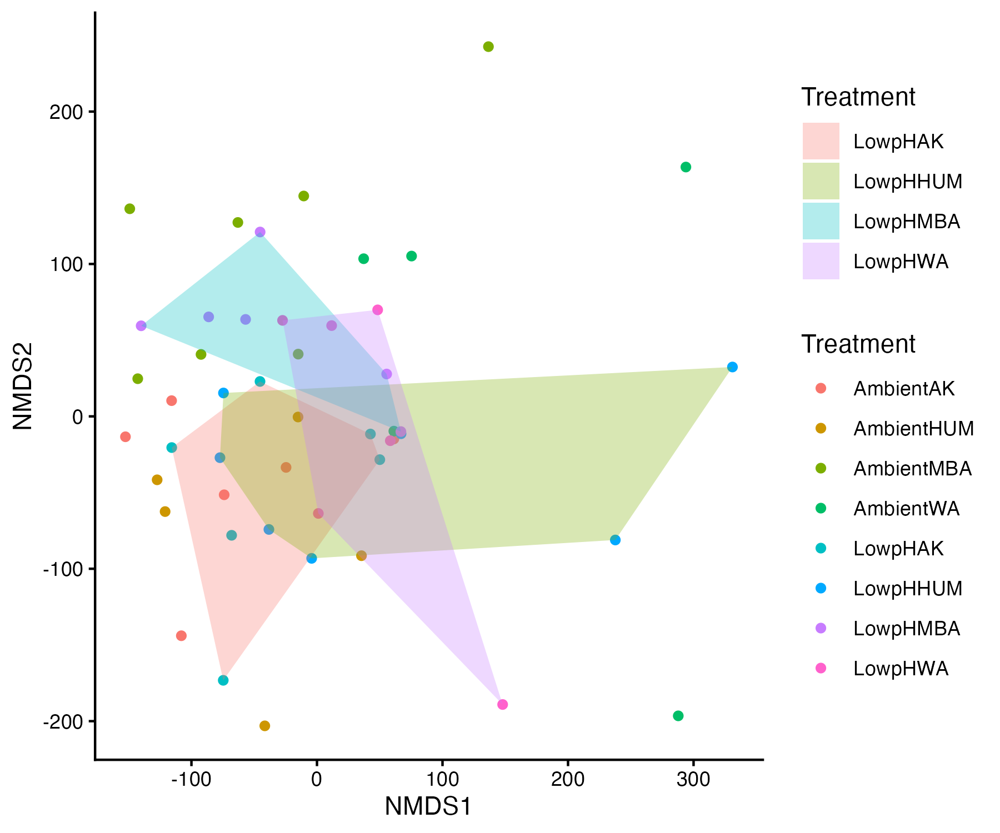

```{r eval=FALSE, message=FALSE, warning=FALSE, include=TRUE}
```


# most differentially expressed proteins

```{r eval=FALSE, message=FALSE, warning=FALSE, include=TRUE}


```

```{r eval=FALSE, message=FALSE, warning=FALSE, include=TRUE}

```

```{r eval=FALSE, message=FALSE, warning=FALSE, include=TRUE}

```

