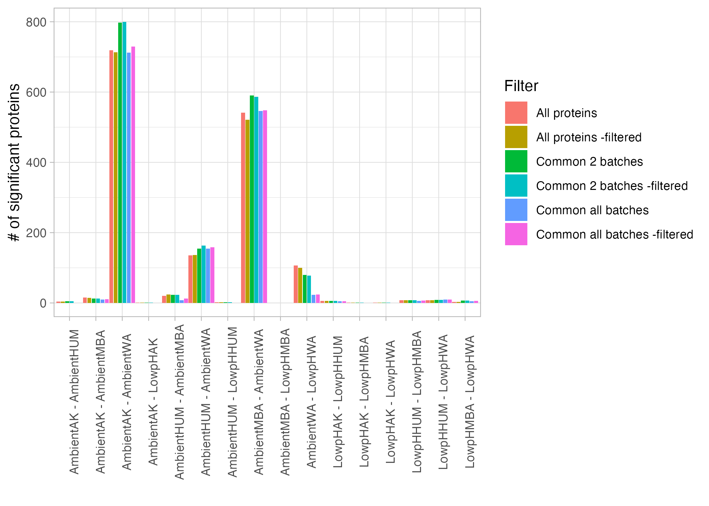

```{r eval=FALSE, message=FALSE, warning=FALSE, include=TRUE}
source("BaseScripts.R")
library(limma) 
library(tidyr)
library(vegan)
library(QFeatures)
library(WGCNA)
library(patchwork)
library(NormalyzerDE)
library(tibble)
library(corrplot)
library(clusterProfiler)
library(enrichplot)
colors<-c(  "#D73027","#B3B3B3" ,"#4575B4")

```

# Read the data in 

```{r eval=FALSE, message=FALSE, warning=FALSE, include=TRUE}
meta<-read.csv("../Data/Keana/metadata_full.csv")
meta2 <- meta %>%
  filter(!grepl("Post", Treatment))
# remove 3 samples
remove<-c('A23', 'W23.1' ,'A17')
meta2<-meta2[!(meta2$Sample.ID2 %in% remove),] #48

meta2$Treatment <- factor(meta2$Treatment)
meta2$Batch<-factor(meta2$Batch)


# Read the combined data processed in #0.ExploreData
dele.df<-read.csv("../Output/Delegance/Dele_combined_raw.csv") #40005 peptides

#Remove 3 samples with too many missing peptides
remove<-c('A23', 'W23.1' ,'A17')
dele.df<-dele.df[,!(colnames(dele.df) %in% remove)]

# Remove proteins with no-overlapping peptides across batches
no.overlaps<-read.csv("../Output/Delegance/Proteins_no.overlapping.peptides.csv")
dele.df.filter<-dele.df[!(dele.df$Protein.Name %in% no.overlaps$Protein.Name),] #39143

dele1<-dele.df.filter
```


## Filter proteins down to those appeared in at least 2 datasets or in all 3 datasets
```{r eval=FALSE, message=FALSE, warning=FALSE, include=TRUE}

prots<-read.csv('../Output/Delegance/Proteins_2batches_8140.csv', row.names = 1)
all_prots<-read.csv('../Output/Delegance/Proteins_3batches_5901.csv', row.names = 1)

dele2<-dele.df.filter[dele.df.filter$Protein.Name %in% prots$x,]

dele3<-dele.df.filter[dele.df.filter$Protein.Name %in% all_prots$x,]

```


# Process in QFetures

```{r eval=FALSE, message=FALSE, warning=FALSE, include=TRUE}

for (i in 1:3){
    df<-get(paste0('dele',i))
    abundance<-colnames(df[3:ncol(df)]) 
    de_qf <- readQFeatures(df,ecol = abundance,name = "raw")
    de_qf$label <- abundance
    de_qf$sample <- abundance
    de_qf$condition <- meta$Treatment[match(abundance, meta$Sample.ID2)]
    colData(de_qf[["raw"]]) <- colData(de_qf)
    assessNAs<-de_qf[["raw"]] %>%
    nNA()
    rna<-data.frame(assessNAs$nNArows)
    rna$Protein.Name<-df$Protein.Name
    rna$Peptide<-df$Peptide
    de_qf <- de_qf %>%
        filterNA(pNA = 0.8,
        i = "raw")
    pep_final <- de_qf[["raw"]] %>%
        nrow() %>%
        as.numeric()
    print(paste0(i,". Total peptide counts: ", pep_final))
    de_qf <- logTransform(object = de_qf,
        base = 2,
        i = "raw", pc=1,
        name = "log_peptides")
    de_qf<- aggregateFeatures(de_qf,
        i = "log_peptides",
        fcol = "Protein.Name",
        name = "log_proteins",
        fun = MsCoreUtils::robustSummary,
        na.rm = TRUE)
    de_qf <- normalize(de_qf,
        i = "log_proteins",
        name = "log_norm_proteins",
        method = "center.median")
    post<-data.frame(assay(de_qf[["log_norm_proteins"]]))
    write.csv(post, paste0("../Output/Delegance/Dele",i,"_filtered_center.median.norm_robustSummary.csv"))
}

# 1. Total peptide counts: 33529
# 2. Total peptide counts: 31787
# 3. Total peptide counts: 28713
```


## LIMMA Analysis
```{r eval=FALSE, message=FALSE, warning=FALSE, include=TRUE}
# Create design matrix

# Only focus on post experiment ambient vs. lowPH
meta2<-meta2[order(meta2$Treatment),]
meta2$Treatment <- factor(meta2$Treatment)
meta2$Batch<-factor(meta2$Batch)

design <- model.matrix(~ 0+ Treatment + Batch, data=meta2)
contrast.matrix <- makeContrasts(TreatmentAmbientAK-TreatmentLowpHAK, 
                                 TreatmentAmbientHUM-TreatmentLowpHHUM, 
                                 TreatmentAmbientWA-TreatmentLowpHWA,
                                 TreatmentAmbientMBA-TreatmentLowpHMBA,
                                 TreatmentAmbientAK-TreatmentAmbientHUM, 
                                 TreatmentAmbientAK-TreatmentAmbientMBA, 
                                 TreatmentAmbientAK-TreatmentAmbientWA,
                                 TreatmentAmbientHUM-TreatmentAmbientMBA,
                                 TreatmentAmbientHUM-TreatmentAmbientWA,
                                 TreatmentAmbientMBA-TreatmentAmbientWA,
                                 TreatmentLowpHAK-TreatmentLowpHHUM,
                                 TreatmentLowpHAK-TreatmentLowpHMBA,
                                 TreatmentLowpHAK-TreatmentLowpHWA,
                                 TreatmentLowpHHUM-TreatmentLowpHMBA,
                                 TreatmentLowpHHUM-TreatmentLowpHWA,
                                 TreatmentLowpHMBA-TreatmentLowpHWA,
                                 levels=design)


for (i in 1:3){
    df<-read.csv(paste0("../Output/Delegance/Dele",i,"_filtered_center.median.norm_robustSummary.csv"))
    df<-df[,meta2$Sample.ID2]
    
    fit1<-lmFit(df, design)
    fit2<-contrasts.fit(fit1, contrast.matrix)
    fit2 <- eBayes(fit2, robust = TRUE, trend = TRUE)
    results <- lapply(colnames(fit2$coefficients), function(co) {
        tt <- topTable(fit2, coef = co, number = Inf, sort.by = "P")
        tt <- tt %>% rownames_to_column("Protein,Name") %>% mutate(contrast = co, .before = 1)
        tt
        }) %>% bind_rows()

    write.csv(results, paste0("../Output/Delegance/Dele",i,"_filtered_Limma_results_robustSummary.csv"))
}


```


# Plot the LIMMA analysis results -Volcano Plots (robustSummary)

```{r eval=FALSE, message=FALSE, warning=FALSE, include=TRUE}
# Positive fold change = More abundant in Left than Right (CFR - TR; more in CFR) 

treat_contrasts<-colnames(contrast.matrix)
fc_thresh  <- 1 
fdr_thresh <- 0.05
    

for (i in 3:3){
    results<-read.csv(paste0("../Output/Delegance/Dele",i,"_filtered_Limma_results_robustSummary.csv"))
    
    list_contrasts<-list()
    for (j in 1:length(treat_contrasts)){
        treatA<-sub(" -.*","",treat_contrasts[j] )
        treatA<-sub('Treatment','',treatA)
        treatB<-sub("^[^-]*- ","",treat_contrasts[j] )
        treatB<-sub('Treatment','',treatB)
        df<-results[results$contrast==treat_contrasts[j],]
        assign(paste0(treatA,"-",treatB), df)
        list_contrasts[[j]]<-df
        names(list_contrasts)[j]<-paste0(treatA,"-",treatB)
    }

    # Volcano plot
    plots<-list()
    for (k in 1:length(list_contrasts)){
        df<-list_contrasts[[k]]
        df$negLog10<-(-log10(df$adj.P.Val))
        df <- df %>%
        mutate(fc_dir = case_when(
            logFC >=  fc_thresh & adj.P.Val<fdr_thresh  ~ "pos",
            logFC <= -fc_thresh & adj.P.Val<fdr_thresh  ~ "neg",
            TRUE         ~ "none"
        ))
        p<-ggplot(df, aes(x = logFC, y = negLog10, color=fc_dir)) +
            geom_point(alpha = 0.7, size = 1.6) +
            scale_color_manual(values = c("none"=colors[2], "pos"= colors[3],"neg"=colors[1]))+
            geom_vline(xintercept = c(-fc_thresh, fc_thresh), linetype = "dashed",color="gray30",        linewidth=0.5) +
            geom_hline(yintercept = -log10(fdr_thresh), linetype = "dashed", color="gray30",        linewidth=0.5) +
            labs(x = "log2 Fold Change", y=expression(-log[10]~"("~italic("Q")~"-value)"),          title=names(list_contrasts[k])) +
            theme_classic()+theme(legend.position = "none") 
        plots[[k]]<-p
    }
    
    png(paste0("../Output/Delegance/VolcanoPlot_filtered",i,"_Ambient-lowPH.png"), width = 7, height =5.5,      units = "in", res=300 )
    p1<-(plots[[1]] | plots[[2]]) /
    (plots[[3]] | plots[[4]]) 
    print(p1)
    dev.off()

    png(paste0("../Output/Delegance/VolcanoPlot_filtered",i,"_Ambient-betwSites.png"), width = 10,     height = 5.5, units ="in", res=300 )
    p2<-(plots[[5]] | plots[[6]]| plots[[7]]) /
    (plots[[8]] | plots[[9]]| plots[[10]]) 
    print(p2) 
    dev.off()
    

    #Site comparison 2 (Ambient)
    png(paste0("../Output/Delegance/VolcanoPlot_filtered",i,"_lowPH-betwSites.png"), width = 10, height     =5.5, units ="in", res=300 )
    p3<-(plots[[11]] | plots[[12]]| plots[[13]]) /
    (plots[[14]] | plots[[15]]| plots[[16]]) 
    print(p3)
    dev.off()
}

```


# Comparison summary
```{r eval=FALSE, message=FALSE, warning=FALSE, include=TRUE}

files <- list.files(
  path = "../Output/Delegance/",
  pattern = "Limma_results",
  full.names = TRUE
)

summary_table <- map_dfr(files, function(f) {

  dat <- read_csv(f, show_col_types = FALSE)

  dat %>%
    group_by(contrast) %>%
    summarise(
      n_tested = sum(!is.na(P.Value)),

      # FDR < 0.05 and |logFC| > 1
      n_fdr05_fc1 = sum(
        adj.P.Val < 0.05 & abs(logFC) > 1,
        na.rm = TRUE
      ),

      .groups = "drop"
    ) %>%

    mutate(
      filtering = tools::file_path_sans_ext(basename(f)),
      .before = 1
    )
})

fnames<-unique(summary_table$filtering)

summary_table$Filter<-summary_table$filtering
summary_table$Filter[summary_table$filtering==fnames[1]]<-"All proteins" 
summary_table$Filter[summary_table$filtering==fnames[2]]<-"Common 2 batches" 
summary_table$Filter[summary_table$filtering==fnames[3]]<-"Common all batches" 
summary_table$Filter[summary_table$filtering==fnames[4]]<-"All proteins -filtered" 
summary_table$Filter[summary_table$filtering==fnames[5]]<-"Common 2 batches -filtered"  
summary_table$Filter[summary_table$filtering==fnames[6]]<-"Common all batches -filtered"  

summary_table$contrast<-gsub("Treatment",'',summary_table$contrast)

ggplot(summary_table, aes(x=contrast, y=n_fdr05_fc1, color=Filter ))+
    geom_point(position=position_dodge(width=1))+
    theme_light()+theme(axis.text.x = element_text(angle=90))

ggplot(summary_table, aes(x=contrast, y=n_fdr05_fc1, fill=Filter ))+
    geom_bar( stat="identity",position=position_dodge(width=1))+
    theme_light()+theme(axis.text.x = element_text(angle=90))+xlab('')+
    ylab('# of significant proteins')
ggsave("../Output/Delegance/QC_filter.vs.no-filter-proteins_comparison.png", width = 7, height =5, dpi=300)
```

